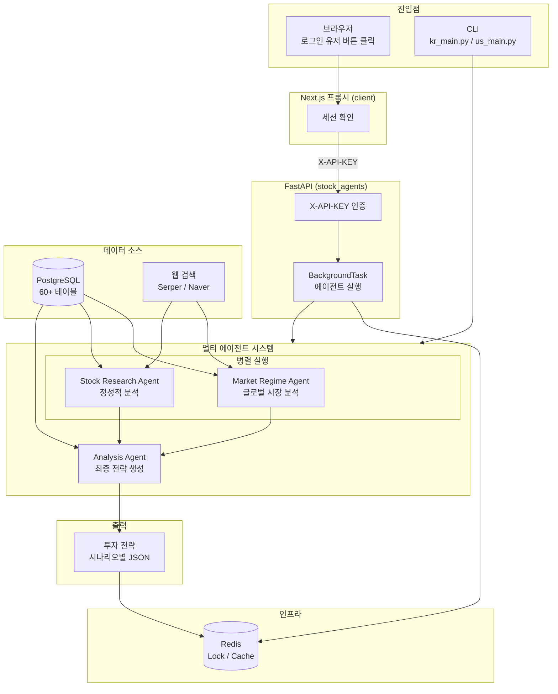
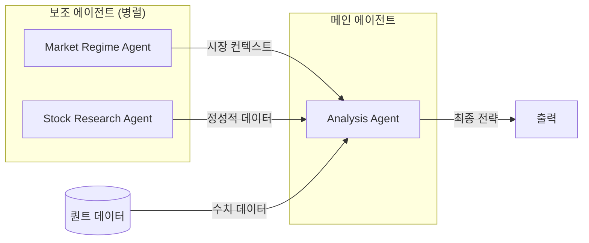
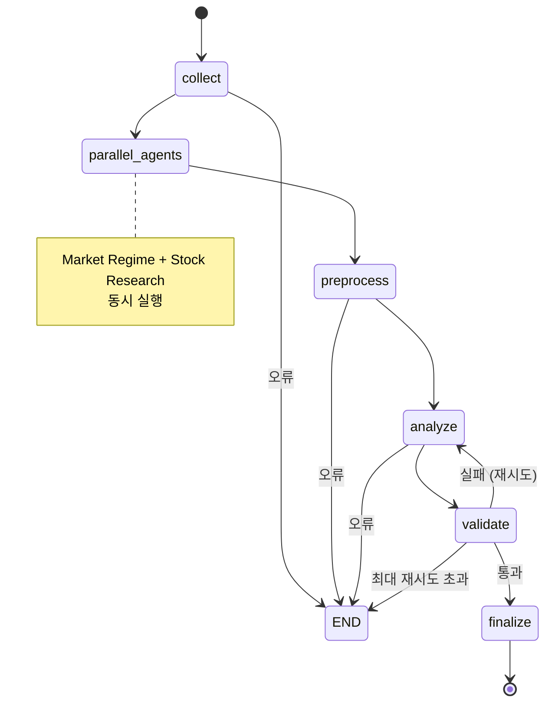
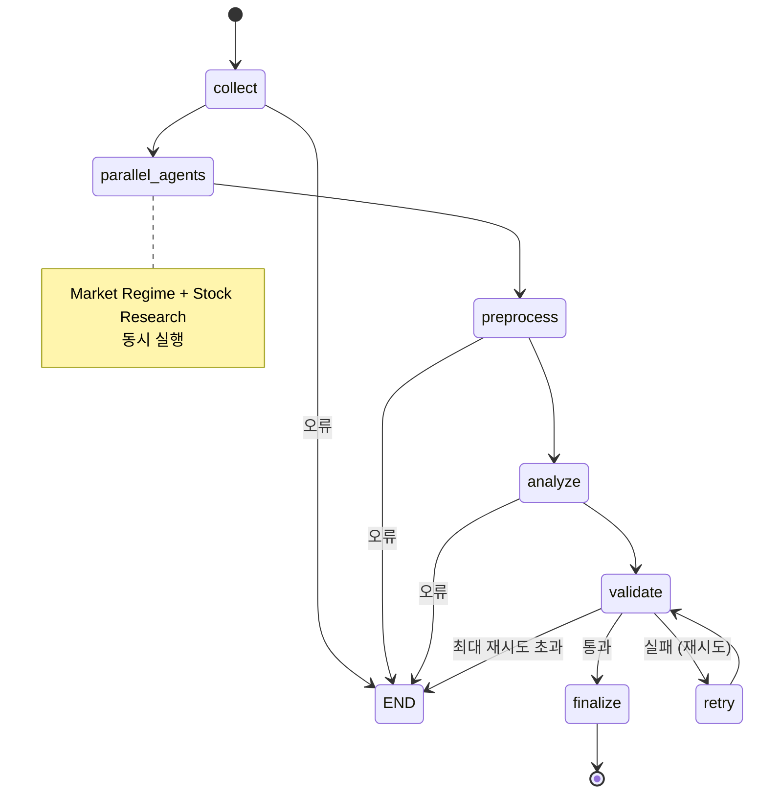
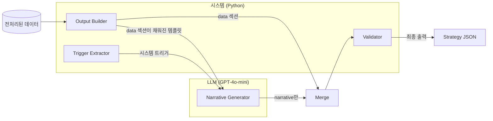

# Stock Agents


**주식 투자 전략 생성 멀티 에이전트 AI 시스템**

> Task-driven 아키텍처: 시스템이 모든 수치를 계산하고, LLM은 해석(narrative)만 생성

---

## 목차

- [이 저장소의 역할](#이-저장소의-역할)
- [프로젝트 구조](#프로젝트-구조)
- [시스템 아키텍처](#시스템-아키텍처)
- [에이전트 시스템](#에이전트-시스템)
- [워크플로우](#워크플로우)
- [기술적 특징](#기술적-특징)
- [REST API](#rest-api)
- [개발환경 및 사용기술](#개발환경-및-사용기술)
- [내부 디렉토리 구조](#내부-디렉토리-구조)
- [License](#license)

---

## 이 저장소의 역할

전체 프로젝트 중 **종목 투자 전략 Multi-Agent AI** 컴포넌트를 담당합니다.

| 기능 | 설명 |
|------|------|
| **멀티 에이전트 아키텍처** | 3개의 전문 AI 에이전트가 오케스트레이션 방식으로 협업 |
| **Task-driven 설계** | Data/Narrative 분리 - LLM이 숫자를 생성하지 않음 |
| **병렬 실행** | Market Regime + Stock Research 에이전트 동시 실행 |
| **검증 루프** | 스키마 & 데이터 일관성 검증 + 자동 재시도 (최대 2회) |
| **Graceful Degradation** | 보조 에이전트 실패 시에도 메인 플로우 계속 진행 |
| **시장별 적응** | 한국/미국 시장 별도 구현 |

## 프로젝트 구조

| 저장소 | 설명 | 기술 스택 |
|--------|------|-----------|
| [**api**](https://github.com/vinjung/alphafolio_api) | AI 채팅 백엔드 API | FastAPI, LangGraph, ChromaDB, Fine-tuned GPT |
| [**data**](https://github.com/vinjung/alphafolio_data) | 데이터 자동 수집 & 지표 계산 | FastAPI, asyncpg, Cloud Scheduler |
| [**chat**](https://github.com/vinjung/alphafolio_chat) | AI 비서 개발환경 | LangChain, LangGraph, ChromaDB |
| [**quant**](https://github.com/vinjung/alphafolio_quant) | 멀티팩터 퀀트 분석 엔진 | NumPy, SciPy, hmmlearn |
| [**stock_agent**](https://github.com/vinjung/alphafolio_stock_agent) | **📍 종목 투자 전략 Multi-Agent AI(현재 저장소)** | LangGraph, Task-driven Architecture |
| [**portfolio**](https://github.com/vinjung/alphafolio_portfolio) | 포트폴리오 생성 & 리밸런싱 엔진 | Risk Parity, VaR/CVaR, LangGraph |

---

## 시스템 아키텍처



### 시스템 설계 원칙

```
1. LLM 자체 판단이 아닌 시스템 제어 구조
2. 최소 규칙 + 명확한 행동 제약 + 반복 가능한 프로세스
3. Role-driven이 아닌 Task-driven 접근
4. "생각"하는 구조가 아닌 "판단 + 검증 루프" 구조
5. 오케스트레이션 (자유로운 에이전트 토론 X)
6. 에이전트 간 구조화된 Knowledge Object로 정보 전달
7. Data/Narrative 분리: 시스템이 계산, LLM이 해석
```

---

## 에이전트 시스템

### 3-에이전트 아키텍처



| 에이전트 | 역할 | 입력 | 출력 |
|----------|------|------|------|
| **Market Regime Agent** | 글로벌 시장 환경 분석 & Risk-On/Off 판단 | VIX, 달러인덱스, 국채수익률, 금리, 시장뉴스 | 시장 레짐 JSON (risk_on/risk_off/neutral) |
| **Stock Research Agent** | 정성적 분석으로 narrative 풍부화 | 뉴스, 실적, 내부자거래, SEC 공시 | 리서치 요약 JSON |
| **Analysis Agent** | 최종 투자 전략 생성 | 모든 데이터 + 보조 에이전트 결과 | 시나리오별 완전한 전략 |

<details>
<summary><b>Market Regime Agent 상세</b></summary>

**목적**: 현재 시장이 위험자산 선호(Risk-On)인지 안전자산 선호(Risk-Off)인지 판단

**데이터 소스**:
- VIX 지수 (공포지수)
- 달러 인덱스 (USD 강세/약세)
- 국채 수익률 (10Y, 2Y, 스프레드)
- 연방기금금리
- 신용 스프레드 (HY-IG)
- MOVE 지수 (채권 변동성)
- 안전자산 ETF (GLD, TLT, SHY)

**출력 카테고리**:
- `risk_on`: 성장주에 유리한 환경
- `risk_off`: 방어적 포지션 권장
- `neutral`: 혼합 신호

</details>

<details>
<summary><b>Stock Research Agent 상세</b></summary>

**목적**: 정량적 신호를 설명할 수 있는 정성적 요소 수집

**한국 시장 소스**:
- DART 공시 (기업 공시)
- 증권사 리서치 리포트
- 네이버 뉴스 API

**미국 시장 소스**:
- us_news 테이블 (sentiment 점수 포함)
- 실적 추정치
- 내부자 거래
- Serper 웹 검색 (SEC 공시, 애널리스트 평가)

</details>

<details>
<summary><b>Analysis Agent 상세</b></summary>

**목적**: 모든 데이터를 종합하여 실행 가능한 투자 전략 생성

**Task-driven V2 설계**:
1. `output_builder.py`가 모든 `data` 섹션을 계산된 값으로 미리 채움
2. 시스템이 퀀트 분석에서 트리거 추출
3. LLM은 템플릿을 받아 `narrative` 섹션만 생성
4. 병합 함수가 시스템 data + LLM narrative 결합

**검증 루프**:
- 스키마 검증 (필수 필드)
- 데이터 일관성 검증 (숫자 일치 확인)
- 실패 시 최대 2회 재시도

</details>

---

## 워크플로우

### LangGraph 상태 머신 (KR)



### LangGraph 상태 머신 (US)

US 워크플로우는 KR과 유사하지만 검증 실패 시 별도 `retry` 노드를 거쳐 재검증합니다.



### KR / US 워크플로우 차이점

| 항목 | KR | US |
|------|-----|-----|
| **검증 재시도 흐름** | `validate → analyze` (재분석) | `validate → retry → validate` (별도 노드) |
| **State 추가 필드** | - | `analysis_output`, `final_output` |

### 노드 설명

| 단계 | 노드 | 설명 | 출력 |
|------|------|------|------|
| 1 | `collect` | PostgreSQL에서 원시 데이터 수집 (20-40+ 테이블) | `raw_data` |
| 2 | `parallel_agents` | Market Regime + Stock Research 동시 실행 | `market_regime`, `stock_research` |
| 3 | `preprocess` | 원시 데이터를 분석 가능한 형태로 변환 | `preprocessed_data` |
| 4 | `analyze` | 출력 템플릿 생성 + LLM narrative 생성 | `strategy` |
| 5 | `validate` | 스키마 & 데이터 일관성 검증 | `validation_errors` |
| 5-1 | `retry` (US만) | 검증 실패 시 재시도 처리 | 재검증 |
| 6 | `finalize` | 메타데이터 추가, DB/파일 저장 | 최종 `strategy` |

---

## 기술적 특징

### Task-driven 아키텍처 (V2)



**Task-driven 선택 이유**:
- LLM의 숫자 환각(hallucination) 방지
- 모든 가격, 확률, 수익률은 시스템이 계산
- LLM은 해석과 설명에만 집중
- 검증 가능한 출력

### 병렬 에이전트 실행

```python
# asyncio.gather로 동시 실행
regime_result, research_result = await asyncio.gather(
    run_regime_analysis(state),
    stock_research_node(state),
    return_exceptions=True  # Graceful 오류 처리
)
```

**장점**:
- 총 실행 시간 ~50% 단축
- 독립적인 실패 처리 (degraded mode)
- 보조 에이전트 간 블로킹 없음

### 시장별 적응

| 기능 | 한국 시장 (kr/) | 미국 시장 (us/) |
|------|-----------------|-----------------|
| **가격 반올림** | 7단계 호가 단위 (1 ~ 1,000원) | Decimalization ($0.01) |
| **뉴스 소스** | 네이버 API | us_news 테이블 + Serper |
| **투자자 수급** | kr_individual_investor_daily_trading | 옵션 Put/Call Ratio |
| **감성 분석** | 없음 | Alpha Vantage sentiment 점수 |
| **내부자 데이터** | kr_largest_shareholder | us_insider_transactions |
| **옵션 데이터** | 없음 | IV Percentile, GEX, Greeks |

<details>
<summary><b>미국 옵션 데이터 활용</b></summary>

| 지표 | 해석 | 활용 |
|------|------|------|
| Put/Call Ratio | < 0.7 낙관, > 1.0 비관 | 시장 심리 판단 |
| IV Percentile | < 20 저변동성, > 80 고변동성 | 변동성 수준 판단 |
| Net GEX | 양수 = 안정, 음수 = 변동성 확대 | 변동성 예측 |
| Gamma Flip | Flip 지점까지 거리 | 지지/저항 수준 |

</details>

### 데이터 수집 범위

에이전트가 분석에 사용하는 DB 테이블과 수집 기간입니다.

<details>
<summary><b>KR 데이터 수집 (20개 테이블)</b></summary>

| 테이블 | 수집 기간 | 설명 |
|--------|----------|------|
| `kr_stock_grade` | 1일 | 최신 퀀트 등급 |
| `kr_indicators` | 90일 | 기술적 지표 |
| `kr_intraday_total` | 90일 | 일간 시세 |
| `kr_individual_investor_daily_trading` | 60일 | 투자자별 매매 |
| `kr_foreign_ownership` | 60일 | 외국인 보유 |
| `kr_financial_position` | 730일 (2년) | 재무상태 |
| `kr_research_reports` | 180일 (6개월) | 리서치 리포트 |
| `kr_blocktrades` | 30일 | 대량매매 |
| `kr_dividends` | 1095일 (3년) | 배당 |
| `kr_largest_shareholder` | 365일 | 최대주주 |
| `market_index` | 60일 | 시장 지수 |
| `bok_economic_indicators` | 365일 | 한국 경제지표 |
| `exchange_rate` | 90일 | 환율 |
| US 경제지표 7종 | 90~365일 | VIX, 달러인덱스, 금리, CPI, GDP, PMI, 실업률 |

</details>

<details>
<summary><b>US 데이터 수집 (25+ 테이블)</b></summary>

| 테이블 | 수집 기간 | 설명 |
|--------|----------|------|
| `us_stock_grade` | 1일 | 최신 퀀트 등급 |
| `us_daily` | 90일 | 일간 시세 |
| `us_weekly` | 52주 (1년) | 주간 시세 |
| `us_indicators` | 90일 | 기술적 지표 |
| `us_option_daily_summary` | 252일 (1 거래년) | 옵션 요약 (IV Percentile) |
| `us_option` | 7일 | 옵션 체인 상세 |
| 재무제표 3종 | 8분기 (2년) | 손익/재무상태/현금흐름 |
| `us_earnings_estimates` | 최근 4건 | 실적 추정치 |
| `us_news` (종목) | 30일 | 종목 뉴스 |
| `us_news` (시장) | 7일 | 시장 뉴스 |
| `us_insider_transactions` | 90일 | 내부자 거래 |
| US 경제지표 6종 | 365일 | 금리, 국채, CPI, 실업률, GDP, PMI |
| US 시장지표 5종 | 90일 | VIX, MOVE, 달러인덱스, 신용스프레드, 역레포 |
| 안전자산 ETF | 90일 | GLD, TLT, SHY |

</details>

### 전략 캐시 TTL

전략 생성 완료 후 Redis에 캐싱되며, 시장별로 만료 시간이 다릅니다.

| 시장 | 만료 기준 | 주말 처리 |
|------|----------|----------|
| KR | 익일 20:59 KST | 금요일 → 월요일 20:59 |
| US | 익일 12:59 KST | 토요일 → 화요일 12:59 |

- 완료 후 `stock:detail:{symbol}` 캐시도 자동 무효화 (페이지 즉시 반영)

### 시나리오별 계산 로직

| 시나리오 | take_profit | stop_loss |
|----------|-------------|-----------|
| **Bullish** | `현재가 x (1 + bullish_return_max)` | `현재가 x (1 + stop_loss_pct)` |
| **Sideways** | `현재가 x (1 + sideways_return_max)` | `현재가 x (1 + sideways_return_min)` |
| **Bearish** | `null` | `"1차: {price1}원, 2차: {price2}원"` |

---

## REST API

FastAPI 기반 API 서버로 프론트엔드와 통신합니다.

### 통신 아키텍처

Next.js 프록시 패턴으로 보안을 확보합니다 (브라우저에서 stock-agent에 직접 접근 불가).

```
[브라우저] → [client API route] → [stock-agent]
              세션 확인 (로그인)     X-API-KEY 인증
              (Next.js 서버)        (FastAPI 서버)
```

### 인증 체계

| 계층 | 인증 방식 | 설명 |
|------|----------|------|
| 1단계 | 세션 쿠키 | 로그인 여부 확인 (client API route) |
| 2단계 | X-API-KEY | 서비스 간 인증 (stock-agent `verify_api_key`) |

### 엔드포인트

| Method | Path | 인증 | 설명 |
|--------|------|------|------|
| `GET` | `/` | - | Health check |
| `GET` | `/health` | - | 로드밸런서용 Health check |
| `POST` | `/api/analysis/generate` | X-API-KEY | 투자 전략 생성 (비동기 백그라운드) |
| `GET` | `/api/analysis/status/{symbol}` | X-API-KEY | 실행 상태 조회 |
| `DELETE` | `/api/analysis/cancel/{symbol}` | - | 실행 상태 초기화 (관리자용) |

### 요청/응답

```json
// POST /api/analysis/generate
// Request
{
  "symbol": "005930",
  "market": "KR"
}

// Response (첫 번째 요청)
{
  "status": "started",
  "message": "멀티 AI 에이전트가 005930 투자 전략을 생성 중입니다. 2~3분 소요 예정입니다.",
  "started_at": "2025-01-20T10:30:00",
  "started_by": null
}

// Response (중복 요청)
{
  "status": "already_running",
  "message": "현재 005930 전략이 생성 중입니다. 잠시만 기다려 주세요.",
  "started_at": "2025-01-20T10:30:00",
  "started_by": "api"
}
```

**응답 status 값**:

| status | 설명 |
|--------|------|
| `started` | 에이전트 실행 시작됨 |
| `already_running` | 이미 실행 중 (중복 요청) |
| `completed` | 완료됨 |
| `error` | 오류 발생 |

### 동시 실행 방지

```
1. Redis SETNX로 atomic lock 획득
2. 첫 번째 요청만 에이전트 실행 (BackgroundTask)
3. 이후 요청은 "already_running" 상태 반환
4. 완료/실패 시 lock 자동 해제 (TTL=300s safety)
5. 결과를 Redis에 캐싱 (시장별 TTL 계산)
6. stock:detail:{symbol} 캐시 무효화 (페이지 즉시 반영)
```

### Redis DB 구성

| DB Index | 키 | 용도 |
|----------|-----|------|
| 0 (CACHE) | `stock:detail:{symbol}`, `stock:strategy:{symbol}` | stock-detail 페이지 캐싱 |
| 1 (TASK) | `agent:running:{symbol}`, `agent:started_at:{symbol}` | 에이전트 실행 상태 관리 |
| 2 (STREAM) | - | AI 채팅 스트리밍 (외부 서비스) |
| 3 (TASK_RESULT) | - | 에이전트 실행 결과 |

### 배포

```
Railway 프로젝트
├── client           Next.js 프론트엔드
├── api              FastAPI AI 채팅 백엔드
├── stock-agent      멀티 AI 에이전트      ← 본 저장소
├── Redis            캐시 / 상태관리
└── PostgreSQL       공유 데이터베이스
```

- 서비스 간 통신: Railway Private Network (`*.railway.internal`)
- 외부 직접 접근 차단 (Public URL 미노출)
- CORS: 로컬 개발 시에만 활성화 (`RAILWAY_ENVIRONMENT` 미설정 시)

---

## 개발환경 및 사용기술

| 구분 | 기술 |
|------|------|
| **언어** | Python 3.11+ |
| **AI 프레임워크** | LangChain + LangGraph |
| **LLM** | OpenAI GPT-4o-mini |
| **API 서버** | FastAPI + Uvicorn |
| **데이터베이스** | PostgreSQL (asyncpg) |
| **캐시/상태관리** | Redis |
| **웹 검색** | Serper API, Google Custom Search, Naver API |
| **비동기** | asyncio, aiohttp |

### 외부 API

| API | 용도 | 사용처 |
|-----|------|--------|
| OpenAI | LLM 추론 | 모든 에이전트 |
| Serper | 웹 검색 (글로벌) | Market Regime, Stock Research |
| Google Custom Search | 웹 검색 (보조) | Market Regime, Stock Research |
| Naver | 뉴스 검색 (한국) | Stock Research (kr/) |
| GCP | 서비스 계정 인증 (선택) | 인프라 연동 |

---

## 내부 디렉토리 구조

```
stock_agents/
├── api/                          # FastAPI REST 서버
│   ├── main.py                   # API 진입점 (FastAPI app)
│   ├── config.py                 # API 설정 (Redis DB, TTL)
│   ├── dependencies.py           # Redis 커넥션 관리
│   ├── routers/
│   │   └── analysis.py           # 전략 생성 엔드포인트
│   └── utils/
│       └── cache.py              # 캐시 TTL 계산, 키 관리
│
├── kr/                           # 한국 주식 멀티 에이전트
│   ├── kr_main.py                # CLI 진입점 (대화형 / CLI 모드)
│   ├── graph.py                  # LangGraph 워크플로우
│   ├── state.py                  # AgentState 정의
│   ├── schemas.py                # Pydantic 스키마
│   ├── config.py                 # 설정
│   ├── agents/
│   │   ├── analysis.py           # Analysis Agent (메인)
│   │   ├── market_regime.py      # Market Regime Agent
│   │   └── stock_research.py     # Stock Research Agent
│   ├── data/
│   │   ├── collector.py          # DB 데이터 수집
│   │   ├── preprocessor.py       # 데이터 전처리
│   │   ├── output_builder.py     # V2 출력 템플릿 빌더
│   │   ├── regime_preprocessor.py    # 시장 레짐 신호 계산
│   │   ├── research_collector.py     # 리서치 데이터 수집
│   │   └── research_preprocessor.py  # 리서치 데이터 가공
│   ├── db/
│   │   ├── connection.py         # asyncpg 커넥션 풀
│   │   └── queries.py            # PostgreSQL 쿼리 정의
│   ├── prompts/
│   │   ├── analysis.py           # 분석 프롬프트
│   │   ├── market_regime.py      # 레짐 프롬프트
│   │   └── stock_research.py     # 리서치 프롬프트
│   ├── tools/
│   │   └── search_tools.py       # Naver, Serper 도구
│   ├── utils/
│   │   └── debug_saver.py        # 디버그 출력 저장
│   ├── result/                   # 전략 결과 JSON 저장
│   │   └── sub/                  # 디버그 중간 결과 (collect, preprocessor, agent별 출력)
│   └── tests/
│       ├── test_e2e.py           # E2E 워크플로우 테스트
│       ├── test_db.py            # DB 연결 테스트
│       ├── test_preprocessor.py  # 전처리 테스트
│       └── test_stock_research.py # 리서치 에이전트 테스트
│
├── us/                           # 미국 주식 멀티 에이전트
│   ├── us_main.py                # CLI 진입점 (대화형 / CLI 모드)
│   ├── graph.py                  # LangGraph 워크플로우 (retry 노드 포함)
│   ├── state.py                  # AgentState 정의 (analysis_output, final_output 추가)
│   ├── schemas.py                # Pydantic 스키마
│   ├── config.py                 # 설정 (Naver API 없음)
│   ├── agents/                   # kr/agents/와 동일한 구조
│   ├── data/                     # kr/data/와 동일한 구조
│   ├── db/                       # kr/db/와 동일한 구조
│   ├── prompts/                  # kr/prompts/와 동일한 구조
│   ├── tools/
│   │   └── search_tools.py       # Serper 도구 (Naver 미사용)
│   ├── utils/
│   │   └── debug_saver.py        # 디버그 출력 저장
│   └── result/                   # 전략 결과 JSON 저장
│       └── sub/                  # 디버그 중간 결과
│
└── requirements.txt              # Python 의존성
```

---

## ⚠️ **사업 코드 - 제한적 공개**

🚫 **상업적 사용 / 수정 / 재배포 엄격 금지**
⏰ **임시 공개 후 Private 전환 예정**
👁️ **참고용으로만 사용하세요**

## License
[CC BY-NC-ND 4.0](https://creativecommons.org/licenses/by-nc-nd/4.0/)
