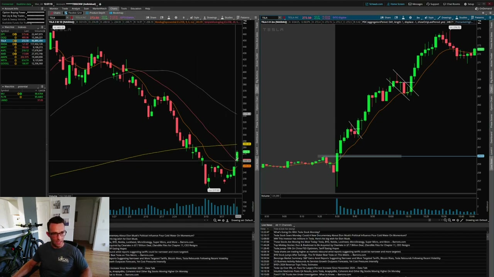
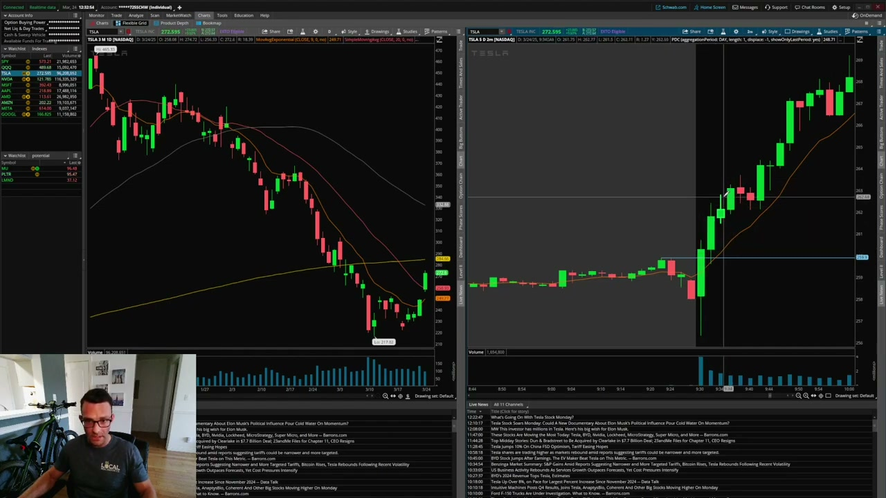
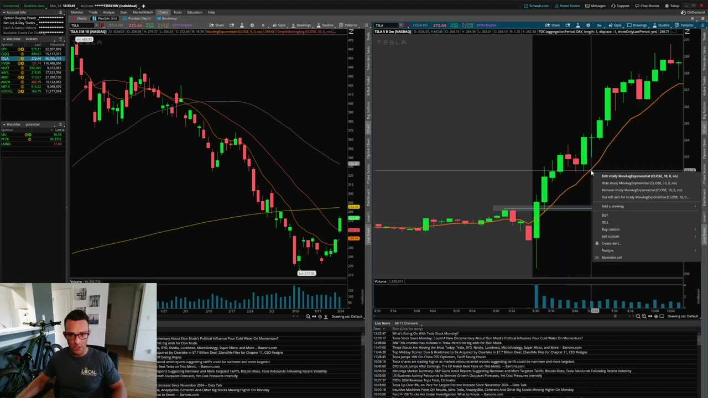
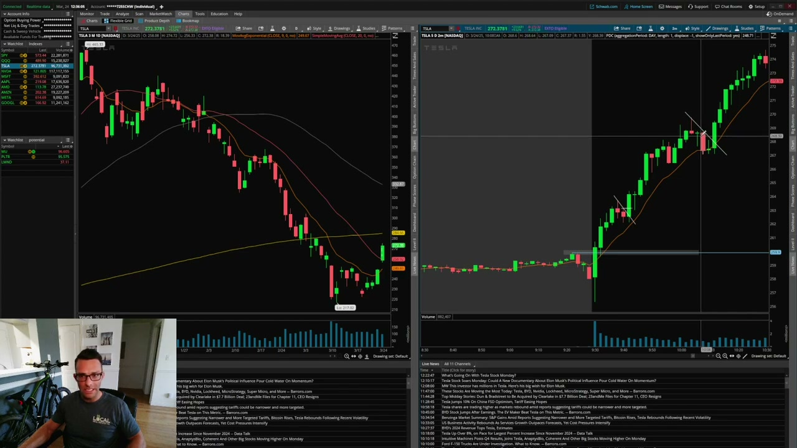
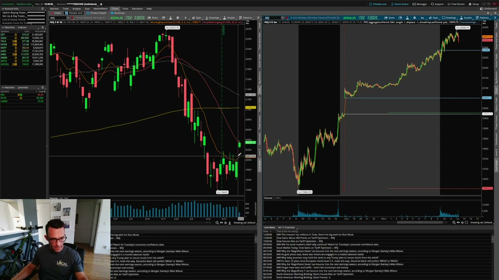
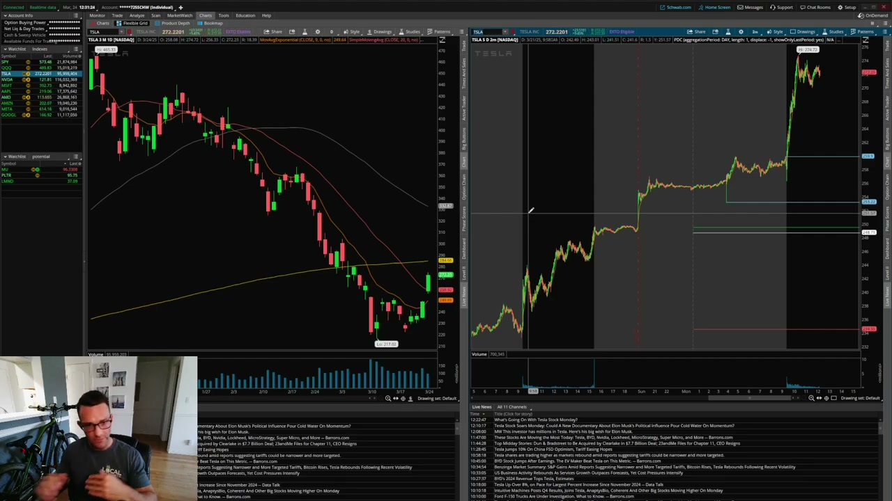
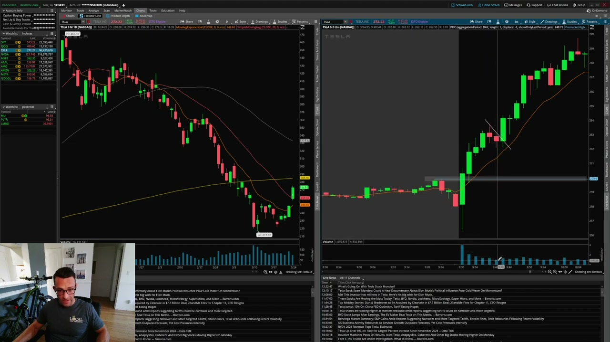
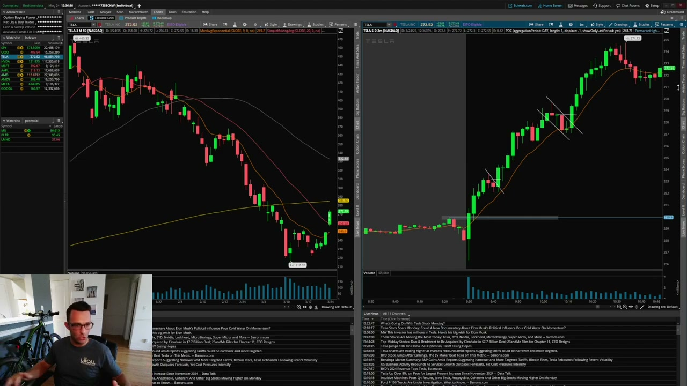

# Matt Diamond — Bull Flag Patterns EXPLAINED

영상: [https://www.youtube.com/watch?v=SNjtH42aCuk](https://www.youtube.com/watch?v=SNjtH42aCuk)
업로더: Matt Diamond (8:26, 2025-03-24)
실증 케이스: **TSLA 2025-03-24 1m 인트라데이** (Schwab thinkorswim)

## 0. 영상 위치 in 우리 자료군

| 자료 | 깊이 | 본 backtester 적용 |
|---|---|---|
| Ross Cameron "$1M in 51 days" (m5zu) | 종합 전략 + 위험관리 | 5 criteria + add-to-winner |
| Ross Cameron "Master Bull Flag" (DP4) | Bull Flag deep-dive + volume profile | 9 EMA, MTF, topping tail, BE stop |
| Patrick Wieland (aP3gw) | 개념 + 시각 식별 입문 | "healthy consolidation" 원칙 검증 |
| **Matt Diamond (SNjt) — 이 문서** | **상위 종목 + Context-first 트레이딩** | **PM high 게이트 정당화 + Green-Take-Red 진입 트리거 후보** |

Matt Diamond 영상은 Ross/Patrick과 결이 다름:
- 대상: **저-Float momentum runner**가 아닌 **TSLA 같은 대형주**
- 강조점: **컨텍스트 (overall market + daily chart + 종목 성격 + 촉매)** > 패턴 자체
- 진입 트리거: **"Green Take Red" candle** (직전 빨강 봉 high를 깨는 첫 초록 봉)
- 시간 프레임: 1m / 2m intraday + daily 컨텍스트
- 스타일: **스캘퍼** — $1~$2 빠른 익절

본 backtester는 Ross 룰 기반이지만, Matt의 **"Context-first"** 와 **"Green-Take-Red entry"** 두 가지가 추가 검증/구현 후보.

---

## 1. Matt Diamond 핵심 원칙 (영상 요약)

### 1.1 컨텍스트가 패턴보다 먼저

매일 random bull flag을 trade하면 **승률 매우 낮음**. Bull flag이 통하려면:

1. **Overall market 방향** (ES, NQ futures)이 같은 방향
2. **Daily chart**가 매수자 우호적 (저항 돌파 / 추세 전환)
3. **종목 personality** 인지 (TSLA의 large-ATR 성격 등)
4. **명시적 촉매** (어닝, 뉴스, 시장 sentiment shift)

이 4가지가 align된 날만 bull flag이 의미가 있다는 게 영상의 주된 메시지.



### 1.2 Pre-Market High = Critical Reference

Matt의 트레이딩 룰에서 PM high는 단순 저항선 이상:

- 시작가가 PM high **위에서 갭업**으로 열렸을 때 = bullish setup 가능
- 시작 후 dip → buyers step up → PM high **break + hold above** 확인
- PM high 위로 첫 풀백 = **1차 bull flag 셋업 위치**

영상에서 강조: "It's not a pre-market break, it's already broke pre-market high — then it does the first bull flag consolidation above pre-market high."



**본 backtester 연관**: `BullFlagDetector.premarket_high_by_date` 게이트가 이 룰과 직접 일치 → 영상-cross 정당화 자료.

### 1.3 10 EMA (9 EMA 변형)

Matt는 9 EMA 대신 **10 EMA** 사용. 이유는 단순 — "다른 사람들이 8/9를 쓰니까 살짝 다르게". 본질은 short-term moving average로서 풀백 지지 검증.

**룰**:
- 풀백이 10 EMA에서 hold → bull flag 살아있음
- 풀백이 10 EMA **밑으로 공격적 sell-off** → 반전 가능성, 게이트 X



**본 backtester**: `require_9ema_support` 게이트가 정확히 이 룰. period가 9 vs 10인 건 미세한 차이.

### 1.4 Green Take Red (GTR) Entry Trigger

Matt의 시그니처 entry 시그널:

> "I want to see the pullback, I want to see buyers really step up, and then watch a **green take red** right near that 10 EMA."

**정의**: 풀백 후 첫 green-bodied candle이 **직전 red candle의 high를 돌파**할 때 = entry trigger.

```
Pullback (red candle 1-2개)
  │  10 EMA 근처에서 hold
  ▼
GTR candle: green body, high > 직전 red high  ← 여기서 진입
  │
  ▼
Stop = GTR candle의 low (또는 10 EMA 살짝 아래)
```


**본 backtester 비교**:
- 현재 `BullFlagDetector`의 breakout 조건: `highs[j] > pole_end_price AND closes[j] > pole_end_price AND green`
- 즉 **폴 고점 돌파**가 기준 (Ross 정통)
- Matt의 GTR은 **풀백 직전 red 봉 high 돌파**가 기준
- 차이: 폴 high 돌파 (Ross) vs. 풀백 내 red high 돌파 (Matt) — Matt 룰이 **약간 빠른 진입**

→ 새 옵션 추가 후보: `entry_mode: "pole_break" | "green_take_red"`. 다만 우선순위 낮음 (Ross 룰 검증이 우선).

### 1.5 ATR을 고려한 stop 폭

Matt는 TSLA에 대해 "risk a point on Tesla = pretty good" 언급. **종목의 ATR 특성에 stop 폭을 맞추는 것이 합리적**임을 의미. AAPL/AMD 같은 low-ATR 종목에 같은 1$ stop = 너무 넓음.

**본 backtester**: `max_stop_distance_pct=0.05` (5%) 절대값 cap. **ATR 기반 동적 cap**으로 바꾸면 종목별 최적화 가능 — 향후 enhancement 후보.

### 1.6 Multiple Bull Flag = Continuation Strategy

영상에서 TSLA 1m 차트에 **2번의 bull flag** 확인:
- **1차 bull flag**: PM high 위 첫 풀백 → 10 EMA hold → GTR → entry
- **2차 bull flag (continuation)**: 1차 익절 후 다음 풀백 → 10 EMA 재테스트 → GTR → entry

Matt 표현: "secondary bull flag" — 추세가 살아있는 한 같은 종목에서 여러 번 entry 가능.



**본 backtester 연관**: `max_nth_pullback` 게이트가 이 개념과 호환. default=2면 첫·둘째 풀백 모두 허용. Matt 룰과 일치.

### 1.7 Earnings Season Catalyst

Matt 영상 후반부 — **earnings season에 bull/bear flag이 가장 잘 통함**:
- 어닝으로 gap up/down → 거래량 elevated → catalyst-driven momentum
- 평소 random bull flag보다 follow-through 확률 ↑

본 backtester: 현재 news catalyst 게이트 없음 (Ross 5 criteria의 #5도 미구현). 향후 enhancement 후보.

---

## 2. TSLA 2025-03-24 케이스 워크스루

영상 전반에 등장하는 단일 케이스. 1m / 2m 인트라데이.

### 2.1 Daily 컨텍스트



- TSLA가 daily에서 2주 sideways 후 **igniting candle on Friday + elevated volume**
- 월요일 (3/24) **gap up** + short-term MA 회복 + 저항선 돌파

### 2.2 Pre-Market



- PM gap up + nice sideways consolidation
- **PM high ≈ $260** — Matt가 이 level을 핵심 reference로 설정

### 2.3 Open


- 시초 dip (downside wick) → 매수자 즉시 진입
- Strong opening drive: $256 → $263 (3분 안)
- 명확히 PM high 위 hold

### 2.4 첫 Bull Flag → Entry



- 폴: 시초 + opening drive까지
- 풀백: 10 EMA까지 controlled selling, 거래량 감소
- 09:42에 **거래량 증가 + GTR candle** ($263 정도) — entry trigger
- Stop: GTR candle low, risk ~$1


### 2.5 2차 Bull Flag (Continuation)


- 1차 익절 후 추세 지속
- 10 EMA에 재차 풀백 (이번엔 처음 닿음)
- 살짝 EMA 밑으로 wick → 다시 위로 wick back → **GTR at 26864** → entry
- Stop: GTR low 또는 10 EMA 살짝 밑 (~$268)
- 익절: 다시 $1-$2 빠른 scalp

### 2.6 결론

영상 마무리:
> "Random bull flag every day → low win rate. But when market + daily + stock + catalyst align → very nice moves."



---

## 3. Ross / Patrick / Matt 비교 매트릭스

| 측면 | Ross Cameron | Patrick Wieland | Matt Diamond |
|---|---|---|---|
| **대상 종목** | 저-Float 모멘텀 (S/M-cap) | 일반 (AXON 사례) | **대형주 (TSLA)** |
| **시간 프레임** | 1m (sweet spot 09:30–11:30) | 1m + 5m | **1m + 2m + daily context** |
| **폴 정의** | 5-7 green candles, +5~10% | "almost vertical spike" | "strong opening drive" |
| **풀백 reference** | 9 EMA + 50% retrace | "tilted rectangle" | **10 EMA + GTR** |
| **Entry 트리거** | 폴 고점 돌파 (first new high candle) | trendline resistance break | **Green-Take-Red candle** |
| **Pre-market high** | 부수적 | 미언급 | **핵심 게이트** |
| **Stop** | 풀백 저점 | 풀백 저점 | **GTR candle low** (or 10 EMA 살짝 밑) |
| **Target** | HoD 재돌파 → 2R / 3R | (모호) | **빠른 $1-$2 scalp** |
| **위험관리** | Quarter-cushion, max 1 loss/session | 미언급 | **ATR-aware risk** ($1 on TSLA OK) |
| **컨텍스트 강조** | 5 criteria 게이트 | 미언급 | **컨텍스트 > 패턴** 최우선 |
| **Catalyst** | 5번째 criteria (news) | 미언급 | **earnings season 등 명시** |
| **추가 풀백** | "1st/2nd OK, 3rd cautious" | 미언급 | **continuation 명시적 trade** |

---

## 4. 본 backtester 적용 가능성 평가

### 4.1 즉시 적용 가능 (이미 코드에 있음)

| Matt 룰 | 본 backtester 코드 | 상태 |
|---|---|---|
| Pre-market high reference | `premarket_high_by_date` 게이트 | ✅ 구현 + 영상-cross 정당화 |
| Short-term MA hold during pullback | `require_9ema_support` (9 EMA, period diff 미세) | ✅ 구현 + Matt 사용은 10 EMA |
| Multiple bull flag in same session | `max_nth_pullback=2` | ✅ 구현 |
| Daily chart context | `require_daily_trend` (현 default OFF, SMA50) | ✅ 옵션 (Matt는 daily 시각적 확인) |

### 4.2 추가 검토 후보

| Matt 룰 | 현재 backtester | 추가 작업 |
|---|---|---|
| **Green-Take-Red entry trigger** | `breakout = highs[j] > pole_end` (폴 고점 돌파) | 새 `entry_mode` 옵션 — Matt 스타일은 풀백 내 red high 돌파 (살짝 빠른 entry) |
| **Overall market direction filter** | 없음 | SPY/QQQ daily trend pre-check (Tier 2) |
| **ATR-aware stop cap** | 절대값 `max_stop_distance_pct=5%` | 종목별 ATR 비례 cap (예: 1× ATR) |
| **News catalyst gate** | 없음 | Ross 5 criteria #5 — EODHD news API 필요 |
| **Earnings calendar awareness** | 없음 | 어닝 발표 D±2일 boost (또는 회피) |

### 4.3 본 backtester와 차이 (의도된 차이)

- **종목 universe**: 본 코드는 Ross 정통 저-Float (`max_float_shares=10M`) — Matt의 TSLA는 통과 불가능. 본 코드 default 그대로 유지.
- **Time-of-day**: 본 코드 `latest_entry_hour=12` — Matt의 컨텍스트-aware 룰과 충돌 없음.
- **Scalper vs. let-it-run**: Matt 스타일은 $1-$2 익절, 본 코드는 `target_at_r_multiple=2.0` (2R 익절) — 둘 다 가능, 사용자 옵션.

---

## 5. 영상 자료 파일 인덱스

```
docs/strategy_notes/images/video_frames_MD/
├── 000025_intro_individual_stocks_vs_indexes.jpg
├── 000045_es_nq_context.jpg                       (ES/NQ futures context)
├── 000114_tesla_daily_chart_context.jpg           (TSLA daily 2-week sideways)
├── 000142_premarket_gap_consolidation.jpg         (PM gap + sideways)
├── 000230_open_dip_buyers_step_up.jpg             (open dip + immediate buy)
├── 000248_premarket_high_break.jpg                (PM high break + hold above)
├── 000335_10ema_pullback_discussion.jpg           (10 EMA reference)
├── 000355_first_bull_flag_pullback.jpg            (1차 bull flag 형성)
├── 000419_first_green_take_red_candle.jpg         (GTR entry trigger)
├── 000435_entry_stop_logic.jpg                    (entry + stop placement)
├── 000509_first_buy_upside_move.jpg               (1차 익절 → 추세 지속)
├── 000555_secondary_bull_flag_268.jpg             (2차 bull flag at $268)
├── 000631_continuation_upside.jpg
├── 000646_random_bullflag_low_winrate_warning.jpg (컨텍스트 없이 random bull flag = 손실)
├── 000705_context_catalyst_principle.jpg          (context + catalyst align)
├── 000734_earnings_season_note.jpg                (earnings season note)
└── 000800_closing_recap.jpg
```

---

## 6. 결론 — Matt Diamond 영상의 backtester 시사점

영상에서 도출되는 **즉시 변경 사항: 없음**. 이유:
- Matt 룰의 핵심 (PM high, short-term MA hold, multiple flag, daily context)는 모두 **본 backtester에 이미 구현됨**
- Matt의 대상 (TSLA 같은 대형주)은 본 backtester 정통 (저-Float)과 별개 — 의도된 차이

영상의 **장기 enhancement 후보 3개**:
1. **Green-Take-Red entry mode** — Ross의 폴 고점 돌파보다 살짝 빠른 entry
2. **ATR-aware stop cap** — 종목별 변동성 고려 stop 폭
3. **Market regime filter (SPY/QQQ)** — overall market 방향과 align된 날만 trade

특히 **"random bull flag every day = low win rate"** 메시지가 본 backtester가 이미 강조하는 **컨텍스트 + 4-criteria 게이트** 의 정당성을 외부에서 입증.
