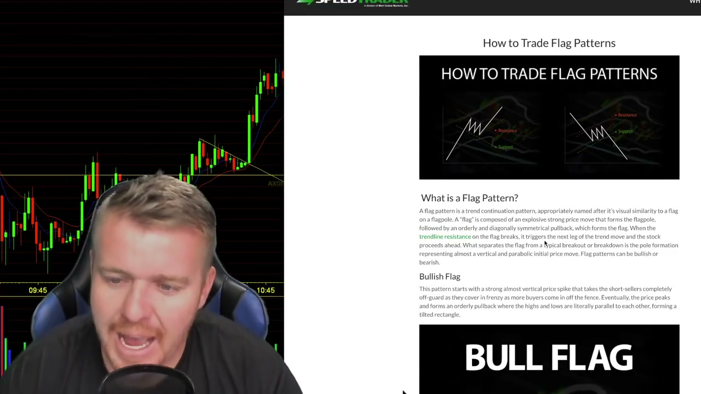
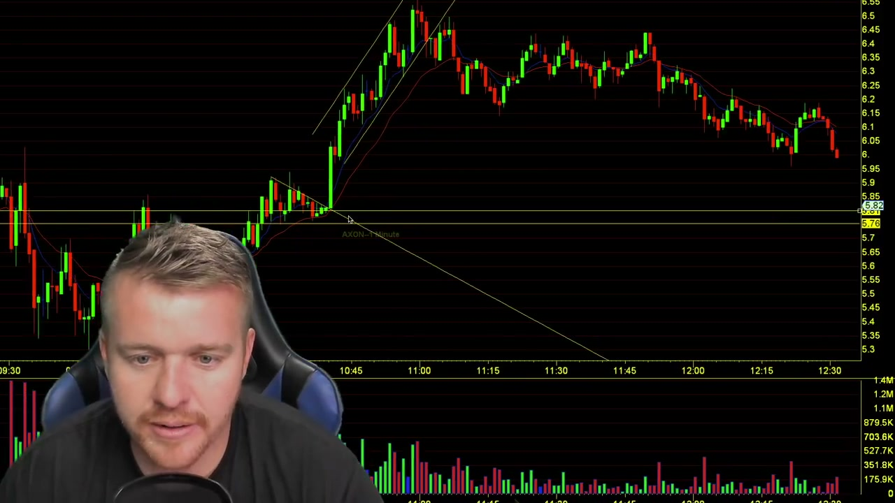
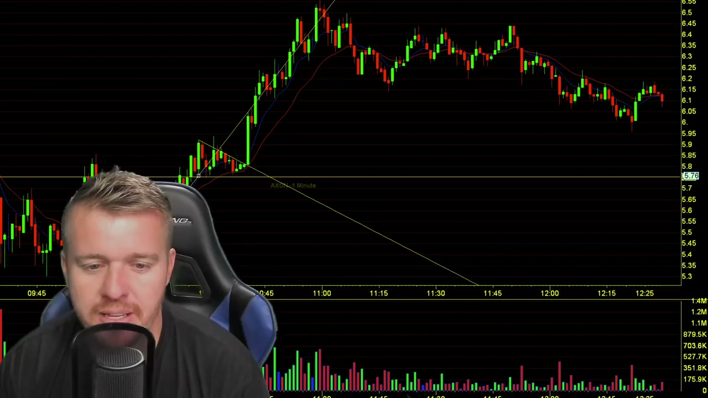
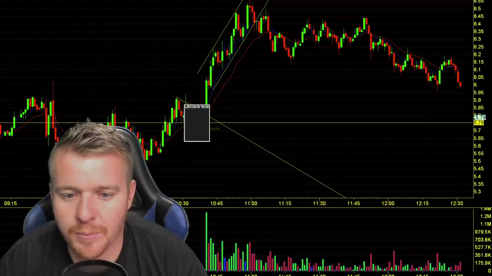
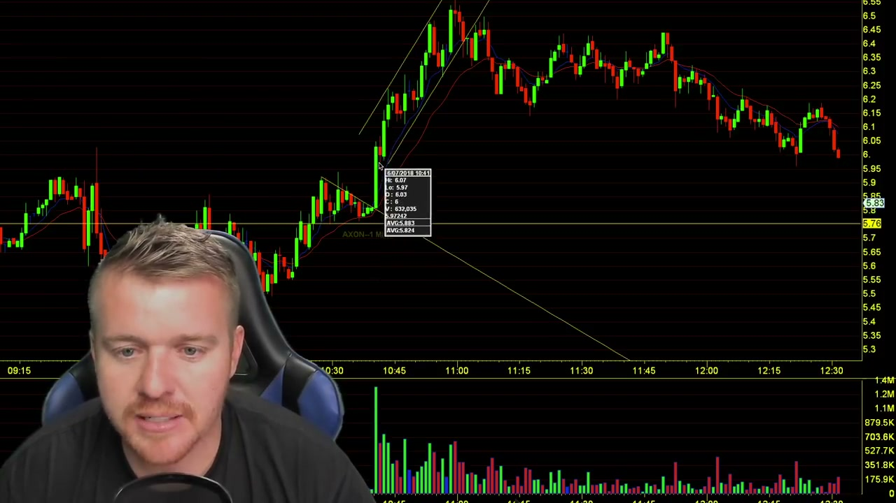
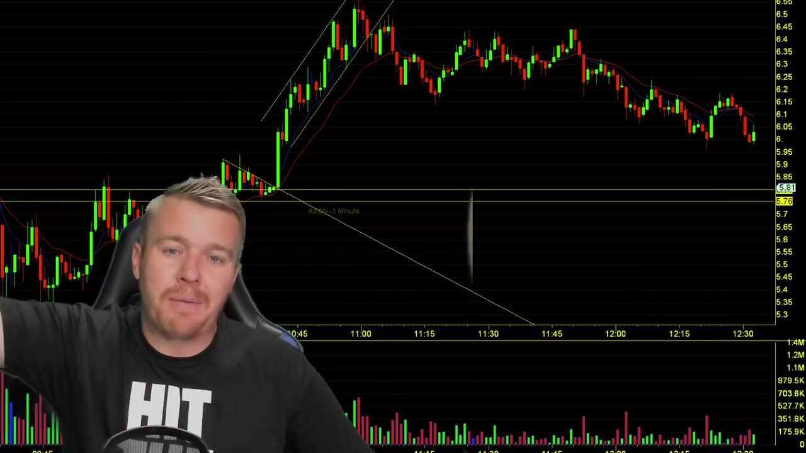
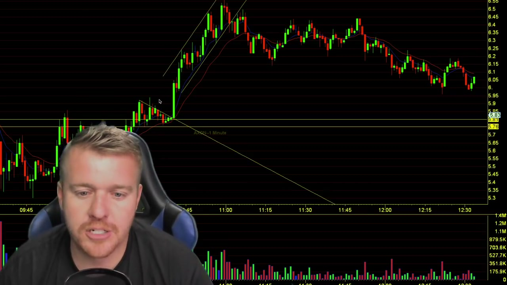
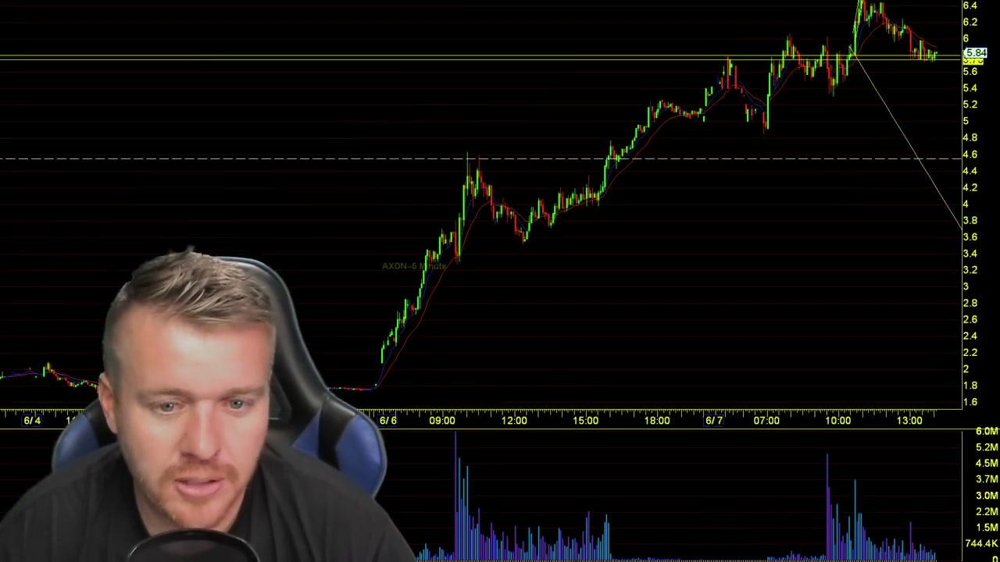

# Patrick Wieland — Day Trading Bull Flag Patterns

영상: [https://www.youtube.com/watch?v=aP3gwzqHxxQ](https://www.youtube.com/watch?v=aP3gwzqHxxQ)
업로더: Patrick Wieland (8:49)
공개: SpeedTrader 협찬 컨텐츠

## 0. 영상 위치 in 우리 자료군

| 자료 | 깊이 | 본 backtester 적용 |
|---|---|---|
| Ross Cameron "$1M in 51 days" (m5zu) | 종합 전략 + 위험관리 | 5 criteria + add-to-winner |
| Ross Cameron "Master Bull Flag" (DP4) | Bull Flag deep-dive + volume profile | 9 EMA, MTF, topping tail, BE stop |
| **Patrick Wieland (aP3gw) — 이 문서** | **Bull Flag *개념* + 시각적 식별 입문** | 시각적 정의 검증 + "healthy consolidation" 원칙 |

Patrick Wieland 영상은 Ross처럼 *수치적 룰*을 정의하지 않음 — Bull Flag 개념의 textbook 정의 + **AXON 2018-06-07 1m 차트 실례 1개**로 시각적 식별 훈련. 본 backtester에선 코드 추가 대신 **기존 정의 검증 + 차트 시각화 정통성 확인**에 사용.

---

## 1. 영상 핵심 인용 — Bull Flag 정의

영상 02:08에 SpeedTrader 교재 본문이 화면에 표시됨:



**Flag Pattern (정의)**:
> A flag pattern is a trend continuation pattern, appropriately named after its visual similarity to a flag on a flagpole. A "flag" is composed of an explosive strong price move that forms the flagpole, followed by an orderly and diagonally symmetrical pullback, which forms the flag. When the **trendline resistance** on the flag breaks, it triggers the next leg of the trend move and the stock proceeds ahead. What separates the flag from typical breakout or breakdown is the **pole formation representing almost a vertical and parabolic initial price move**. Flag patterns can be bullish and bearish.

**Bullish Flag (구체화)** — 영상 02:48:
> This pattern starts with a **strong almost vertical price spike** that takes the short-sellers completely off guard as they cover in a frenzy as more buyers come in off the fence. Eventually, the price peaks and forms an **orderly pullback** where the highs and lows are literally **parallel to each other**, forming a tilted rectangle. Upper and lower trendlines are plotted to reflect the parallel diagonal nature, and the breakout forms when the **upper resistance trendline breaks** again as price surges back towards the high of the formation and **explodes through** to trigger another breakout and uptrend move.

**가장 강조한 시각적 단서**:
> "The **sharper the spike** on the flagpole, the **more powerful** the bull flag can be."

---

## 2. AXON 2018-06-07 1m 차트 — 실증 케이스

영상 전반에 걸쳐 AXON 단일 케이스 분석. 화면 우측 위 ticker tag "AXON—1 Minute" 확인:



### 2.1 폴 (Pole) — 09:45 ~ 10:30

- 시작가 ~$5.30 (09:45 부근)
- 폴 종점 ~$6.45 (10:30 직전)
- 약 **+21.7% 인트라데이 폴** — 영상의 "sharper the spike, more powerful" 정통
- 폴 진행 봉 대부분 큰 body의 green candle

영상 03:34:
> "We're gonna call this **the flagpole** — this big move up here we break above that previous resistance"



### 2.2 풀백 (Flag) — 10:30 ~ 11:30

- 풀백 시작점 $6.45 (폴 peak)
- 풀백 저점 ~$5.80–$6.00 (10:45 부근)
- 약 **35–45% retrace** (영상은 정확 수치 명시 X)
- 풀백 후반 (10:50~11:25) **consolidation 박스** 형성 — $5.80 지지선
- 9 EMA (보라색)와 50 EMA (빨간색)가 ~$5.90에서 수렴하여 지지 역할

영상 04:24 — Volume 패턴 강조:
> "From 10:30 on the **volume is dying**, the volume is dying — you're consulting across there, looking, getting really tight. The **EMA**'s got everything lining up right in that area."



### 2.3 돌파 (Breakout) — ~11:30

- 돌파 시점에 폴 peak high ($6.45) 재돌파 시도
- 영상에서 "fake breakout 한 번 있지만 전체적으로 작동" 언급
- 영상의 정형: 폴 시작가 + 폴 height ≈ 익절 target ($5.30 + $1.15 = $6.45 ~ 또는 그 위)



---

## 3. Bull Flag Anatomy — Ross / 우리 코드와 비교

| 요소 | Ross 영상 | Patrick 영상 | 본 backtester (`BullFlagDetector`) |
|---|---|---|---|
| **폴 정의** | 5~7 green candles, +5~10% | "almost vertical price spike", sharper = stronger | `pole_lookback`=7, `pole_min_pct`=8%, `pole_min_green_bars`=3 |
| **풀백 길이** | 1~3 candles | "orderly pullback" (수치 X) | `flag_max_bars`=4 |
| **풀백 깊이** | 50% retrace 안쪽 | "tilted rectangle" — parallel highs/lows | `flag_max_retrace`=0.7 (default 0.5에서 완화) |
| **돌파 트리거** | 직전 캔들 high 돌파 | trendline resistance 깨짐 | `highs[j] > pole_end_price` + green |
| **Volume 풀백 중** | "light volume on red candles" | "volume is **dying**" | `pullback_volume_ratio`=0.7 |
| **돌파 거래량** | "even higher volume" (정성) | (영상 명시 X) | `breakout_volume_ratio`=0.0 (opt-in) |
| **EMA 지지** | 9 EMA 모든 시간프레임 | "EMAs lining up" (수치 X) | `require_9ema_support`=True, tolerance 2.5% |

→ Patrick 영상은 Ross 영상의 **상위 집합** — 같은 패턴을 더 느슨하게 정의. 본 코드는 Ross 룰 베이스라 Patrick 룰을 자동 만족.

---

## 4. Patrick 영상 특화 인사이트

### 4.1 "Healthy Consolidation" 원칙 (영상 05:29)

> "A stock that **just goes straight up — that's not healthy**, it's not good. Because what happens is, stock goes straight up, it comes **straight back down**. ... For a stock to move in a healthy way, you really want to see this kind of a nice big move → consolidation → nice big move → consolidation."



**우리 코드 반영**: `pullback_volume_ratio` 게이트가 정확히 이 원칙 — 폴 거래량 많고, 플래그 거래량 줄어들면 healthy. flag/pole < 0.7이 그 정량화.

### 4.2 Short Squeeze가 돌파를 가속 (영상 06:32)

> "Once the shorts can't hold it down and get that squeeze — shorts are trying to cover, they're trying to cover, they're trying to cover — and **boom boom boom**, they're covering it there."



**메커니즘**: 폴 + 풀백 동안 short interest 누적 → 돌파 시 stop-loss covering 폭풍 → 거래량 + 가격 폭증. 본 backtester의 `breakout_volume_ratio` 옵션 (default 0.0, opt-in 0.5~1.0)이 이 효과 활용 가능.

### 4.3 Bull Flag = Cup-and-Handle 변형 (영상 07:00)

> "I guess you could really kind of call this almost a **cup and handle** as well... on the larger time frame you can maybe see a better cup and handle."



**시사점**: 동일 패턴이 시간프레임에 따라 cup-and-handle vs bull flag로 보일 수 있음. 1m → bull flag, 5m/15m → cup-and-handle. **Multi-timeframe alignment** (Ross DP4 영상)의 또 다른 관점 — 우리 `enable_mtf_check` 옵션 정당화.

---

## 5. 본 backtester 적용 제안

Patrick 영상에서 새로 도출되는 코드 변경 사항: **없음**. 기존 룰이 영상 정의를 이미 포함.

대신 **검증 자료**로서:

| 항목 | 활용 |
|---|---|
| AXON 6/07/2018 1m 케이스 | 본 detector의 시각적 정통성 unit test 후보 (synthetic test로 reproduce 가능) |
| "Healthy consolidation" 원칙 | `pullback_volume_ratio` 게이트의 정당성 외부 검증 |
| Cup-and-handle 변형 언급 | MTF 게이트의 영상-cross 근거 |
| 폴 sharpness 강조 | `pole_min_pct` default 0.08 (영상 정통) 유지 근거 |

---

## 6. 영상 자료 파일 인덱스

```
docs/strategy_notes/images/video_frames_PW/
├── 000030_intro_title.jpg
├── 000113_first_bullflag_descending_triangle.jpg
├── 000140_bullflag_5min_chart.jpg
├── 000208_definition_intro_text.jpg          (SpeedTrader 교재 본문)
├── 000245_bullish_flag_start.jpg
├── 000334_flagpole_identification.jpg        (폴 라벨링)
├── 000342_pullback_area_570s.jpg             (풀백 영역 마크)
├── 000424_consolidation_with_ema.jpg         (EMA 수렴 강조)
├── 000442_breakout_to_581.jpg
├── 000509_support_buy_area.jpg               (전체 AXON 차트 + 진입 영역)
├── 000530_healthy_consolidation_explanation.jpg
├── 000610_breakout_586.jpg
├── 000623_volume_decrease_in_flag.jpg
├── 000632_short_squeeze_explanation.jpg
├── 000700_cup_and_handle_naming.jpg
├── 000714_larger_timeframe_cup.jpg
└── 000800_closing_recap.jpg
```

---

## 7. Patrick Wieland vs Ross Cameron — 요약 비교

| 측면 | Patrick Wieland (aP3gw) | Ross Cameron (m5zu + DP4) |
|---|---|---|
| 영상 길이 | 8:49 | 1h+ × 2개 |
| 깊이 | 개념 + 시각 식별 | 수치 룰 + 위험관리 + 실거래 |
| 정량적 룰 | 거의 없음 | 5 criteria (gap/RVOL/price/float/news) |
| 위험관리 | 언급 X | quarter-cushion, max session losses |
| 핵심 contribution | **"healthy consolidation"** 원칙 | 정량 entry/stop/target, 9 EMA, MTF |
| 적용 backtester | 시각적 검증 자료 | 코드 룰 기반 |

본 backtester는 Ross 영상 룰을 기반으로 구현. Patrick 영상은 동일 패턴의 시각적/개념적 정의 보완 자료로 활용.
