# Ross Cameron — "Master the Bull Flag Trading Pattern" 심화 정리

**출처 영상:** [Master the Bull Flag Trading Pattern TODAY (Step-by-Step Guide)](https://www.youtube.com/watch?v=DP4ayEWhmvM)
**진행자:** Ross Cameron (Warrior Trading)
**영상 길이:** 약 58분
**자료 추출 워크플로:** [`.claude/scripts/extract_youtube_tutorial.sh`](../../.claude/scripts/extract_youtube_tutorial.sh)

> 첫 영상 [`ross_cameron_million_in_51days.md`](ross_cameron_million_in_51days.md) 의 **Bull Flag 부분만 더 깊게 파고든 영상**. 5 criteria / 더블링 / 사이즈 룰 같은 거시 룰은 첫 영상과 동일하므로 여기서는 **Bull Flag 패턴 자체의 미세 조정 룰**에 집중한다.

---

## 0. 첫 영상 대비 새로 추가된 6가지 인사이트

| # | 새 룰 | 첫 영상 | 이번 영상 |
|---|---|---|---|
| 1 | **Float cap** | < 10M | **< 20M** (완화) |
| 2 | **Pullback 깊이** | ≤ 50% retrace | **≤ 25% 선호 / 50% 하드캡** (엄격화) |
| 3 | **Volume profile** | 언급만 | **명시 필수**: pole 高 / flag 低 / breakout 高 |
| 4 | **9 EMA** | 미언급 | 1m/5m/daily 공통 — 풀백 지지선 |
| 5 | **200 EMA/SMA** | 미언급 | 일봉에서 인접하면 저항으로 reject |
| 6 | **Multi-timeframe alignment** | 미언급 | 1m + 5m 동시 풀백이면 confluence |

추가로 **Topping tail / Bottoming tail / Half-dollar / Whole-dollar 심리적 레벨** 같은 미시적 트리거가 더 자세히 다뤄짐.

---

## 1. 영상 도입부 — Bull Flag 패턴 해부

Bull Flag을 초보자에게 가르치는 이유 두 가지:
1. **차트에서 즉시 식별 가능** — 한 번 익히면 절대 놓치기 어려움
2. **세 가지 가격이 패턴 자체에 박혀 있음** — Entry / Max Loss / Profit Target이 패턴 구조에 의해 자동 결정. 초보자의 "어디서 사야 하지?"라는 협상 여지 자체를 제거.

영상 도입부 화이트보드 — 폴 + 풀백 + 신고가 캔들 + 익절 곡선:

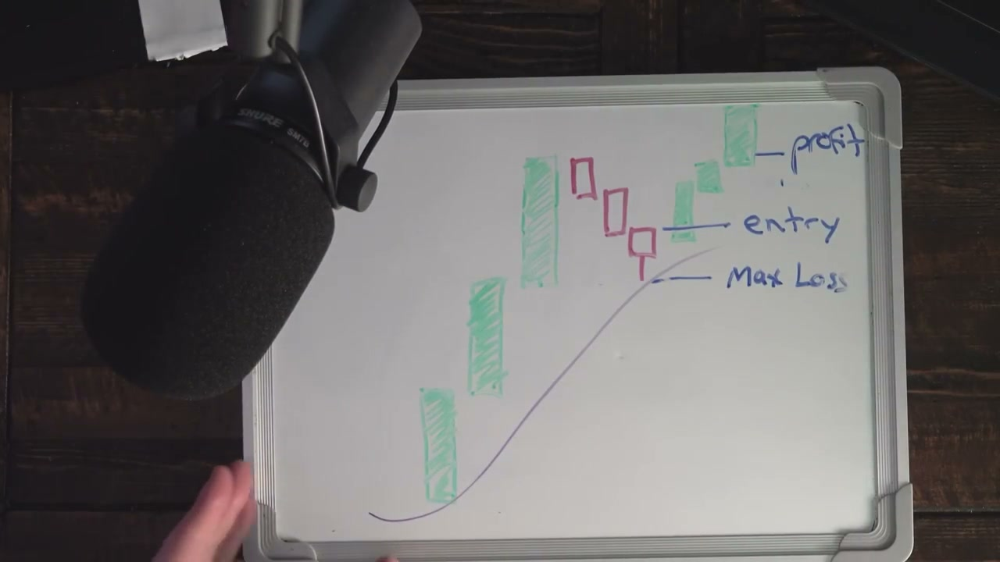

3-point 구조 (entry / max loss / profit) 손글씨 라벨링:

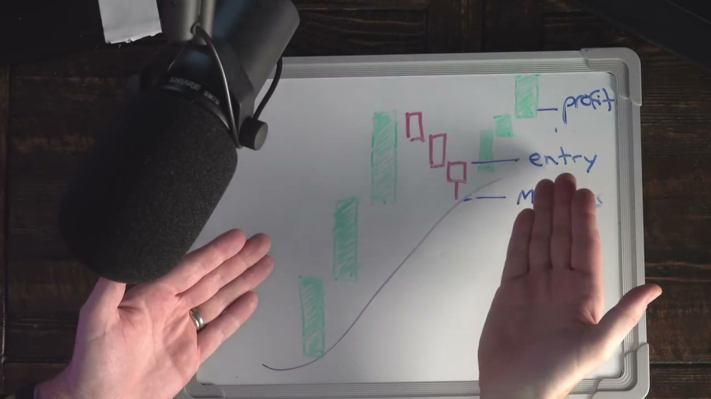

| 항목 | Bull Flag에서의 정의 |
|---|---|
| **Entry** | 풀백 끝 직후 첫 신고가 캔들 (= 직전 캔들 high 돌파) |
| **Max Loss** | 풀백의 가장 낮은 low |
| **First Profit Target** | 당일 고점(HoD) 재돌파 |
| **Second Profit Target** | 그 위 continuation (다음 풀백 또는 둥근 가격) |

Trend curve 추가본 — pole→flag→continuation의 매크로 추세 흐름:

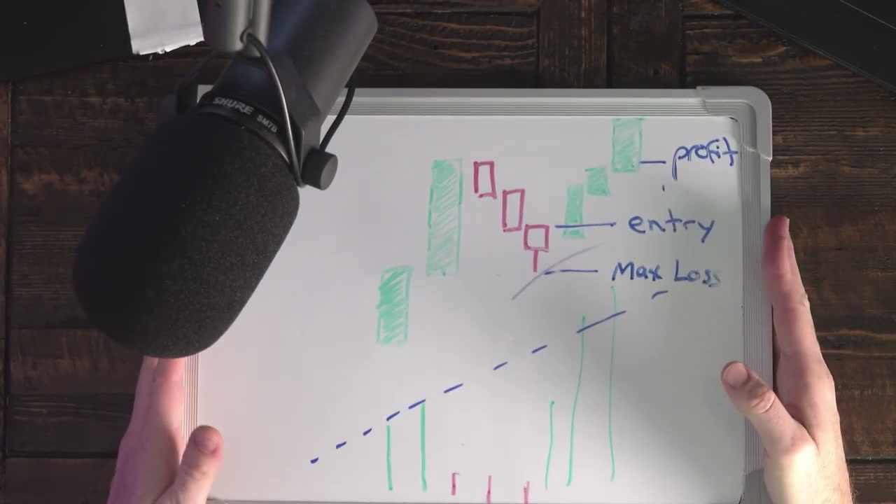

---

## 2. 가장 중요한 새 룰 — Volume Profile

영상에서 가장 강조한 부분. **Volume 없이는 Bull Flag을 판독할 수 없다.**

### 2.1 정상 Bull Flag의 거래량 모양

```
┌── 큰 그린 봉 (高 거래량) ─── 폴
├── 큰 그린 봉 (高 거래량)
├── 작은 레드 봉 (低 거래량) ── 풀백
├── 작은 레드 봉 (低 거래량)
└── 큰 그린 봉 (突 高 거래량) ── 신고가 돌파
```

영상의 **SPWR 슬라이드** — Light Vol Selling + MACD signal line above:

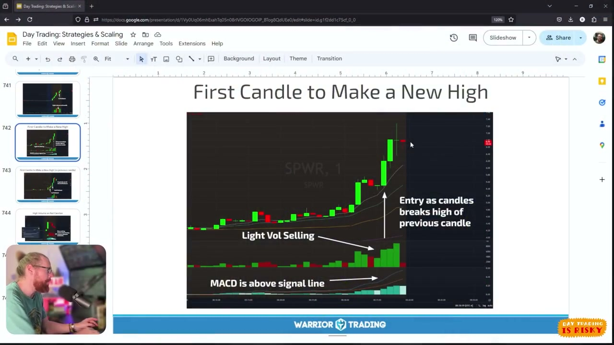

SPWR 차트 라이브 형태 (동일 슬라이드, 강조 표시 변형):

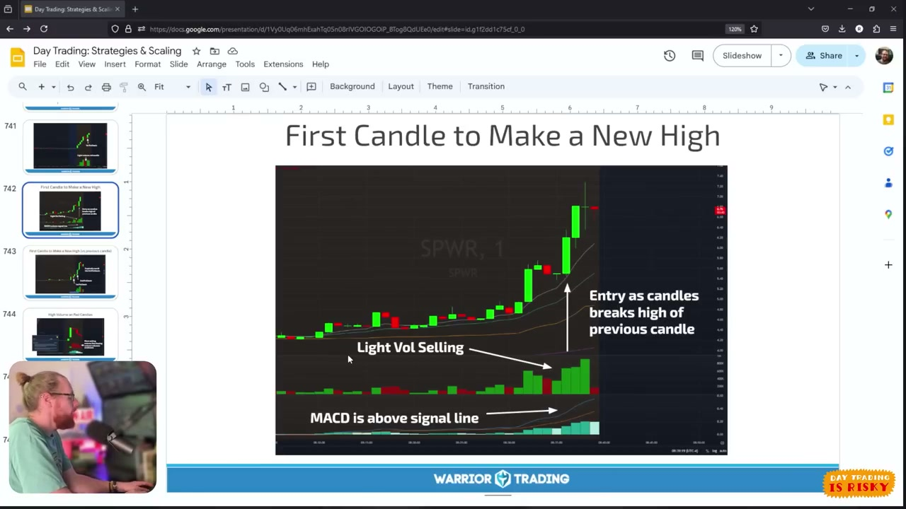

화이트보드 — 풀백 시점에서 어떤 거래량 패턴을 봐야 하는지 손글씨 정리:

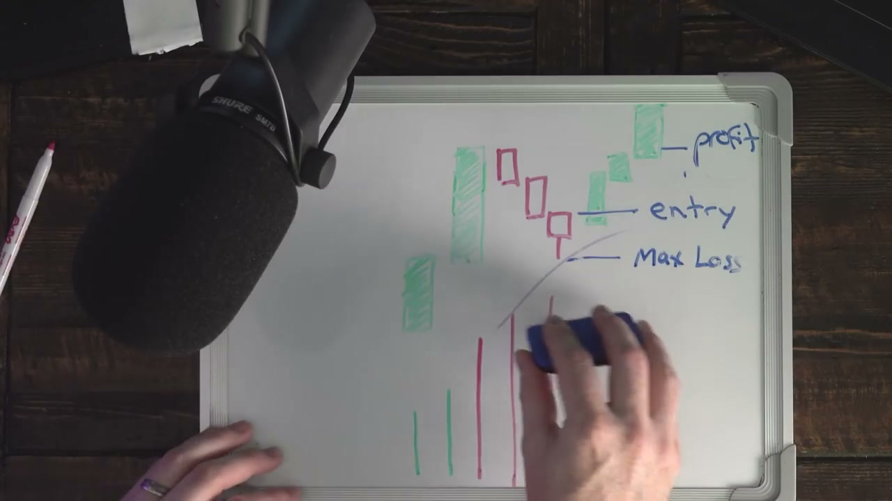

### 2.2 Counter-example — High Volume on Red Candles

영상에서 직접 인용한 카운터 예시. **MDJH** 차트:

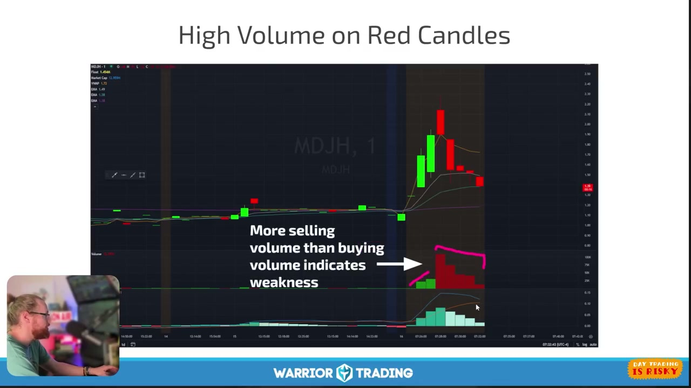

- 폴 거래량 弱 + 풀백 거래량 强 → **bull flag fake**
- 신고가 캔들이 형성되더라도 즉시 거부
- 영상은 Volkswagen 파트너십 호재 뉴스에도 fade한 사례를 추가 인용

### 2.3 Backtester에 어떻게 녹일까

| Filter | 검증식 |
|---|---|
| 폴 거래량 | `mean(volume[pole_green_bars]) ≥ session_avg_volume` |
| 풀백 거래량 | `mean(volume[flag_red_bars]) < mean(volume[pole_green_bars]) × pullback_volume_ratio` (예: 0.7) |
| 돌파 거래량 | `volume[breakout_bar] ≥ mean(volume[pole_green_bars]) × breakout_volume_ratio` |

기본 threshold 후보:
- `pullback_volume_ratio = 0.7` — 풀백 평균 거래량이 폴 평균의 70% 이하
- `breakout_volume_ratio = 1.0` — 돌파봉 거래량이 폴 평균 이상

---

## 3. Pullback 깊이 — 25% 선호, 50% 하드캡

영상의 **AWIN 라이브 차트** — 1st & 2nd Pullbacks가 가장 잘 통한다는 슬라이드:

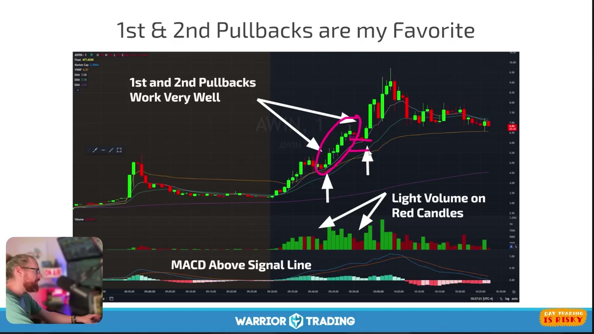

| Retrace | 영상 평가 |
|---|---|
| ≤ 25% | **이상적** (top 25% of range) |
| 25 ~ 50% | 허용 가능, 약간 약함 |
| > 50% | **하드 reject** — bullish 구조 깨짐 |

**이전 detector 기본 설정 (`flag_max_retrace=0.7`)은 이번 영상 기준으로는 너무 lenient.** 권장 새 default:
- 권장 strict mode: `flag_max_retrace=0.25` (영상 이상치)
- 보통 mode: `flag_max_retrace=0.5` (영상 hard cap)
- 백테스트 default 30~40% 사이로 좁히는 것이 영상 의도에 부합

---

## 3.5 Entry / Stop / Take-Profit 조건 — 영상 정통 룰 + ALGS 실증

영상에서 Ross가 명시적으로 정의한 3가지 trade-execution 가격대. 영상 표현은
"three very important prices … part of the construction of the pattern"로,
패턴 구조 자체에 박혀 있는 가격이라 협상 여지가 없다고 강조.

### 3.5.1 Entry — 폴 고점 돌파

**영상 룰** (Ross의 직접 표현 요약):
- "first candle to make a new high" — 풀백이 끝난 후 직전 폴 고점을 돌파하는 첫 캔들이 트리거
- "the second it breaks 305 and goes to 306 it's made a new high — that is our indicator to be a buyer"
- "I'm willing to pay 306 307 a couple cents higher and be in the trade" *(실제 시장에서 stop-limit slippage가 발생한다는 코멘트 — 백테스트는 이 1~2¢을 simulate하지 않고 idealized **pole_end_high** 가격에 체결)*

→ **백테스트 정의: entry_price = pole_end_high (idealized, no slippage buffer)**.
영상 ALGS 사례에서 10:45의 close ($7.94) = 폴 윈도우 최고점. 사용자 화면의 entry line이 정확히 이 가격에 그려짐.

영상 화이트보드 — Ross의 "$3.06 entry" 예시:


영상 슬라이드 — "Entry as candle breaks high of previous candle" 주석:


영상 NBEV 사례 — 진입 화살표가 폴 고점 돌파 시점:

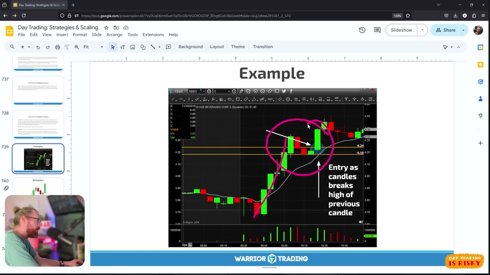

### 3.5.2 Max Loss — 풀백 저점

**영상 룰**:
- "the low of the pullback is your max loss"
- "If price violates this level the FVG's structural support is broken" (개념적 동치)

→ **백테스트 정의: stop_loss = flag_low (idealized, no tick buffer)**.
풀백 도중 가장 낮았던 low가 stop. ALGS 사례에서 10:47의 low ($7.86) = stop. 풀백 저점이 깨지면 bull flag 구조 자체가 무효.

영상 화이트보드 — profit / entry / Max Loss 3-point 도식:


영상 화이트보드 — Bull Flag 손절선 X 마커:


### 3.5.3 Take-Profit — 1차 타깃 = HoD 재돌파 (≥ 2:1 R/R)

**영상 룰**:
- "first target is a retest of high of day"
- "second target is continuation higher"
- "I won't take the trade if I don't think I can get 326" (target/risk 비가 2:1 미만이면 진입 자체 X)

→ **정의 1차 target**: 당일 고점(HoD) 재돌파 가격.
→ **사전 R/R 게이트**: `(target − entry) / (entry − stop) ≥ 2.0` 미만이면 trade 자체 skip.
→ Backtest fixed-target 옵션: `entry + N × risk` (default 2R).

영상 화이트보드 — entry/stop/target 산수 (3.06 / 2.96 / 3.26):

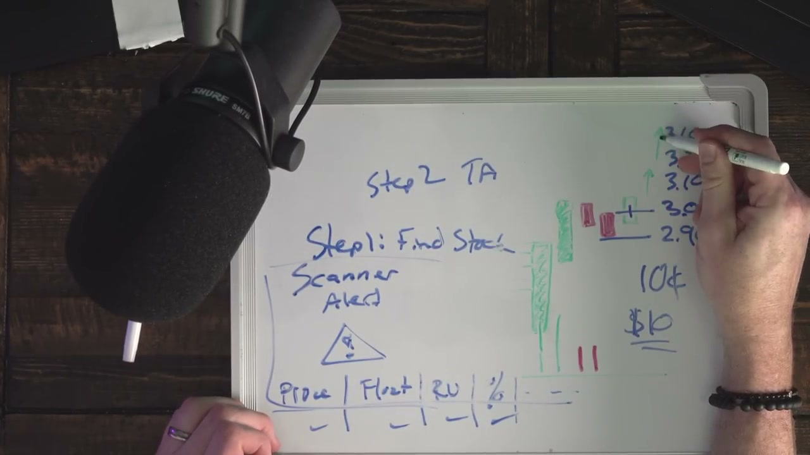

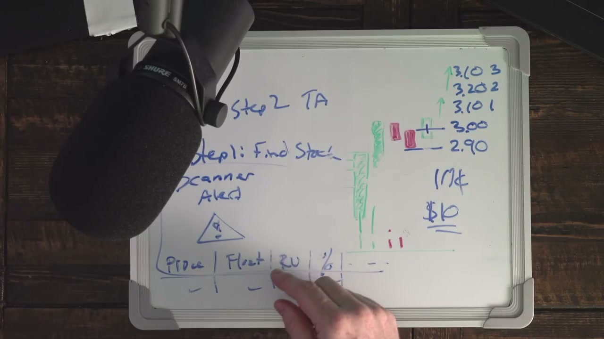

### 3.5.4 패턴 구조와 3개 가격의 관계 (영상 도식)

폴 + 풀백 + 첫 신고가 캔들의 anatomy 위에 3개 가격이 자연 배치됨:


```
                       ━━━━━━━ profit (HoD or entry+2R)  ──┐
                                                            │ R = 2 × risk
        ▲      ━━━━━━━ entry  (= pole_end_high)         ──┤
       ▲▲▲                                                  │ R = risk
      ▲▲▲▲   ━━━━━━━ Max Loss (= flag_low)              ──┘
     ▲       \ ▼
    ▲         \▼▼ (pullback)
   ▲           \▼  (flag_low ↑ stop reference)
  ▲(pole)
```

---

### 3.5.5 ALGS 2026-04-16 실증 케이스 — 룰 적용 1:1 매핑

페이지 데이터(yfinance via composed market adapter) 기준 1m bar별 분석.

#### 입력 1m 봉 (10:38 ~ 10:55, ET)

| 시각 | OHLC | 색깔 | 역할 |
|---|---|---|---|
| 10:38 | 7.700/7.700/7.700/7.700 | ⬜ | 무거래 (zero-range, detector reject) |
| 10:39 | 7.685/7.685/7.670/7.670 | 🔴 | 사이드웨이 |
| 10:40 | 7.628/7.628/7.620/7.626 | 🔴 | 사이드웨이 |
| 10:41 | 7.620/7.620/7.585/7.620 | 🔴 | **lowest low → pole_start** |
| 10:42 | 7.620/7.670/7.610/7.670 | 🟢 | pole 시작 |
| 10:43 | 7.660/7.7045/7.600/7.690 | 🟢 | pole |
| 10:44 | 7.690/7.860/7.690/7.860 | 🟢 | pole (큰 body) |
| **10:45** | **7.870/7.940/7.870/7.940** | 🟢 | **pole_end_high $7.94** ★ |
| 10:46 | 7.915/7.930/7.880/7.930 | 🔴 | 풀백 1봉째 |
| 10:47 | 7.865/7.9299/**7.860**/7.865 | 🔴 | 풀백 저점 **flag_low = $7.86** ★ |
| **10:48** | **7.865/7.970/7.865/7.970** | 🟢 | **돌파 캔들** — high $7.97 > pole_end $7.94 ★ |
| 10:49 | 7.940/8.100/7.900/8.054 | 🟢 | 진입 후 +1봉 |
| 10:50 | 8.060/8.090/8.0401/8.065 | 🟢 | |
| **10:51** | **8.060/8.250/7.970/8.140** | 🟢 | **TP 발사** — high $8.25 ≥ target $8.15 ★ |

#### 영상 룰 → 가격 적용

| 영상 룰 | ALGS 4/16 적용 결과 |
|---|---|
| Entry = pole_end_high (idealized) | $7.94 (10:45 high/close) = **$7.94** |
| Max Loss = flag_low (idealized) | $7.86 (10:47 low) = **$7.86** |
| Risk per share | $7.94 − $7.86 = **$0.08** |
| Target (2R) | $7.94 + 2 × $0.08 = **$8.10** |
| R/R 게이트 | (target − entry) / risk = $0.16 / $0.08 = **2.0 ✓** |

#### 시뮬레이션 결과 (page default 파라미터)

| Bar | Stop check | TP check | Add check | 액션 |
|---|---|---|---|---|
| 10:48 | (entry bar — skip) | — | — | **Position open @ $7.94**, shares N |
| 10:49 | low 7.90 > $7.86 ✓ | high 8.10 ≥ $8.10? edge | close 8.054 < add$8.06 | hold (TP는 high≥target, 만약 안 찍으면 hold) |
| 10:50 | low 8.04 > $7.86 ✓ | high 8.09 < $8.10 | close 8.065 ≥ add$8.06 → **add fires** | shares 2x, BE stop = entry $7.94 |
| **10:51** | low 7.97 > $7.94 ✓ | **high 8.25 ≥ $8.10 ✅** | (skip — TP fired) | **Exit @ $8.10** |

→ **Take-profit 체결 — 영상 textbook 그대로**:
- 진입가 $7.94 (idealized)
- 익절가 $8.10 (= entry + 2R)
- 보유 시간: 3분 (영상 평균 winner hold time과 정확히 일치)

> **Add 후 BE stop 정책 (영상 정통)**: add 발화 시 평단가가 아니라 *최초 entry 가격* ($7.94)으로 stop을 끌어올림. 평단가($8.00) - 0.3% = $7.97에 두면 add 직후 wick 한 번에 즉시 BE stop이 발사되어 LOSS로 처리됨 — Ross의 영상 표현 "stop at original entry, worst case I'm flat on initial size"와 정면 충돌. 본 backtester는 영상 정통 룰(BE = 최초 entry)로 구현.

#### Second-pullback 게이트 — 첫 익절 후 재진입 룰

영상 룰 ("first and second pullback work very well"):
- "First pullback" = 첫 폴 + 첫 풀백 후 진입
- "Second pullback" = 첫 익절 후 **새로운** 추진(continuation) → **새로운** 풀백 → 다시 진입
- 핵심: 두 번째 진입의 폴은 **첫 trade가 종료된 후의 신규 가격 액션**으로만 구성돼야 함

ALGS 4/16 실증 — 검출기는 다음 3개 신호를 모두 잡지만, 후순위 2개는 **strategy 단계에서 reject**:

| 신호 | entry | pole_start | pole_end | 판정 |
|---|---|---|---|---|
| 1 | 10:48 | 10:41 | 10:45 | ✅ 첫 trade — 폴 전체가 pre-entry 시점 |
| 2 | 10:56 | 10:47 | 10:51 | ❌ pole_start (10:47) ≤ last_exit (10:51) → **reject** |
| 3 | 10:58 | 10:51 | 10:56 | ❌ pole_start (10:51) ≤ last_exit (10:51) → **reject** |

신호 2의 폴은 **10:47~10:51을 잡고 있는데**, 이 구간은 첫 trade의 풀백+hold+exit 봉. 즉, 신호 2의 폴은 첫 trade의 up-move를 *재활용*하는 셈 — 영상의 "second pullback = NEW pole" 룰 위반. 사용자 표현으로 "익절하고나서 bullish candle이 두개밖에 안 되는데 다시 들어가는" 케이스.

→ **Backtester 정의: `signal.pole_start_ts > last_exit_ts` (strict)** 일 때만 진입 허용.
세션 변경 시 `last_exit_ts`는 None으로 리셋.

#### 영상 anatomy → 실제 ALGS 매핑 시각화

영상 25% 풀백 룰 슬라이드와 비교:


ALGS 풀백 retrace 검증:
- pole height = $7.94 − $7.585 = $0.355
- flag_low retrace = $7.94 − $7.86 = $0.08
- retrace ratio = 0.08 / 0.355 = **22.5%**

→ 영상의 idealized "≤ 25%" 안쪽으로 들어가는 textbook 풀백.
영상의 AWIN 사례와 거의 동일한 구조 (light volume on red, retrace top 25% range).

#### Volume profile 검증 (영상 룰: pole 高 / flag 低)

| 구간 | 평균 거래량 | 비율 |
|---|---|---|
| Pole green bars (10:42~10:45) | 4,713 | (baseline) |
| Flag red bars (10:46~10:47) | 3,167 | flag/pole = **0.67 ≤ 0.7 ✓** |

→ 영상의 "light volume on red candles" 정통 통과. 풀백 거래량이 폴 거래량의 67%로
30%+ 감소.


영상은 9 EMA를 모든 시간 프레임(1m / 5m / daily) 공통으로 사용한다고 명시.

**NBEV 차트** — 풀백 저점이 9 EMA에서 멈추고 신고가 캔들에서 돌파한 사례:


- 풀백 저점이 9 EMA 부근에서 멈추면 강한 신호
- 9 EMA를 깊게 깨면 풀백이 단순 차익실현이 아닐 가능성

**Backtester 적용**:
- 인트라데이 9 EMA 컬럼 추가
- 옵션 필터: `flag_low ≥ 9 EMA - tolerance × ATR`
- Page 차트에 9 EMA 오버레이 추가

---

## 5. 200 EMA / 200 SMA — 일봉 저항

영상은 daily 200 EMA / 200 SMA를 저항선으로 체크하는 흐름을 직접 시연. 진입가가 200 EMA에 가까우면 reject.

**SNGX 라이브 멀티 차트** — Day Trade Dash 패널에서 5m / 1m / 1d / 10s 동시 표시:

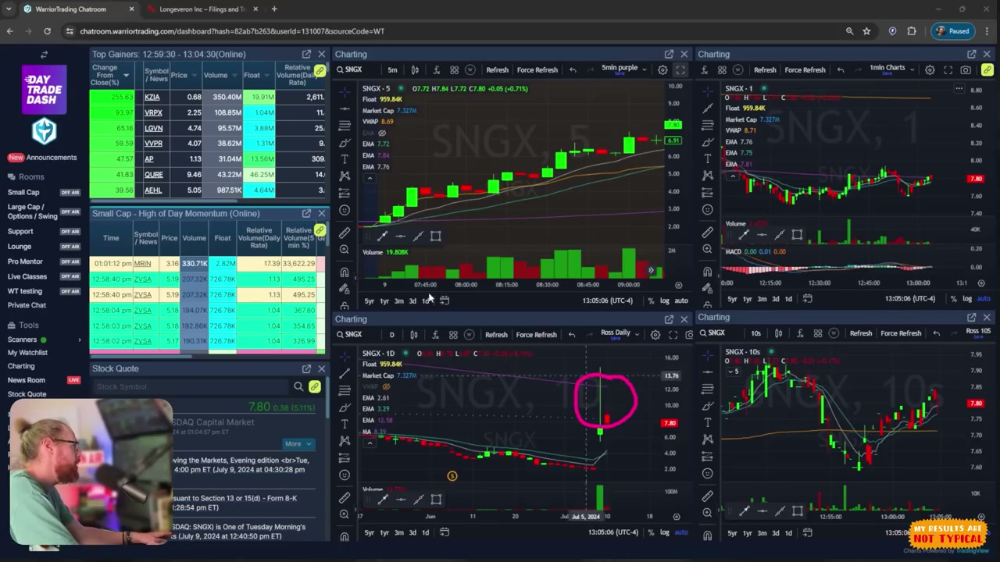

영상에서 한 종목이 200 EMA에 부딪혀 돌파 실패한 사례가 거론됨.

**Backtester 적용**:
- Daily 200 EMA + 200 SMA 계산
- 옵션 필터: 진입가가 두 라인 중 어느 것 아래로 `min_distance_atr × daily_ATR` 이내면 reject

---

## 6. Multi-Timeframe Alignment

1m 차트에서 bull flag 형성 + 5m 차트에서도 동일 시점에 풀백/돌파 형성 = **double confirmation**.

화이트보드 — multi-timeframe 개념 도식 (bull flag candles inside circle):

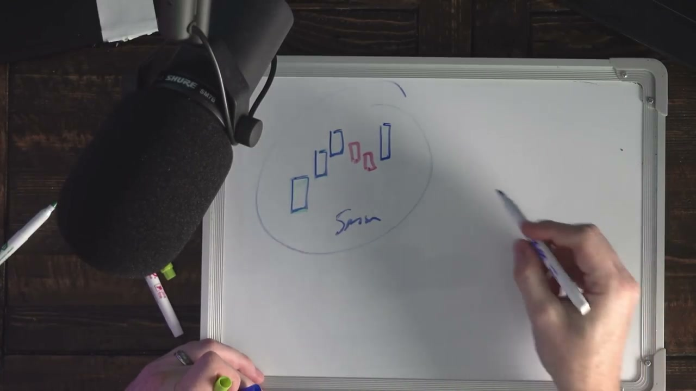

### 6.1 Ross의 정확한 표현 (영상 33:30~35:00 VVPR 라이브 인용)

VVPR을 화면에 띄우고 Day Trade Dash로 **1m + 5m을 동시에** 보여주면서:

> "this is a bull flag that's forming right here on the **one minute** — on the **five minute** the flag has already started to break out. it's a little hard to tell but it's already started to break out. so we actually have what we would call **multi-timeframe alignment**. multi-timeframe alignment is when you have **both a one-minute time frame and a five-minute time frame both giving you the same signal** — which in this case is to buy."

핵심 단서:
- **"both giving you the same signal"** = 두 분봉 모두 buy 방향. 굳이 같은 *phase* (forming vs. breaking out)일 필요는 없음. VVPR 사례에서:
  - 1m: 풀백이 *forming* 중 (아직 break-out 전)
  - 5m: 이미 *breaking out* 중 (한 봉 앞서 가는 중)
- **"this is happening right here"** = 동시각. Ross는 두 화면을 동시에 보고 판단 → tolerance ≈ **0**.
- 두 분봉 모두 bull flag *pattern* (폴+풀백)이 잡혀야 함. Bull flag이 1m에만 있고 5m이 아직 down-trend면 alignment X.

### 6.2 Backtest tolerance — 영상이 명시 X, 5m bar 폭이 자연 단위

영상은 정확한 초/분 tolerance를 절대 명시 안 함 (Ross는 "보면 보인다" 식 정성 판단). 하지만 다음 구조적 제약이 backtest tolerance의 *상한선*을 규정:

| Tolerance | 의미 | 정통도 |
|---|---|---|
| **0s** (정확 동시) | 1m 신호의 entry_ts와 5m 신호의 entry_ts가 **정확히 같은 분** | Ross "both at the same time" 의 가장 직역. 데이터 sparse 시 0건 매칭 가능. |
| **±300s** (= 1 5m bar 폭) | 5m 봉 안에서 1m 신호가 발생 — 5m bar는 연속이므로 결국 둘이 *같은 5m 캔들 안*에 있음 | 영상 정통의 **합리적 backtest 매핑**. |
| **±600s** (= ±10분, 2 5m bar) | 1m 신호가 5m 신호 직전/직후 1 5m bar 거리에 있음 — Ross의 "5m가 한 봉 앞서 가는 중" 케이스 (VVPR) 포함 | **Default 권장**. VVPR-style "5m이 살짝 먼저 돌파" 케이스를 catch. |
| **±900s** (= ±15분) | Bull flag의 일반적 lifecycle 안 | 너무 느슨 — 무관 신호도 매칭. |

**Backtester default**: `mtf_tolerance_seconds=600` (= ±10분). Ross의 VVPR 발언("5m이 한 봉 앞서 가는 중")이 ±5~10분 거리에 해당하므로 영상 정통 정신을 가장 잘 반영.

### 6.3 구현

```python
# 같은 BullFlagDetector를 5m 데이터에도 돌려서 5m 신호 추출
sigs_5m = self._detect_5m_signals(df_5m, df_daily)

# 1m 신호 ts ±tolerance 안에 5m 신호가 있는지 확인
for s5 in sigs_5m:
    if s5.session_date != sig_1m_ts.date(): continue
    gap = abs((sig_1m_ts - s5.entry_ts).total_seconds())
    if gap <= self.mtf_tolerance_seconds:
        return True  # alignment ✅
return False
```

5m detector는 1m과 동일한 `BullFlagDetector` (재사용). bar gap만 5m 스케일로 일시 조정 (`max_bar_gap_seconds=400` = 1 bar slack).

### 6.4 5m chart 시각화 룰

페이지 (`21_Bull_Flag_Strategy.py`)는 5m chart에 **MTF로 매칭된 5m signal만** 표시. 매칭 안 된 5m signal (= 1m에 짝이 없는 잡음)은 차트에서 숨김. "정확히 똑같은 5m flag" (1m signal과 매칭 안 되는 5m signal) 표시는 노이즈로 판단.

---

## 7. 단일 캔들 시그널 — Topping / Bottoming Tail

화이트보드 candle anatomy 해부 — 그린/레드 캔들의 H / C / O / L 위치:

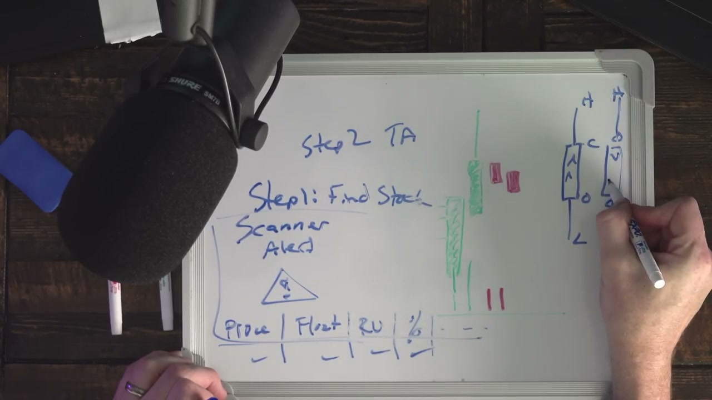

### 7.1 Topping Tail (긴 위꼬리) on 폴

- 폴 마지막 캔들에 긴 위꼬리 → 매수 압력이 정점에서 거부됨
- bull flag 진입 자체를 망설이게 만드는 신호
- **Backtester**: 폴 마지막 캔들의 upper wick / total range ≥ 0.5면 reject

### 7.2 Bottoming Tail (긴 아래꼬리) on 풀백

- 풀백 마지막 캔들에 긴 아래꼬리 → 매도 후 매수자 복귀
- bull flag 진입 신뢰도 ↑
- **Backtester**: 풀백 종료 캔들의 lower wick / total range ≥ 0.4 → confidence boost

VVPR 라이브 트레이드 — bottoming tail 형성 직후 추가매수:

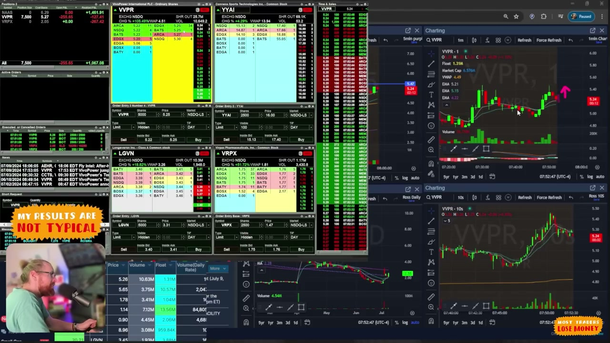

---

## 8. 심리적 가격 레벨 — Half-Dollar / Whole-Dollar

매수자/매도자가 둥근 숫자 부근에 집중. 영상의 LGVN 사례에서 $4.50 → $5 → $5.50 → $6 → $7 단계별 매수/매도가 반복되며 bull flag이 multiple times 재발생.

**LGVN $4.50 half-dollar 돌파 시점**:

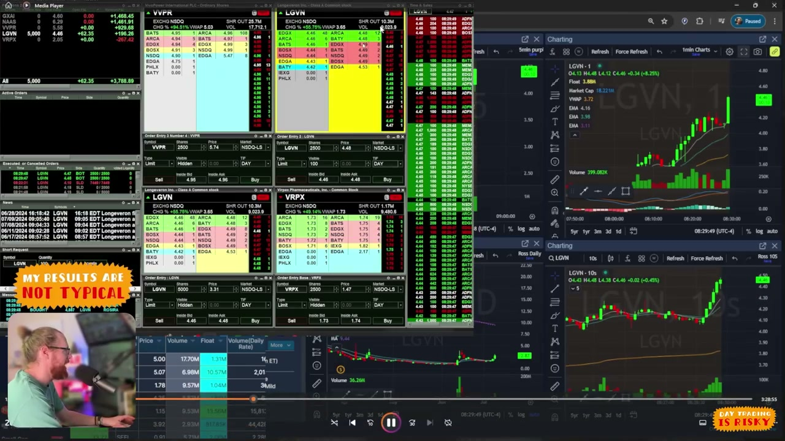

**Backtester 적용**:
- target / stop 가격을 $0.50 / $1.00 grid에 snap하는 옵션
- 진입가가 round number 직전이면 (예: $4.95) "round number 돌파 후 진입" mode

---

## 9. 트레이딩 워크플로 (영상 시연)

**Step 1: Find Stock** — 스캐너에서 5 criteria(Price / Float / RV / %)에 맞는 종목 추출:

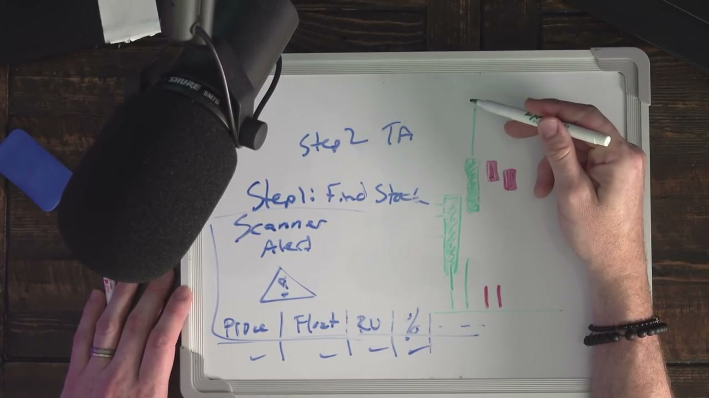

**Step 2: TA + 진입가 산정** — 동일 화이트보드에 entry math 추가 (3.10 / 3.00 / 2.90 = 10¢ risk = $10 손실):


완성된 entry math (3.10 익절 / 3.00 entry / 2.90 stop):


**Bull Flag 애니메이션** (slide deck) — 폴 형성 단계:

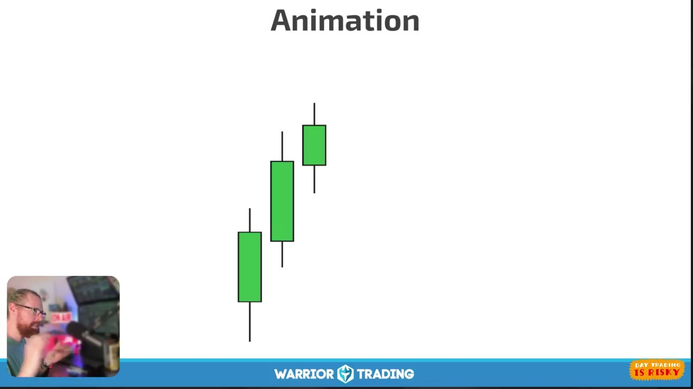

---

## 10. 5가지 Stock Selection 기준 — 화이트보드 정리

영상의 5 criteria가 손글씨로 정리됨:

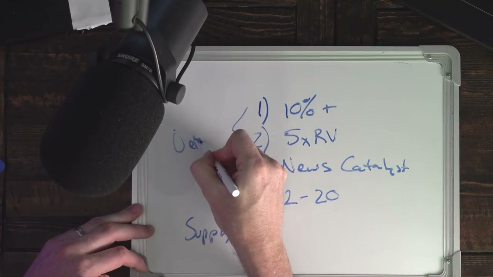

| # | 기준 | 기본값 |
|---|---|---|
| 1 | **이미 당일 +10% 이상** | gap-up + 본 봉 인트라데이 강세 |
| 2 | **5x Relative Volume** | 50일 평균 거래량 대비 |
| 3 | **News Catalyst** | FDA / 임상 / 어닝 / M&A |
| 4 | **주가 $2 ~ $20** | retail 자금 규모 매칭 |
| 5 | **Float < 20M shares** (영상 갱신값) | supply 제약 |

**slide deck 풀스크린 형태**의 동일 5 criteria 슬라이드:

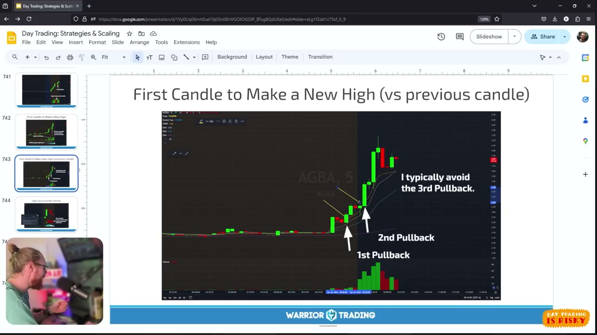

---

## 11. 영상의 실제 트레이드 사례 — VVPR + LGVN

### 11.1 VVPR — 영상 촬영 당일 +$1,931

영상 시점: leading percentage gainer, +105%, $5.23, 10M 거래량, **1.31M float**.

**5개 그린 캔들 연속 후 풀백 직전** (1m + 5m 동시 강세):

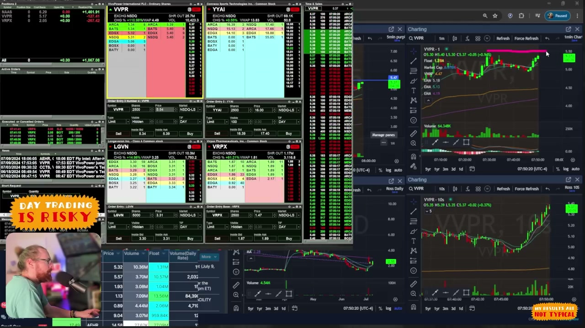

**풀백 starter 진입** — Ross가 anticipated entry 시연 (5,000 shares at $5.27 + add at $5.24, avg $5.27):

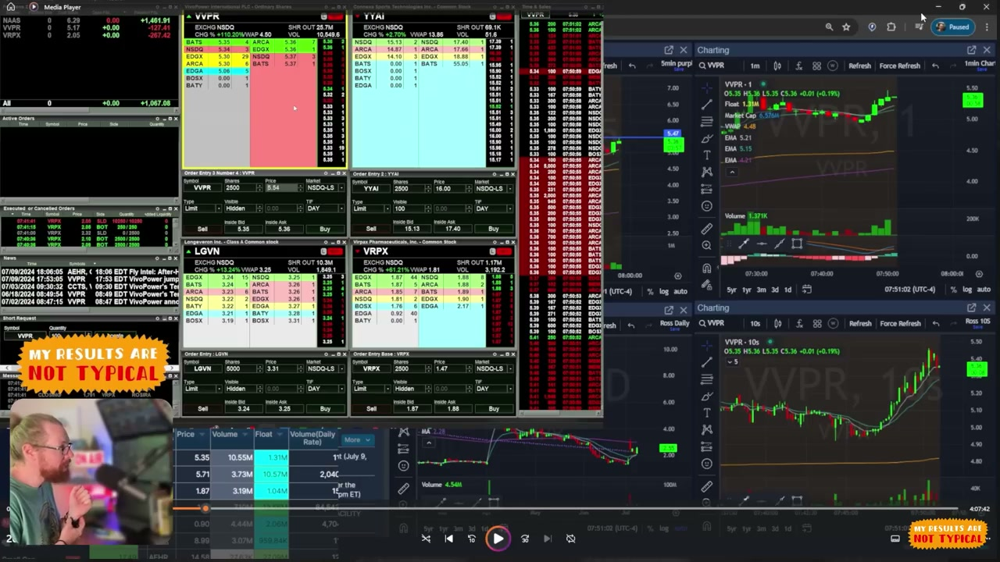

> Multi-timeframe alignment(1m + 5m 동시 강세) 덕분에 anticipated entry 적용. Beginner는 confirmation entry($5.30 = first new high candle)에서 진입 권장.

### 11.2 LGVN — 영상 동일 일자 +$10K

LGVN 메트릭: +42% gain, **3.88M float**, short interest 65%, 200 EMA가 $8 (저항까지 충분한 상방).

**LGVN 첫 진입 — $4.20 base**:

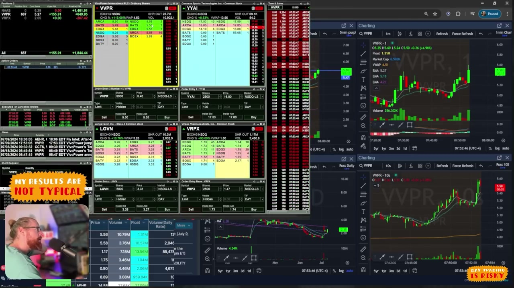

**$5 round number 돌파 후 base 형성**:

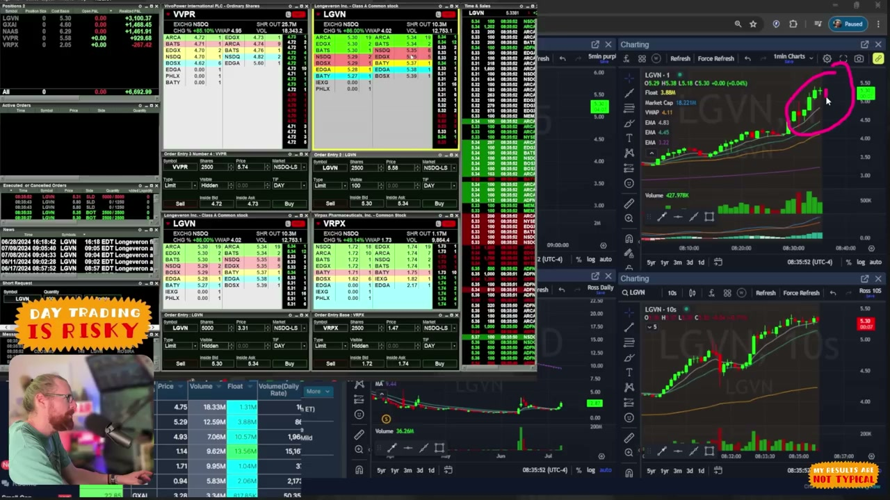

**Parabolic squeeze to $7+** (115% on the day, 9K profit):

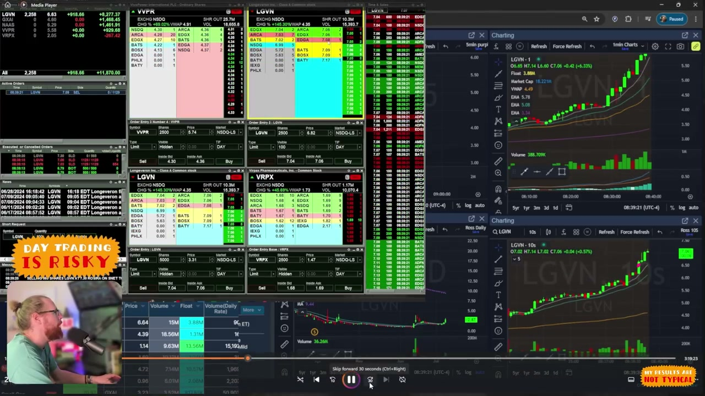

핵심 학습:
- **Multi-timeframe alignment** 작동한 VVPR이 high-conviction 트레이드
- **심리적 레벨**(LGVN의 $5/$5.50/$6/$7)이 bull flag을 multiple times 재발생시킴
- **마지막 트레이드 손실 후 즉시 종료** — 첫 영상의 "max session losses" 룰과 일관

---

## 12. 9년 누적 통계 (영상에서 공개)

영상에서 Ross가 자기 9년치 트레이드 메트릭을 Tradervue 대시보드로 공개:

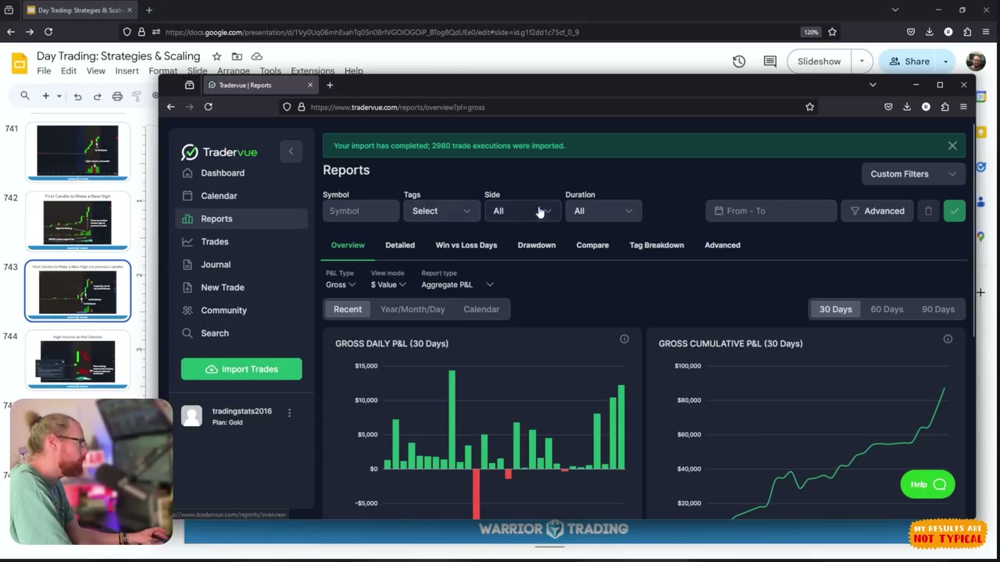

| 항목 | 값 |
|---|---|
| 누적 트레이드 수 | ~25,000~26,000건 |
| 누적 그로스 수익 | ~$25M (winner) |
| 누적 손실 | ~$12M (loser) |
| **순이익** | **~$13M** |
| Avg winner | ~14¢/share, ~$1,400 |
| Avg loser | ~18¢/share, ~$1,500 |
| **Profit/Loss ratio** | **0.93:1 (살짝 inverted)** |
| **Accuracy** | **68.5%** |
| 평균 포지션 | ~10,000 shares |

흥미로운 시사점:
- 손익비가 **1:1 약간 미만** (winner가 loser보다 작음)
- 그럼에도 흑자인 이유 = **68.5% 정확도** 가 모든 것을 메움
- 이는 첫 영상의 "51일 1M trade"에서의 71.4% accuracy + 2.4:1 P/L 와는 다른 운영 (51일 트레이드는 fixed-target에 더 가깝고, 평소엔 빠른 분할 익절)

→ **Backtester 평가 기준 두 가지**:
1. 51일 챌린지 mode: 71% acc / 2.4:1 P/L → 빅 R-multiple 익절
2. 9년 통계 mode: 68% acc / 1:1 P/L → 빠른 1R 익절 + 다회 트레이드

---

## 13. Beginner vs Advanced 진입 분리

영상은 두 가지 진입 모드를 명시적으로 구분:

| 모드 | 진입 시점 | 정확도 | 비용 효율 |
|---|---|---|---|
| **Beginner / Confirmed** | 첫 신고가 캔들 형성 후 | **高 정확도** | 진입가 비쌈 |
| **Advanced / Anticipated** | 풀백 도중 (저점 형성 전) | 低 정확도 | 진입가 저렴 |

Ross 본인은 LGVN/VVPR에서 anticipated entry를 사용 — 그러나 영상에서 **"초보는 절대 anticipated 진입 시도하지 말라"**고 강조.

**Backtester 적용**:
- `entry_mode = "confirmed" | "anticipated"` 옵션
- Confirmed: 현재 구현 (첫 신고가 close)
- Anticipated: 풀백 도중 진입 + stop은 **임의**가 아니라 풀백이 깨지는 가격 (= 더 빡빡한 stop), 단 실시간으로 결정해야 해서 backtest로 구현 시 어느 시점을 anticipated로 볼지 합의 필요

---

## 14. Backtester 구현 우선순위 (이번 영상 → 코드)

| 우선순위 | 항목 | 영향 |
|---|---|---|
| **P0** | **Volume profile gate** | 가장 큰 false positive 차단 — pole 高 / flag 低 / breakout 高 |
| **P0** | **flag_max_retrace 0.7 → 0.5 (default)** | 영상 hard cap에 맞춤. 0.25 옵션은 strict mode |
| **P0** | **9 EMA overlay** on intraday chart | 풀백 저점 시각화 |
| P1 | **200 EMA / 200 SMA daily resistance gate** | 큰 손실 케이스 차단 |
| P1 | **Topping tail reject on pole** | False breakout 차단 |
| P1 | **Bottoming tail bonus on flag** | High-conviction 트레이드 |
| P2 | **Multi-timeframe alignment** (1m + 5m) | Confluence boost |
| P2 | **Half-dollar / whole-dollar awareness** | Target snap |
| P2 | **Anticipated entry mode** | 더 advanced 모드 옵션 |

**Float cap 10 → 20M**은 사용자 선택 (페이지 widget으로 expose).

---

## 15. 이전 검증 사례에 대한 재해석

이전에 검증한 **SPRC 2026-04-21**:
- Float 47K (영상 신 cap 20M의 0.2%) ✅
- Gap +43.7%, RVOL 31.5x ✅
- 1m bull flag 매칭 (`flag_max_retrace=0.7`) — **이번 영상 기준 50%** 로 좁히면 매칭 사라질 가능성
- Volume profile 검증 안 됨 — **이번 영상 P0 필터** 추가하면 다른 결과 가능

**다음 단계**: Volume profile gate를 추가한 뒤 SPRC 4/21을 재검증하고, 적용 전후 winner/loser 비교.

---

## 부록 A: 자료 추출 재현

이 문서를 만들 때 사용한 모든 명령어는 첫 영상에서 만든 스크립트로 재현 가능:

```bash
.claude/scripts/extract_youtube_tutorial.sh \
  "https://www.youtube.com/watch?v=DP4ayEWhmvM" \
  "docs/strategy_notes"
```

**주의**: 720p 이상 다운로드 권장 (`yt-dlp -f "298+251/best[height<=720]"`). 360p는 슬라이드 텍스트가 깨져 보임.

## 부록 B: 영상에 첨부된 다운로드 자료 (영상 발언 인용)

영상 caption / 발언에서 PDF 다운로드 링크를 댓글 상단에 둔다고 언급:
- Micro Pullback Strategy PDF — Ross가 short-timeframe(10초~1분) 변형으로 사용
- Small Account 트레이딩 PDF — small account 챌린지 사이즈 룰

> 두 PDF는 영상에서 직접 첨부된 게 아니라 별도 channel description 링크로 제공. 본 정리에는 미포함.

## 부록 C: 추출된 프레임 목록 (26장)

```
docs/strategy_notes/images/video_frames_DP4/
├── 000008_pattern_overview.jpg          (whiteboard 폴+풀백+신고가+익절 곡선)
├── 000130_three_point_anatomy.jpg       (whiteboard profit/entry/Max Loss 라벨)
├── 000230_volume_profile_intro.jpg      (SPWR slide — Light Vol Selling)
├── 000345_volume_good_vs_bad.jpg        (whiteboard 진행 중)
├── 000410_sngx_volume_example.jpg       (SPWR slide variant)
├── 000700_price_range_2_20.jpg          (AGBA First Candle to Make a New High)
├── 000800_five_criteria_whiteboard.jpg  (whiteboard 5 criteria 손글씨)
├── 000945_master_one_pattern.jpg        (whiteboard 추세선 추가)
├── 001100_nine_year_metrics.jpg         (Tradervue 30일 P&L)
├── 001830_scanner_workflow.jpg          (whiteboard Step 1 Find Stocks)
├── 001900_candle_anatomy.jpg            (whiteboard candle H/C/O/L)
├── 002030_entry_stop_target_math.jpg    (whiteboard entry math)
├── 002100_sngx_live_charts.jpg          (Day Trade Dash 멀티차트)
├── 002330_nine_ema_intraday.jpg         (NBEV Example)
├── 002630_bull_flag_animation.jpg       (slide Animation - 폴 단계)
├── 002930_counter_example_fakeout.jpg   (MDJH High Volume on Red)
├── 003050_twenty_five_pct_rule.jpg      (AWIN 1st & 2nd Pullbacks)
├── 003300_vvpr_five_green_candles.jpg   (VVPR 5 green candles)
├── 003430_multi_timeframe_alignment.jpg (whiteboard MTF 개념)
├── 003600_vvpr_pullback_starter.jpg     (VVPR pullback starter)
├── 003900_bottoming_tail.jpg            (VVPR bottoming tail)
├── 004200_confirmation_entry.jpg        (whiteboard 최종 entry math)
├── 004800_lgvn_intro.jpg                (LGVN $4.20 base)
├── 005030_half_dollar_level.jpg         (LGVN $4.50 돌파)
├── 005400_bull_flag_at_five.jpg         (LGVN $5 base)
└── 005530_parabolic_squeeze.jpg         (LGVN $7+ parabolic)
```

원본 자료:
- `/Users/apple/development/pattern-finder/yt_DP4ayEWhmvM.en.vtt` (영문 자막)
- `/Users/apple/development/pattern-finder/video_DP4ayEWhmvM.mkv` (720p 다운로드본)
