# Ross Cameron — "$1,000,000 in 51 Days of Day Trading" 전략 정리

**출처 영상:** [How I Made $1,000,000 in 51 Days of Day Trading (Full Training)](https://www.youtube.com/watch?v=m5zu_X-_51I)
**진행자:** Ross Cameron (Warrior Trading)
**영상 길이:** 약 1시간 39분
**첨부 PDF:**
- `20250611 Candlestick Pattern Reference Chart.pdf` — 캔들스틱 패턴 단일 페이지 레퍼런스 포스터
- `ChartPatternsv2.pdf` — Warrior Trading 차트 패턴 스터디 가이드 (Bull Flag / Bear Flag / Moving Average Pop 등 다수의 슬라이드)

> 트레이더 본인의 결과로, 일반화는 불가하지만 backtest 가설 수립용으로 정리한다.
> 자료 추출에 사용한 스크립트: [`.claude/scripts/extract_youtube_tutorial.sh`](../../.claude/scripts/extract_youtube_tutorial.sh)

---

## 0. TL;DR — 영상 한 줄 요약

> "고변동 소형주(Float < 10M, $2~$20)에서 뉴스 호재로 5x 이상 거래량이 터질 때, **Bull Flag 풀백의 첫 신고가 캔들**을 매수하고 풀백 저점을 손절로 둔다. 손익비 2:1 이상을 강제하고, 매일 **1/4 사이즈로 시작 → 쿠션 만든 후 풀사이즈**로 스케일업한다."

영상에서 강조한 3대 축:
1. **Risk Management** — 절대 손익비 < 2:1 트레이드는 안 잡는다
2. **Stock Selection** — 5가지 기준을 모두 만족하는 "A-quality" 종목만
3. **Entry/Exit** — Bull Flag 풀백 + 첫 신고가 캔들 진입, 손절은 풀백 저점, 1차 익절은 당일 고점 재돌파

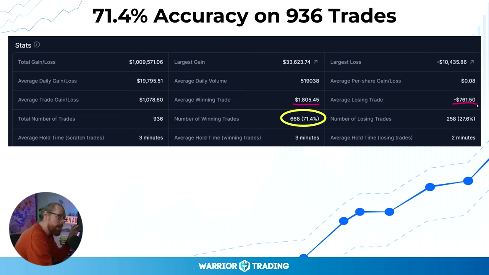

*51일간 936 trades · accuracy 71.4% · avg winner ~$1,800 · avg loser ~$761*

---

## 1. 본인 실적 (영상에서 공개한 metrics)

| 항목 | 값 |
|---|---|
| 기간 | 약 51 거래일 (2026년 1월~3월 17일경) |
| 총 트레이드 | 936건 |
| Accuracy | **71.4%** |
| Avg winner | $1,800 (≈ +11¢/share) |
| Avg loser | $761 (≈ −8¢/share) |
| Profit / Loss ratio | **약 2.4:1** |
| Avg hold (winner) | 3 분 |
| Avg hold (loser) | 2 분 |
| 평균 종가 | $6.56 |
| 평균 winner 포지션 | ~16,000주 (≈ $107K) |
| 평균 loser 포지션 | ~9,500주 (≈ $62K) |

핵심 시사점:
- **Winner는 Loser보다 거의 두 배 큰 사이즈**로 들어가 있다 → 트레이드 시작 시점이 아니라 **trade가 작동하는 도중에 추가 매수**(Add to winners)했기 때문.
- "Red day"의 accuracy는 평균 46%, "Green day"는 70%대 → green/red day의 통계적 특성이 다르다는 사실이 사이즈 룰의 근거.
- 지난 9개월 중 **red day 단 7회**, 76연속 green day 기록.

---

## 2. Risk Management — 2:1 손익비 강제

### 2.1 손익비별 손익분기 정확도

| Profit:Loss | 손익분기 정확도 |
|---|---|
| 1:2 (loser가 winner의 2배) | **67%** |
| 1:1 | 50% |
| **2:1** | **33%** |
| 3:1 | 25% |
| 5:1 | 17% |

→ 2:1만 지켜도 **33%만 맞으면 본전**. 71% 정확도라면 압도적 흑자.

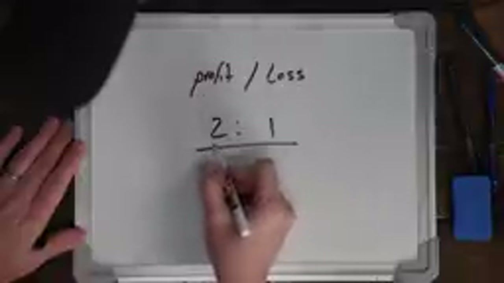

### 2.2 트레이드 진입 전 사고 절차

> "내가 이 트레이드에서 잃을 수 있는 최대 금액은 얼마인가?" — 이 질문을 던지는 것이 **트레이더와 도박꾼의 차이**.

- 진입가 ↔ 손절가 사이의 거리(센트/주)가 실제 risk.
- 포지션 사이즈를 $100K 잡아도, 손절 폭이 $0.10이면 risk는 $0.10/share × shares.
- 익절 목표가 < 2 × risk 면 진입 자체를 거른다.

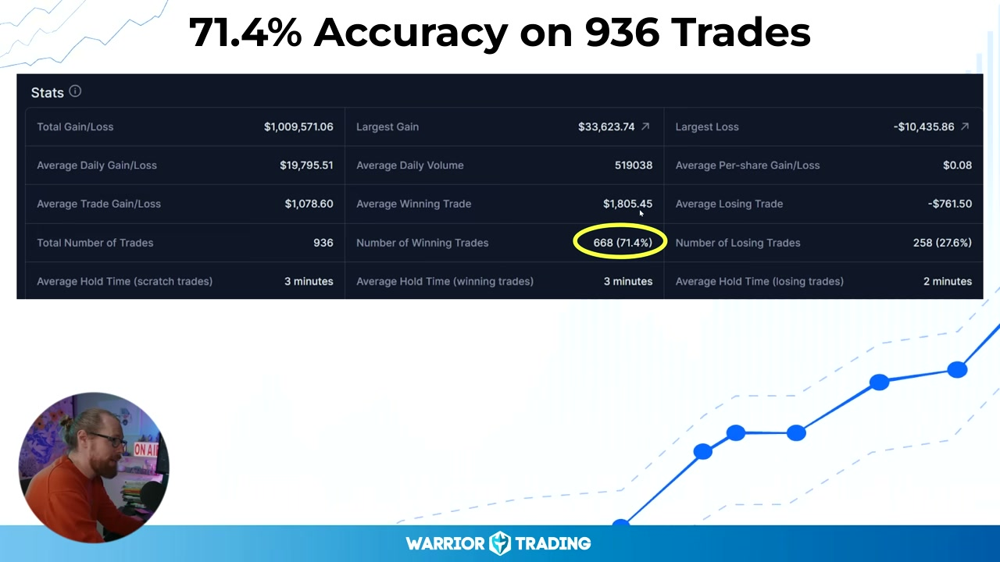

### 2.3 손절 원칙

- 손절은 항상 **풀백 저점**(구조적 위치)에 둔다.
- "Hold and pray" 금지 — 초보자 가장 큰 실수는 winner는 빨리 끊고 loser는 키우는 것 (반전 P:L 비).
- "Cut losers ruthlessly, add to winners only."

---

## 3. Stock Selection — 5가지 A-Quality 기준

영상에서 강조하는 **5 criteria**. 5개 모두 만족 = A, 4/5 = B, 3/5 = C. **A만 트레이드**.

### 3.1 다섯 가지 기준 (영상의 핵심 슬라이드)

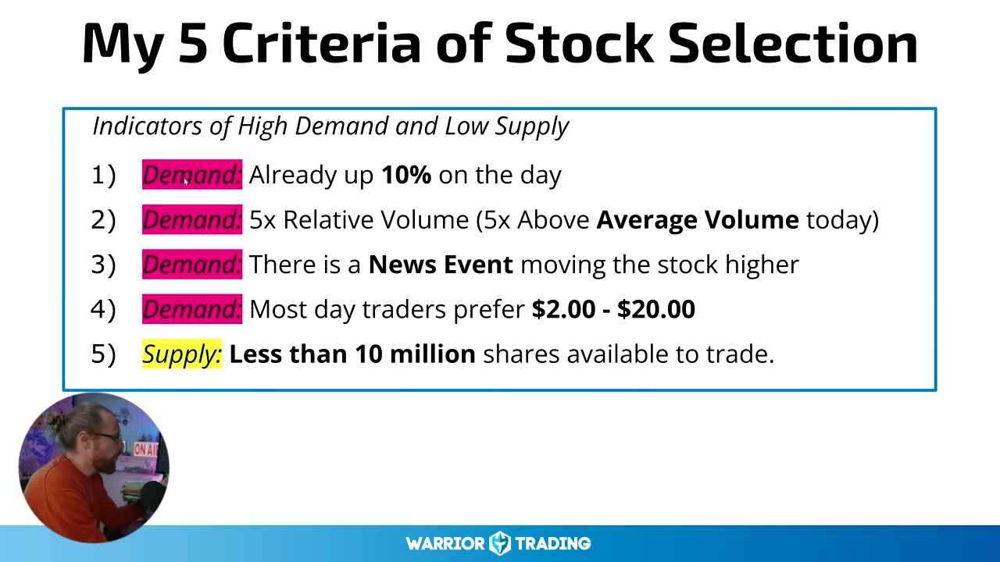

| # | 기준 | 비고 |
|---|---|---|
| 1 | **이미 당일 +10% 이상 (Demand)** | 갭업 = 매수 압력 존재의 직접 증거. 영상에서는 "최소 +2%, 이상적으로 +10%" |
| 2 | **5x Relative Volume (Demand)** | 50일 평균 거래량 대비 5배 이상. 매수 클램(clamor) 정량 지표 |
| 3 | **News Event 존재 (Demand)** | FDA 승인, 임상 결과, 어닝, M&A 등. 호재 없는 갭업은 의심 |
| 4 | **주가 $2.00 ~ $20.00 (Demand)** | 소매 트레이더 자금 규모와 매칭, 큰 % 변동 가능 |
| 5 | **Float < 10 million shares (Supply)** | 공급 < 수요 환경의 핵심 원인 |

> 슬라이드의 1~4번이 **수요(Demand)** 인자, 5번이 **공급(Supply)** 인자. 수요/공급 불균형이 클수록 폭발적 상승.

### 3.2 가격대 별 수익성 — 왜 $2~$20인가

영상에서는 본인 트레이드 통계를 바탕으로 가격대별 누적 P&L을 보여준다. **$2~$10 구간에 수익이 압도적으로 집중**됨을 시각화.

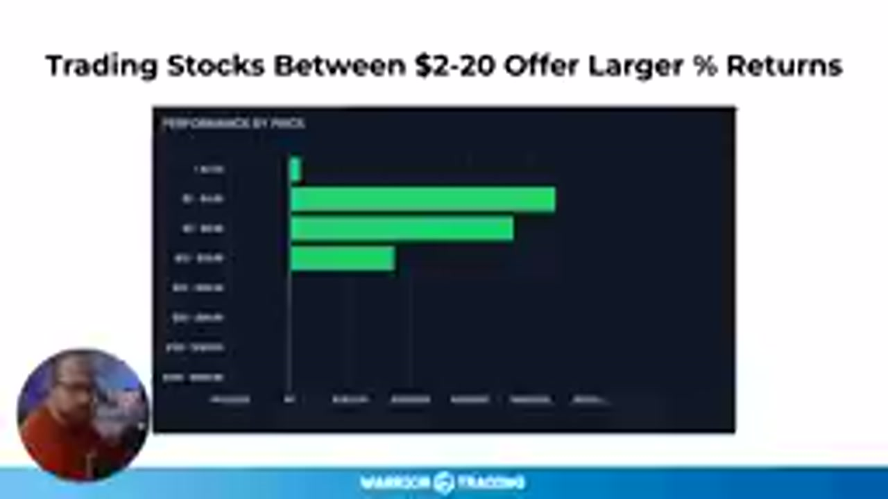

기본 산수: $2 종목 1,000주 매수($2,000) → $3 도달 시 +$1,000 = **+50%**. 같은 % 변동을 $50 종목에서 잡으려면 자본이 25배 더 필요.

### 3.3 Float이 핵심인 이유 (수요/공급 불균형)

영상 인용 사례:
- **MLGO**: Float ≈ 800K, 거래량 300M, 당일 +430%
- **IMTE**: 비슷한 구조, 거래량 폭증
- 스캐너에서 `Float = 0` 표시는 실제 0이 아닌 IPO/warrant로 매우 낮은 케이스

> "전 세계가 사고 싶은데 살 게 800,000주밖에 없다" → 가격이 폭발.

### 3.4 실제 스캐너 화면

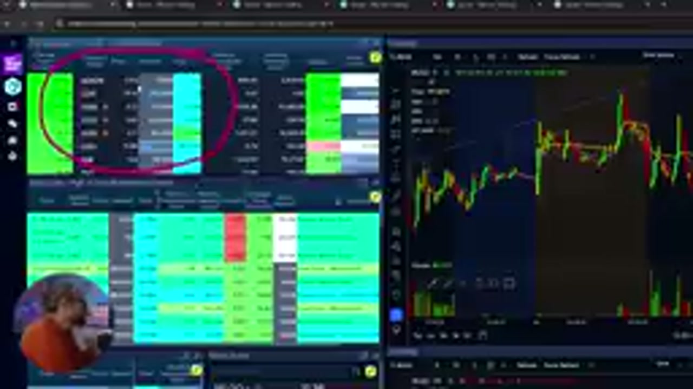

매일 아침 이런 스캐너에서 5가지 필터를 만족하는 5~10개 종목으로 좁혀서 트레이딩.

---

## 4. Entry / Exit — Bull Flag 패턴

영상에서 가장 비중 있게 다룬 단일 셋업. 5~7개 캔들로 구성.

### 4.1 패턴 구조 (애니메이션 단계별)

영상은 Bull Flag 패턴을 단계별로 그려가며 설명한다.

**Step 1 — 큰 첫 그린 캔들 (Pole 시작):** 뉴스 발표와 함께 급등 시작.

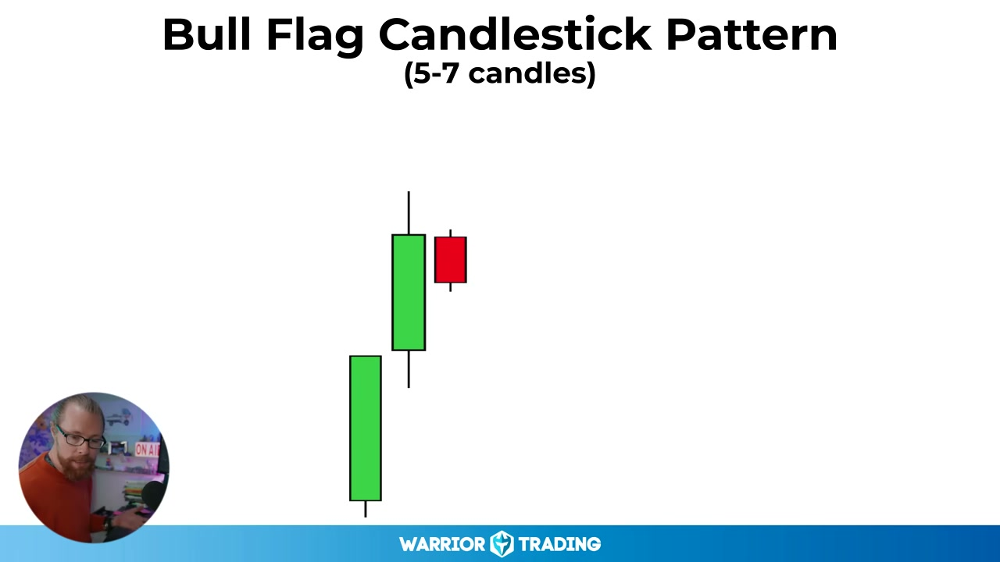

**Step 2 — 두 번째 그린 캔들 + 풀백 시작:** 추가 매수 후 차익실현 시작.

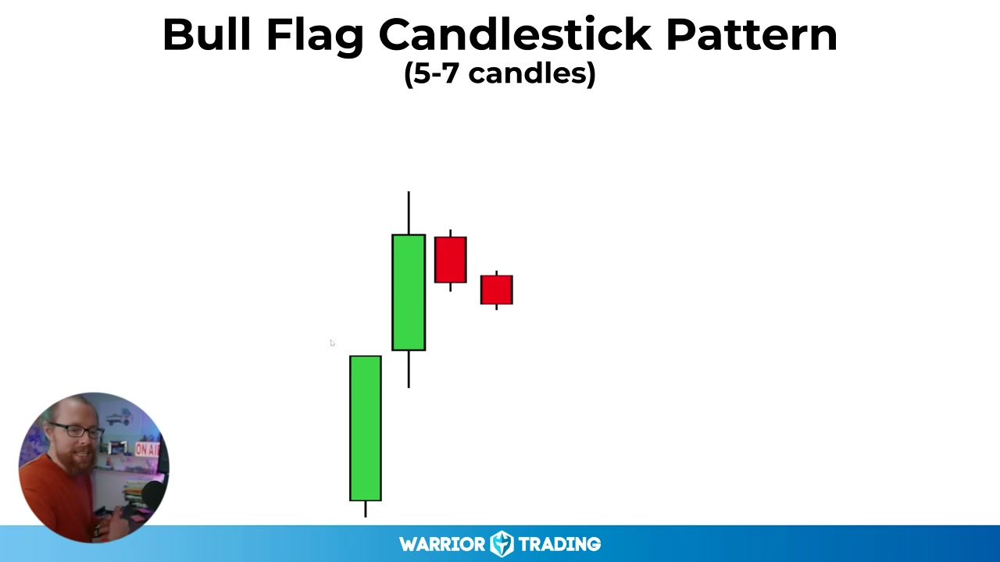

**Step 3 — 풀백 진행 (Flag 형성):** 1~3개 캔들의 정상적 차익실현. **반드시 폴 시작점 + 50% 이상 유지** (50% retrace = bullish 한계선).

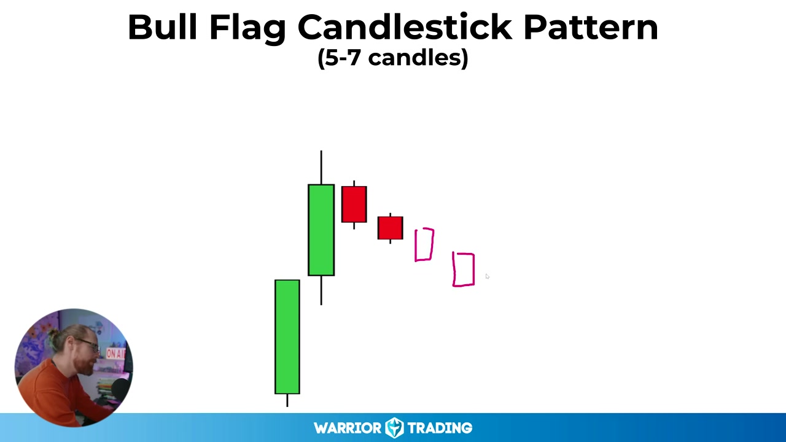

**Step 4 — 풀백 저점 = 손절선 표시 (Stop):** 풀백의 가장 낮은 가격이 구조적 손절 위치.

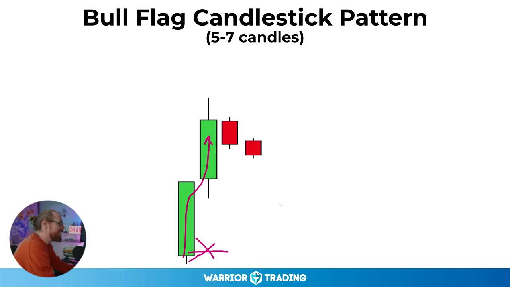

**Step 5 — Breakout (진입):** 풀백 후 **첫 번째 캔들이 직전 캔들의 고점을 돌파**하는 순간이 진입 포인트.

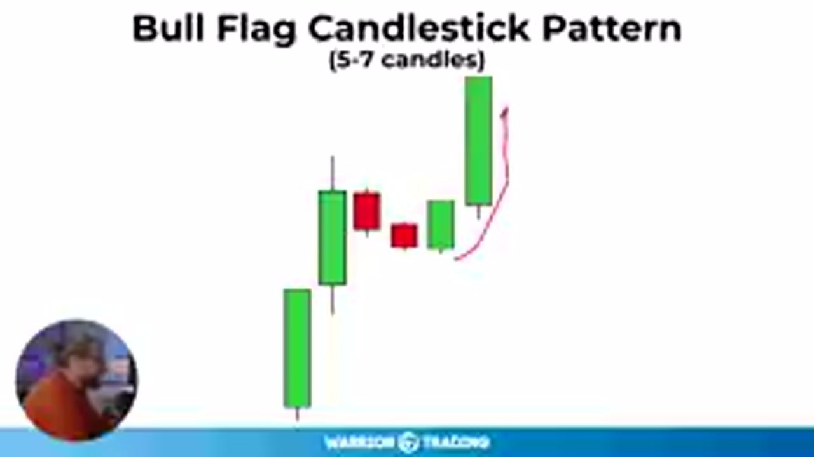

### 4.2 진입 / 손절 / 익절 룰

| 항목 | 정의 |
|---|---|
| **Entry** | 풀백 후 첫 캔들이 새로운 신고가를 만드는 그 가격 (예: 직전 캔들 고가 $3.05 → $3.06 터치 즉시 매수) |
| **Stop** | 풀백의 가장 낮은 가격 (구조적 저점) |
| **1st Target** | 당일 고점(High of Day) 재돌파 — 일반적으로 2:1 R/R 이상 |
| **거를 조건** | 진입가 ↔ HoD 거리가 너무 가까워 2:1 R/R이 안 나오면 패스 |

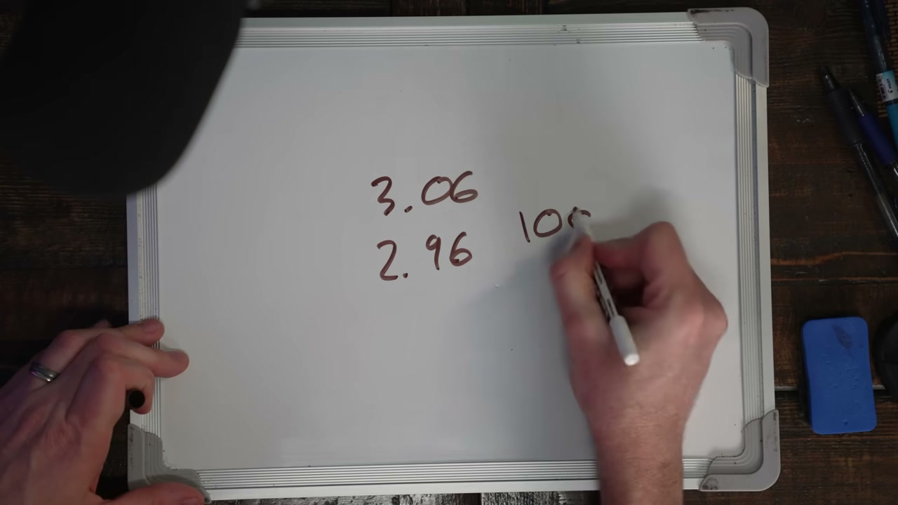

영상의 화이트보드 예시: 진입 $3.06 / 손절 $2.96(10¢ risk) / 1차 목표 $3.26(20¢ profit) → **2:1 R/R**.

### 4.3 시간 프레임

10초 / 1분 / 5분 / 15분 차트 모두 사용 가능. **첫 풀백이 가장 강하다**.
- 초기 모멘텀에서 1분 차트의 첫 풀백이 가장 자주 통한다.
- 첫 5분 풀백, 첫 15분 풀백 모두 양호.
- 3번째 풀백부터는 보수적으로.

### 4.4 실전 차트 예시 (영상 인용)

**예시 1 — SPWR형 차트의 진입 화살표:**

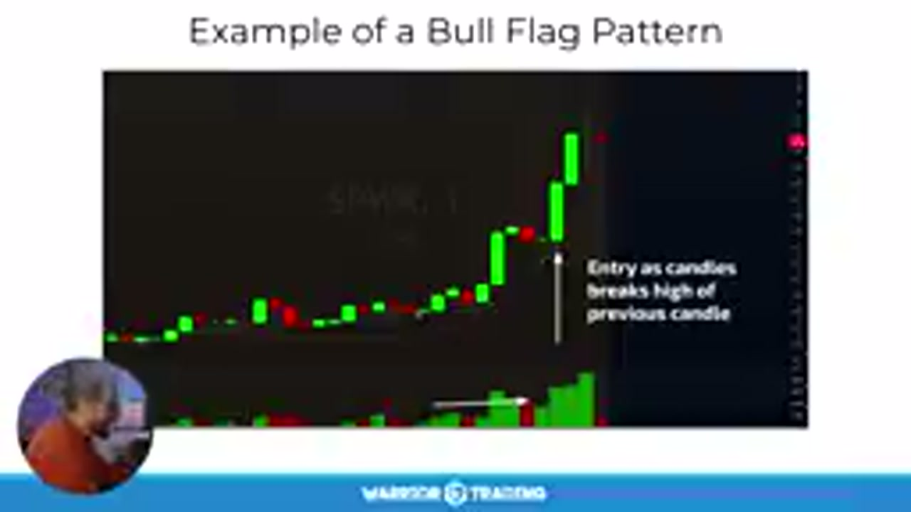

> "Entry as candle breaks high of previous candle" — 풀백 직후 첫 신고가 캔들에서 매수.

**예시 2 — 풀백 후 강한 거래량 동반 돌파:**

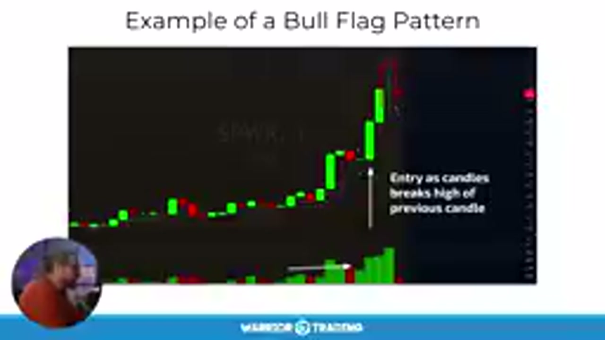

> 풀백 시 거래량 감소 → 돌파 시 거래량 폭증이 이상적인 형태.

**예시 3 — Dragonfly Doji 풀백 진입 (긴 아래꼬리):**

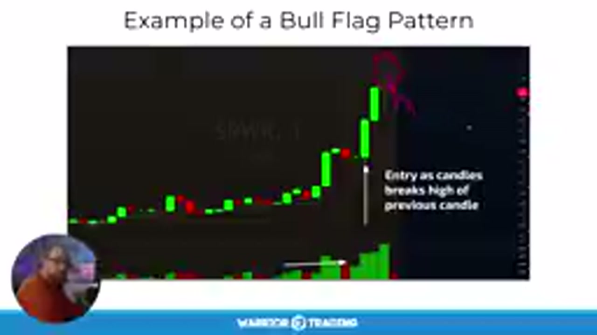

> 캔들이 열렸다가 매도 후 매수자 복귀 → bullish reversal 단서. 영상에서 직접 진입 트리거로 거론.

**예시 4 — ATNF $98K green day:**

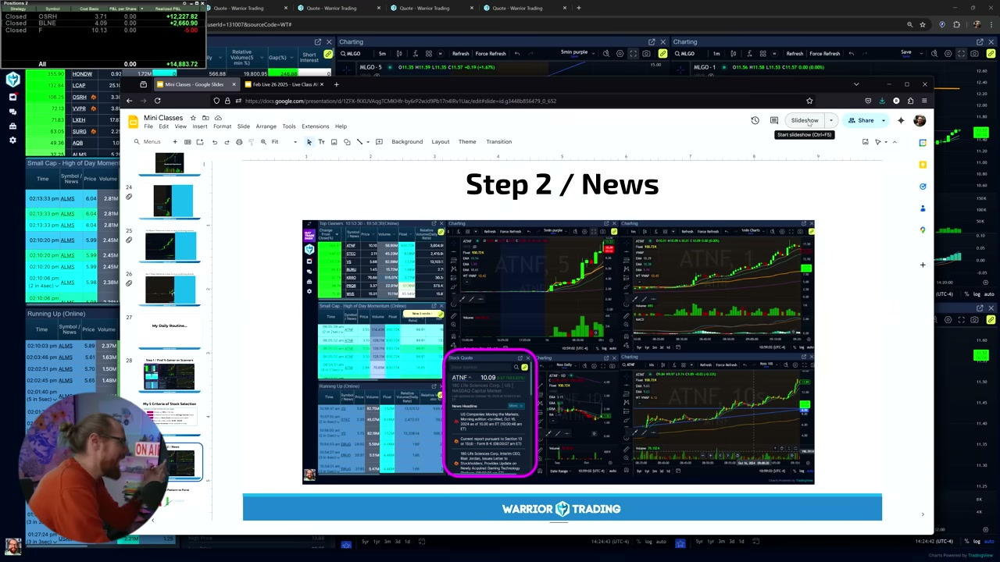

### 4.5 단일 캔들 의미 (영상 내 설명)

- **큰 그린 캔들** — 강한 매수.
- **큰 레드 캔들** — 강한 매도.
- **Dragonfly Doji** (긴 아래꼬리) — 매도 후 매수자 복귀, **풀백 진입 트리거**.
- **위·아래 wick 모두 큰 doji형 (tug-of-war)** — 매수자/매도자 줄다리기. 평소엔 횡보 단서지만, **급등 후라면 trend exhaustion 신호 → 익절 트리거**.

---

## 5. Position Management — Consistency의 비밀

> "Profit는 결과물이지 목표가 아니다. 정확도 → 손익비 → consistency → confidence → 사이즈업 → profitability 의 양의 피드백 루프."

### 5.1 문제: Revenge Trading (음의 루프)

`-$ → 슬픔 → 회복 욕구 → 트레이드 횟수 ↑ + 사이즈 ↑ + 품질 ↓ → 더 큰 손실 → 가속`

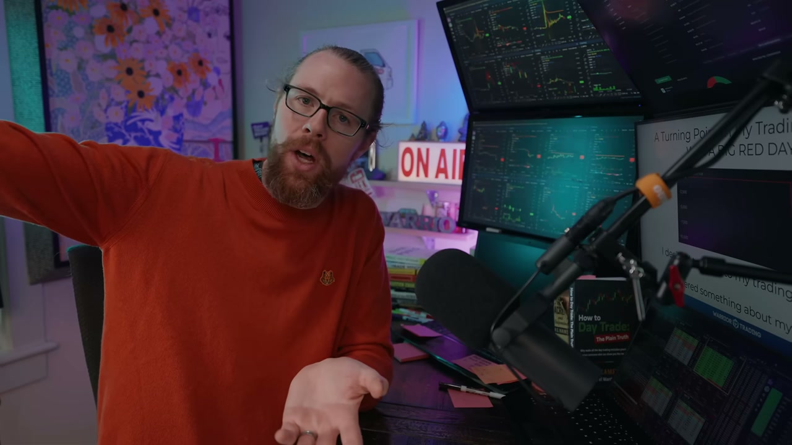

### 5.2 해결책: **Quarter-size Cushion 전략**

영상에서 9개월간 red day 7회·76연속 green day를 만든 핵심 룰.

| 단계 | 룰 |
|---|---|
| 1 | **풀사이즈의 1/4로 하루를 시작** (예: 풀=16,000주 → 시작=4,000주) |
| 2 | **일일 목표의 1/4 만큼 수익(쿠션) 확보**할 때까지 1/4 사이즈 유지 |
| 3 | 쿠션 확보 시 → 풀사이즈로 사이즈업 |
| 4 | 쿠션을 다시 잃으면 → 다시 1/4 사이즈로 다운 |
| 5 | **30분간 setup 못 잡으면 그날은 콜드 마켓 → 종료** |
| 6 | 일일 max loss = 일일 목표와 동일 ("거울 룰") |

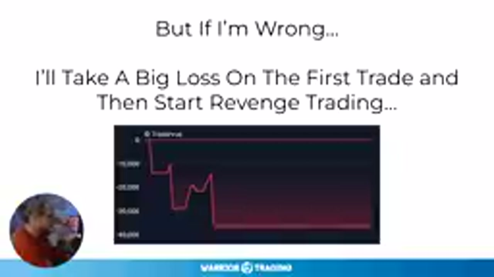

이 룰의 통계적 효과:
- 손실 트레이드는 항상 1/4 사이즈에서 발생 → 손실의 절대 금액 작음.
- 익절 트레이드는 풀사이즈에서 → 같은 ¢/share이라도 절대 금액 큼.
- 결과적으로 **avg winner $1,800 vs avg loser $761** 의 비대칭이 자연스럽게 형성.

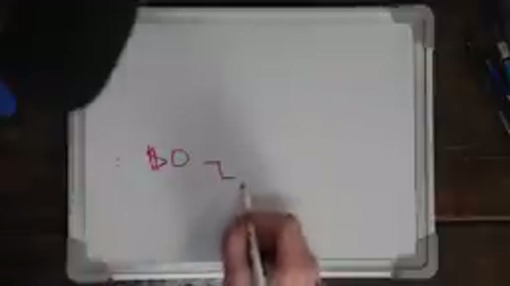

### 5.3 Adding to Winners (스케일업의 핵심)

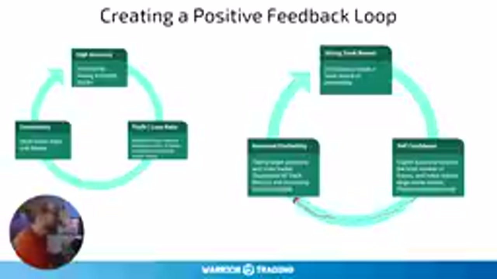

- Starter 진입 후 가격이 +10~20¢ 움직이면 **두 번째 매수로 포지션 더블**.
- 이때 손절을 **break-even (평단가)** 으로 끌어올림 → 손실 위험을 0으로 클램프.
- 추가 매수의 본질: "이미 확보한 +20¢ × starter 분량의 수익을 risk로 사용"하는 것.
- 이 한 번의 더블링이 winner의 평균 사이즈를 17,000주, loser는 9,500주로 만든 메커니즘.


### 5.4 종료 트리거 ("Quit" 사고)

영상은 Annie Duke의 *Quit* (뉴욕 택시 운전사 일화) 인용. **Hot day는 길게, cold day는 짧게.**
- Hot market: 30분에 일일 목표 달성해도 **사이즈업해서 계속**.
- Cold market: 시그널 없으면 **30분 미체결 시 빠지기**.

---

## 6. 일일 루틴

1. 아침 (장 시작 전): 폰으로 스캐너(Day Trade Dash) 확인.
2. 갭업 + 5x volume + 뉴스 + $2~$20 + Float<10M 종목 5~10개 추출.
3. **첫 풀백 대기** — 보통 2~3분 안에 셋업 발생.
4. Bull flag 신고가 캔들 진입.
5. 1/4 사이즈로 시작 → 쿠션 후 풀사이즈.
6. 30분 무체결 시 종료.

영상 내 인용 사례 — ATNF 어느 날: 30분 트레이딩으로 +$98,754.

---

## 7. Scaling Roadmap (영상의 "처음부터 다시 한다면")

| Step | 내용 |
|---|---|
| 1 | **검증된 전략을 학습** (현재 시장에서 통하는 것) |
| 2 | **시뮬레이터로 90일** 실전 검증 |
| 3 | 실계좌 입금 (margin: $25K + PDT, 또는 cash/offshore) |
| 4 | **첫 1,000 trades**: 평균 ~160주 → 목표 $10K 누적 수익 |
| 5 | **두 번째 1,000 trades**: 점진 증가 → 1,600주 → 목표 $100K 누적 |
| 6 | **세 번째 1,000 trades**: 16,000주 → 목표 $1M 누적 |

> "전략은 down-scale은 가능하지만 up-scale은 항상 가능하지 않다 (유동성 한계)."

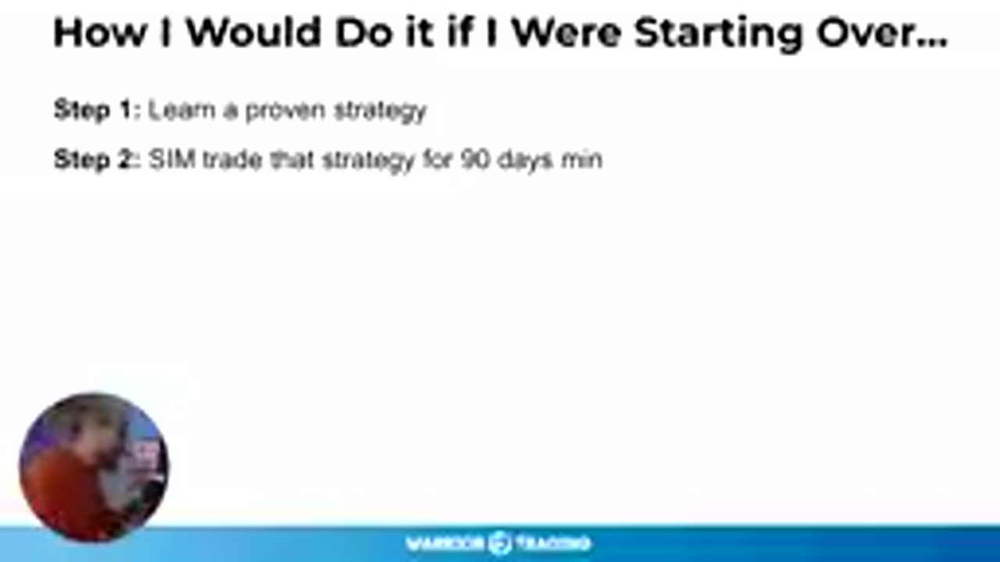

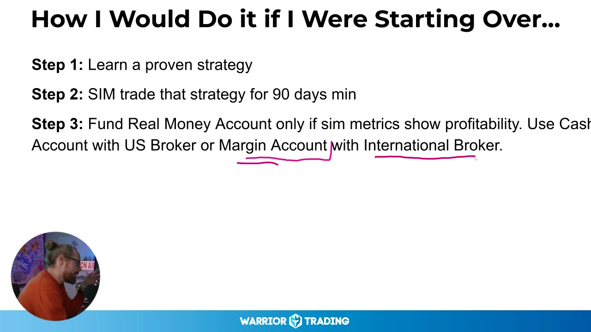

---

## 8. 실패 패턴 — Red Day가 발생하는 3가지 원인

영상 후반부 자기 분석:

1. **A-quality 셋업이 시장에 없는 날** — 품질 임계값을 낮추고 싶어짐 → 함정.
2. **Sweet spot 시간대(개장 후 1~2시간) 종료 후에도 계속 트레이딩** — 결정 피로 + 권태 트레이딩.
3. **FOMO / 좌절 / 분노 / 욕심으로 룰 이탈** — 76연속 green day가 끝난 직접 원인. 한 번의 bad trade 뒤 hail-mary로 손실 더블링.

---

## 9. 추천 도서 (영상 마지막)

- *How to Day Trade: The Plain Truth* — Ross Cameron
- *Thinking in Bets* — Annie Duke
- *Quit* — Annie Duke
- *The Happiness Advantage* — Shawn Achor
- *Trade Mindfully* — Gary Dayton

---

## 10. 첨부 PDF 요약

### 10.1 Candlestick Pattern Reference Chart

단일 페이지 포스터. Bullish / Neutral / Bearish 3 컬럼으로 단일·이중·삼중 캔들 패턴 한눈에 정리.

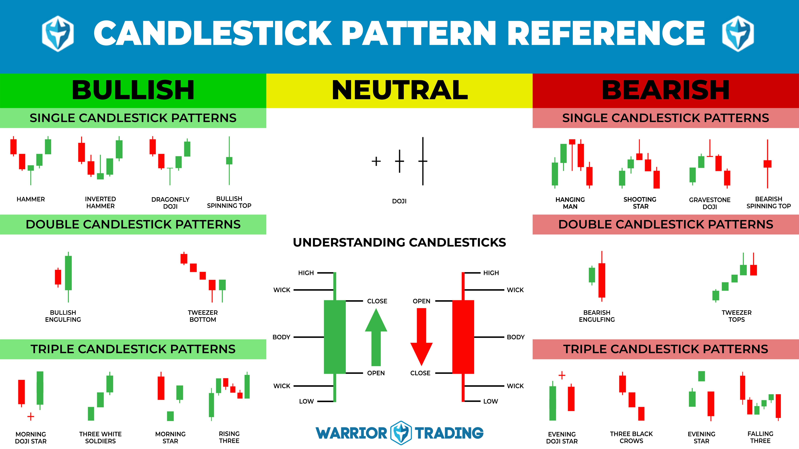

| 분류 | Bullish | Neutral | Bearish |
|---|---|---|---|
| Single | Hammer, Inverted Hammer, Dragonfly Doji, Bullish Spinning Top | Doji | Hanging Man, Shooting Star, Gravestone Doji, Bearish Spinning Top |
| Double | Bullish Engulfing, Tweezer Bottom | — | Bearish Engulfing, Tweezer Tops |
| Triple | Morning Star, Three White Soldiers, Morning Doji Star, Rising Three | — | Evening Doji Star, Three Black Crows, Evening Star, Falling Three |

영상에서 직접 거론된 것: **Dragonfly Doji** (풀백 진입 신호), **위/아래 wick이 큰 doji형** (exhaustion → 익절 신호).

### 10.2 Chart Pattern Study Guide (Warrior Trading 2021)

총 112개 슬라이드. 주요 패턴별 실차트 예시.

대표 카테고리 (페이지 라벨 1a, 1b, ... 형태):
- **1**: Bull Flag / Bear Flag
- **2**: Flat Top Breakout
- **3**: Moving Average Pop (shorting)
- **4**: ABCD Pattern
- **5**: Reversal / Parabolic Short
- **9~16**: VWAP, Trend Line, Resistance/Support
- **17 이후**: Gap and Go, Red to Green, EOD setups 등

대표 슬라이드 — Bear Flag Breakdown:

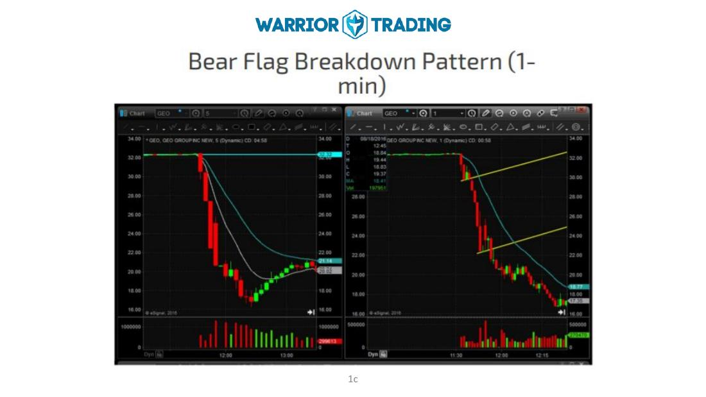

대표 슬라이드 — Moving Average Pop (Shorting):

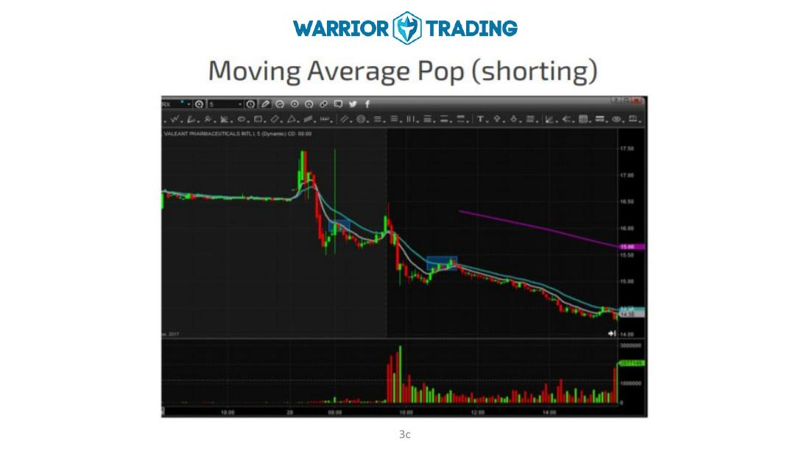

전체 112장 이미지는 `images/pdf_chartpatterns/page-001.jpg` ~ `page-112.jpg` 에 보존.

> 영상은 Bull Flag만 자세히 다루지만, PDF에는 short-side와 reversal 셋업도 존재. 향후 Bull Flag 외 셋업으로 확장 시 참고.

---

## 11. Backtester 구현용 메모

이 저장소(`pattern-finder`)에서 백테스트화할 때 매핑:

### 11.1 신규 패턴 어댑터 후보
- `pattern/adapters/bull_flag.py` — pole(연속 green) + flag(50% retrace 안쪽) + breakout(첫 신고가 캔들) 검출.
  - 입력: OHLCV (1m / 5m / 15m), 종목별 pre-market gap %, relative volume, float, news flag.
  - 출력: PatternHit(entry_price, stop_price, target_price, ratio).

### 11.2 신규 전략 어댑터 후보
- `strategy/adapters/bull_flag_strategy.py`
  - 진입: pattern hit + R/R ≥ 2 만족 시.
  - 사이즈: quarter-size cushion 룰 (`daily_goal / 4` 누적 시 풀사이즈).
  - 손절: pullback low.
  - 익절 1: HoD 재돌파 (≥ 2:1 R/R).
  - 익절/추가매수: position double + stop to break-even.
  - 종료: 30분 미체결 / max daily loss / cold-market detection.

### 11.3 Universe / Stock Selection 필터 (signals 모듈)
- 데이터: `signals/adapters/universe_scanner.py`에 5가지 필터 추가.
  - `gap_pct >= 2`
  - `relative_volume_50d >= 5`
  - `2 <= price <= 20`
  - `float_shares <= 10_000_000`
  - `has_news_catalyst == True` (catalyst 데이터 소스 필요 — Benzinga/StockTwits/EOD news API 등)

### 11.4 평가 메트릭 (backtest 결과 검증용)
- Accuracy(Win rate), Avg winner $, Avg loser $, P/L ratio, Max DD, 일일 손익 분포(green/red day 분포).
- 영상의 71.4% / 2.4:1 와 비교 가능한 수준이 나오는지 검증.

---

## 12. 한 줄 결론

**"고변동 소형주의 첫 풀백을 1/4 사이즈로 노크하고, 작동하면 더블, 안 작동하면 즉시 손절"** — 이 한 줄이 영상 1시간 39분의 압축이다. 정확도는 종목 선별이, 손익비는 사이즈 룰이 만든다.

---

## 부록 A: 디렉터리 구조

```
docs/strategy_notes/
├── ross_cameron_million_in_51days.md          ← 이 문서
└── images/
    ├── pdf_candlestick/
    │   └── page-1.jpg                          (1장 — 4K 포스터)
    ├── pdf_chartpatterns/
    │   ├── page-001.jpg ~ page-112.jpg         (112장)
    └── video_frames/
        ├── 000030_intro.jpg
        ├── 000530_51day_equity_curve.jpg
        ├── 003050_demand_4chars_clean.jpg      (5 criteria 슬라이드)
        ├── 003450_bull_flag_complete.jpg       (Bull flag step 1)
        ├── 003830_bullflag_rr_setup.jpg        (Bull flag step 2)
        ├── 003600_first_new_high_candle.jpg    (Bull flag step 3)
        ├── 003840_bullflag_HoD_label.jpg       (Bull flag step 4 - stop)
        ├── 003950_bull_flag_real1_zoomed.jpg   (Bull flag step 5 - entry)
        ├── 004000_bullflag_real_2.jpg          (Real chart 예시)
        ├── ...
        └── 013530_scaling_plan.jpg             (총 70+장)
```

원본 자료:
- `/Users/apple/development/pattern-finder/20250611 Candlestick Pattern Reference Chart.pdf`
- `/Users/apple/development/pattern-finder/ChartPatternsv2.pdf`
- `/Users/apple/development/pattern-finder/yt_m5zu_X-_51I.en.vtt` (영문 자막 원본)
- `/Users/apple/development/pattern-finder/video_m5zu.mp4` (저해상 다운로드본)

## 부록 B: 자료 추출 재현 방법

이 문서/이미지를 만들 때 사용한 모든 명령어는 한 개의 스크립트로 정리되어 있다:

```bash
# 단일 명령으로 동일 워크플로 재현
.claude/scripts/extract_youtube_tutorial.sh \
  "https://www.youtube.com/watch?v=m5zu_X-_51I" \
  "docs/strategy_notes" \
  "20250611 Candlestick Pattern Reference Chart.pdf" \
  "ChartPatternsv2.pdf"
```

스크립트가 하는 일:
1. `brew install poppler yt-dlp ffmpeg` (없을 때만)
2. `yt-dlp` 로 영문 자막(VTT) + 360p 영상 다운로드
3. `pdftotext` / `pdftoppm` 로 PDF → 텍스트 + 페이지 이미지(150dpi JPEG)
4. `ffmpeg -ss <ts> -frames:v 1 -vf "scale=1280:-1"` 로 핵심 타임스탬프에서 1280px 프레임 추출

다른 영상에 재사용할 때는 스크립트 안의 `TIMESTAMPS` 배열만 그 영상의 핵심 시점으로 교체하면 된다.
