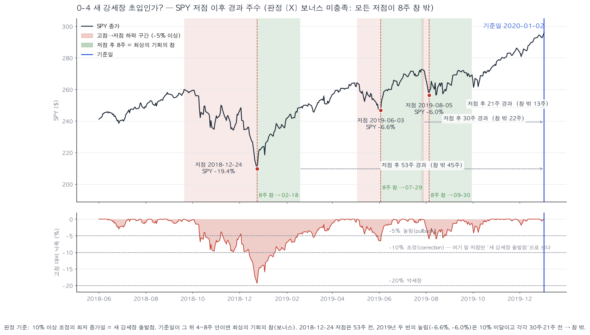
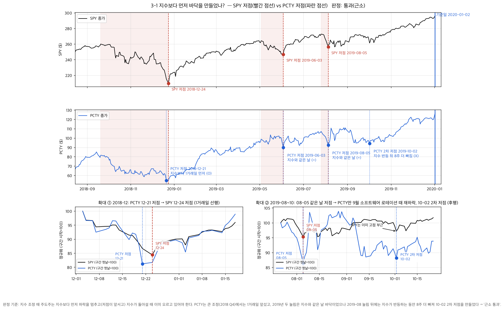
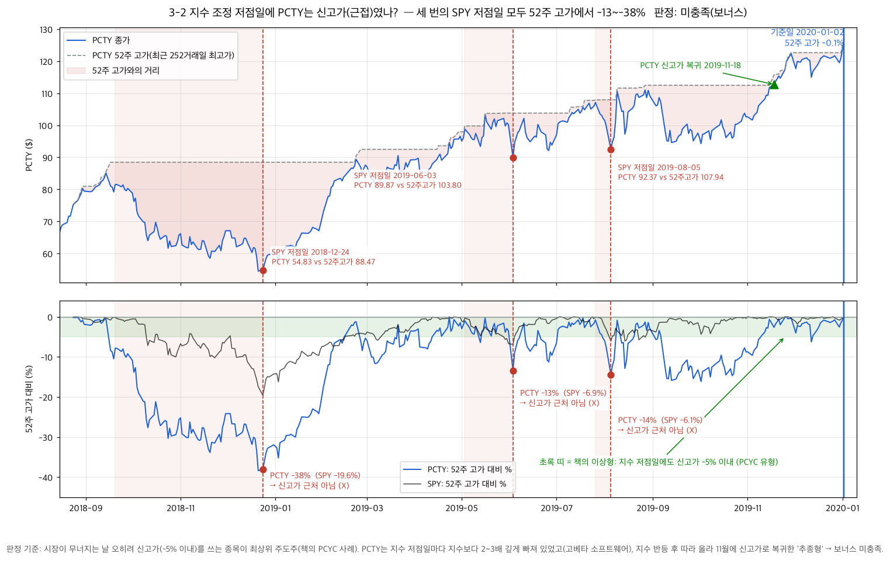
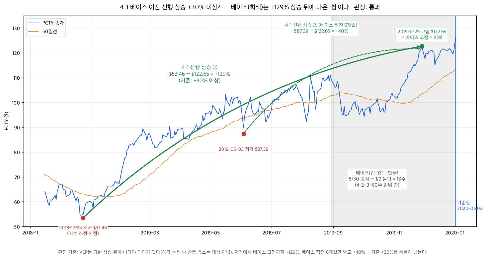
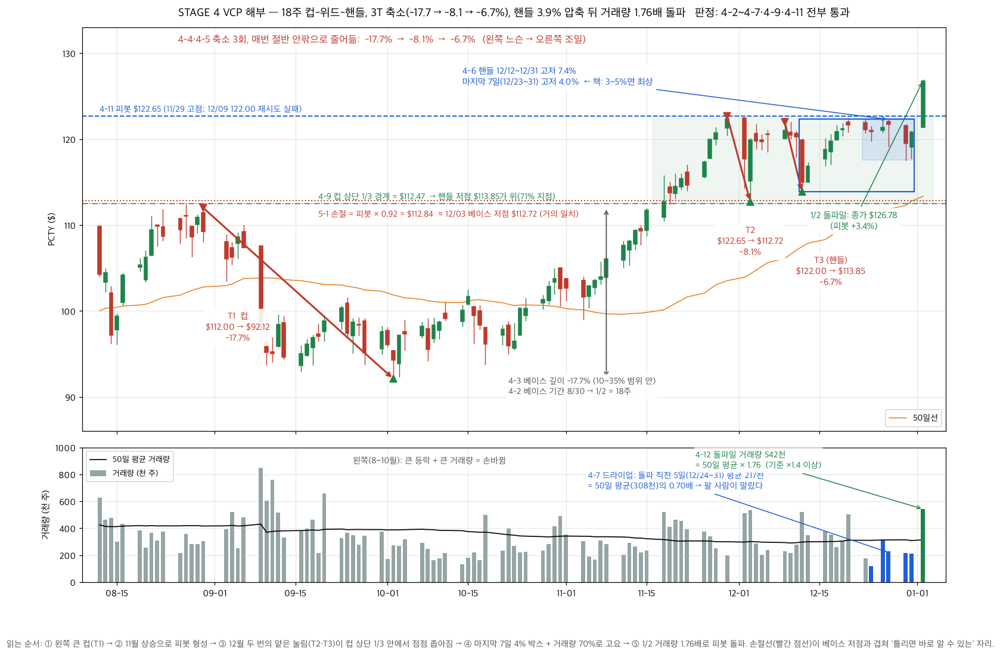
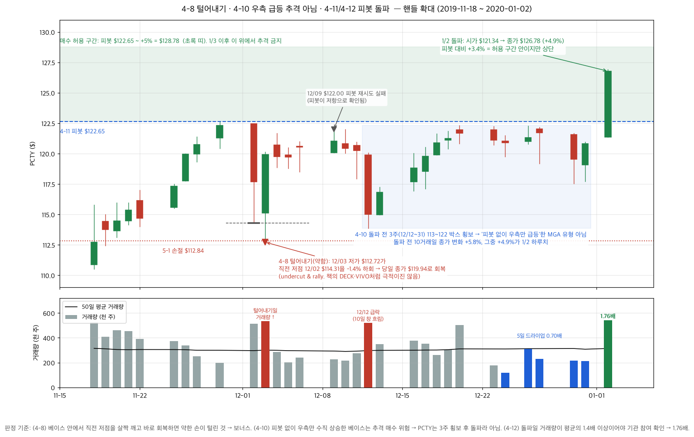

# PCTY(Paylocity) — 2020-01-02 기준 미너비니 체크리스트 전수 검증

> **한 줄 결론**: 44번 스크리너가 2020-01-02 기준 1등으로 뽑은 PCTY는
> 자동 항목(STAGE 0~5, 25개 — 2-5·2-6·2-10 연간 판정 자동화 이후)을 필수 기준에서
> **전부 통과**하고, 수동 체크리스트 16개 중 **12개 통과 · 2개 보류(계좌 의존) ·
> 2개 미충족(전부 '보너스' 항목)** 이다.
> 필수 항목에서 탈락한 것은 없다. "지수 저점일에 신고가" 같은 최상위
> 주도주 보너스는 놓쳤지만, **매출 26% 성장 + 4분기 연속 어닝 서프라이즈 +
> 가이던스 상향 + 18주 컵(−18%)에서 3단 축소(−18 → −8 → −7%) 뒤 1/2 거래량
> 1.76배로 돌파**라는, 책이 말하는 SEPA 매수 셋업의 교과서적 사례였다.
>
> 이 문서는 `pages/_shared/minervini_manual.md`(원문 기준)와
> `pages/_shared/minervini_manual_checks.py`(수동 16항목) 순서를 그대로 따른다.
> 검증에 쓴 스크립트·차트는 §7 참고. 모든 숫자는 **2020-01-02까지의 데이터만**으로
> 계산했다 (look-ahead 없음). §6 "그 뒤 실제 결과"만 예외.

---

## 1. 재현 조건

| 항목 | 값 |
|---|---|
| 기준일 | 2020-01-02 (목) — 2020년 첫 거래일 |
| 유니버스 | `nasdaq_full` (2,245종목). PCTY는 S&P500·Nasdaq100 미편입이라 `sp500+nasdaq100`에선 안 나온다 |
| 스크리너 설정 | 44번 페이지 기본값 — 최소 주가 $10 · 거래대금 $5M · RS 컷 70 · EPS YoY ≥25% · 매출 YoY ≥20% · 성장 3/4 · 피봇 −5% 이내만 · 손절 8% · 익절 22% |
| 가격 데이터 | Mongo 캐시(yfinance 일봉, 분할조정) — `build_default_market_data()` |
| 분기·연간 실적 | Alpha Vantage `EARNINGS` / `INCOME_STATEMENT` / `BALANCE_SHEET` (발표일 포함) |
| 가이던스·서프라이즈 | 2019-08-08, 2019-10-30 실적 보도자료 (SEC 8-K Ex.99.1) |
| 깔때기 | 유니버스 2,245 → 프리필터 547 → 추세 템플릿 187 → RS≥70 148 → 성장 41 → 피봇 근접 최종 후보 **38** |
| 최종 순위 | **PCTY 종합점수 90.9/100 — 1위 / 38** (RS 92 백분위, 순위 117/1,451). 2026-09-19 코드33 요소(가중 5) 추가 후 재계산하면 88.0 — 순위 영향은 재실행으로 확인 필요 |
| 생존편향 제거 재검증 (2026-09-20) | 유니버스를 **`nasdaq_full@2020-01-02`**(Alpha Vantage LISTING_STATUS — 그날 실제 상장 3,045종목, 폐지 종목 가격은 EODHD 폴백)로 바꿔 재실행: 깔때기 3,045 → 839 → 277 → 230 → 94 → **85**, **PCTY 여전히 1위** (90.8점, RS 91.9 백분위, 순위 208/2,567). 2~3위는 XLRN(2021 머크 인수)·HSKA(2022 마스 인수)처럼 이후 폐지된 종목 — 단, 폐지 종목은 Alpha Vantage 펀더멘털이 없어 '미확인 = 통과' 처리된 점에 주의 |

---

## 2. 자동 판정 항목 — 22개 전부 통과

### STAGE 0 시장 환경 (SPY)

| # | 항목 | 실제 값 | 판정 | 쉬운 설명 |
|---|---|---|---|---|
| 0-1 | 지수 > 200일선, 200일선 상승 (SPY+QQQ) | SPY 296 vs SMA200 268 (21일 전 264, 상승 중) · QQQ 208 vs 183 (상승 중) | ✅ | 두 지수 모두 오르는 중이고 장기 추세선도 위를 향한다. 신규 매수 허용 환경 |
| 0-2 | 분산일 (SPY+QQQ) | 최근 25거래일 중 SPY **2회** · QQQ **3회** (경고선 5회) | ✅ | 기관이 파는 흔적(하락+거래량 증가일)이 거의 없다 |
| 0-3 | 신고가 > 신저가 | 52주 신고가 −5% 이내 **376** vs 신저가 +5% 이내 **19** | ✅ | 오르는 종목이 압도적으로 많다 = 건강한 시장 |

### STAGE 1 추세 템플릿 (1-1 ~ 1-8)

기준일 종가 **$126.78**. SMA50 113.35 · SMA150 104.75 · SMA200 101.86 · 52주 저가 56.70 · 52주 고가 126.91.

| # | 항목 | 실제 값 | 판정 | 쉬운 설명 |
|---|---|---|---|---|
| 1-1 | 주가 > 150·200일선 | 126.78 > 104.75, 101.86 | ✅ | 장기 추세선 위에 있다 |
| 1-2 | 150일선 > 200일선 | 104.75 > 101.86 | ✅ | 이평선이 정배열 |
| 1-3 | 200일선 상승 | 21일 전 98.19 → 101.86 (+3.7%). **116거래일 연속 상승** | ✅ 우량 | 책의 '4~5개월 연속 상승' 기준(85~105일)을 넘는다 |
| 1-4 | 50일선 > 150·200일선 | 113.35 > 104.75, 101.86 | ✅ | 단기 추세도 장기보다 강하다 |
| 1-5 | 주가 > 50일선 | 126.78 > 113.35 (+11.8%) | ✅ | |
| 1-6 | 52주 저가 +30% 이상 | **+124%** (56.70 → 126.78) | ✅ | 책: "최고의 종목은 저가에서 100~300% 위에서 나온다" — 정확히 그 구간 |
| 1-7 | 52주 고가 −25% 이내 | **−0.1%** (사실상 신고가) | ✅ 우량 | 기준일 당일 52주 신고가를 새로 썼다 |
| 1-8 | RS 백분위 ≥ 70 | **92** (가중 모멘텀 2.49 = 2×34.5% + 25.5% + 41.4% + 112.9%) | ✅ | 3/6/12개월 수익률 모두 SPY(13.3/9.8/32.3%) 대비 2~3배. RS라인(종가/SPY) 최근 1개월 +2.8% 상승 |

### STAGE 2 펀더멘털 (발표일 ≤ 2020-01-02 분기만, 최신 = FY20 Q1 2019-09-30, 발표 2019-10-30)

| # | 항목 | 실제 값 | 판정 | 쉬운 설명 |
|---|---|---|---|---|
| 2-1 | 분기 EPS YoY ≥ 25% | $0.36 vs $0.20 = **+80%** (non-GAAP) | ✅ | 이익이 1년 전보다 80% 늘었다 |
| 2-2 | EPS 가속 | 최근 3분기 YoY: −32% → +209% → +80% | ❌ (자동) | **데이터 왜곡** — 아래 참고. 자동 판정은 실패지만 3/4로 STAGE 2 통과 |
| 2-3 | 매출 YoY ≥ 20% 또는 가속 | **+26.1%** (직전 분기 +24.6% → 가속) | ✅ | 매출도 같은 속도로 늘고, 속도가 빨라지고 있다 |
| 2-4 | 순이익률 개선 | 11.0% vs 전년 동기 9.8% | ✅ | 같은 매출에서 남기는 돈이 늘었다 |

2-2가 자동으로 실패한 이유: Alpha Vantage의 `reportedEPS`가 GAAP/non-GAAP를 섞어 준다.
FY18 Q3(2018-03)에 $0.88이 찍힌 것은 미국 세제개편으로 이연법인세 평가충당금을 환입한
**일회성 GAAP 이익**이다. 그 분기를 기준으로 한 FY19 Q3 YoY가 −32%로 나와 "가속"이
깨졌다. 보도자료 기준 non-GAAP EPS는 FY19 Q4 $0.34(+48%) → FY20 Q1 $0.36(+80%)로
가속 중이다. 즉 **실제로는 2-2도 통과**로 봐야 하지만, 이 문서는 자동 판정값을 그대로 둔다.

### STAGE 3·4·5 자동 항목

| # | 항목 | 실제 값 | 판정 | 쉬운 설명 |
|---|---|---|---|---|
| 3-5 | 산업군 집계 | SOFTWARE - APPLICATION, 최종 후보 중 생존자 **4 (ADBE·DOCU·PCTY·UPBD)**종목 | ✅ | 같은 산업군에서 여러 종목이 살아남았다 = 주도 그룹 |
| 3-7 | 유동성·가격 | 주가 $126.78, 20일 평균 거래대금 ≈ $40M/일 | ✅ | 개인 포지션의 수백 배 유동성 |
| 4-2 | 베이스 기간 | 자동 4.4주(11/29 고점 기준). 눈 판독 **18주**(8/30 고점 기준) | ✅ | 3~60주 범위 안 |
| 4-3 | 베이스 깊이 | 자동 −8.1%. 눈 판독 컵 **−17.7%** (112.00 → 92.12) | ✅ | 10~35% 범위. 60% 이상 급락 종목 아님 |
| 4-4 | 축소 횟수 | 자동 2회. 눈 판독 **3회** (−17.7 → −8.1 → −6.7%) | ✅ | 2~6회 범위 |
| 4-5 | 축소의 체감 | 17.7% → 8.1% → 6.7% — 매 단계 절반 안팎으로 줄어듦 | ✅ | "왼쓱 느슨 → 오른쪽 조밀"의 정의 그대로 |
| 4-6 | 최종 축소 조밀함 | 핸들(12/12~12/31) 고저 **6.9%**, 마지막 7일(12/23~31) **3.9%** | ✅ 최상 | 책: 10% 미만 통과, 3~5%면 최상 |
| 4-7 | 거래량 드라이업 | 10일/50일 = 0.91 (자동 힌트 미달). **돌파 직전 5일(12/24~31) = 0.70** | ✅ (경계) | 연말 5일간 거래량이 평소의 70%로 말랐다. 10일 창은 12/12~13 급락일이 섞여 흐려짐 |
| 4-11 | 피봇 | 자동 126.91(**당일 고가 — 아티팩트**). 실제 피봇 = **$122.65** (11/29 고점, 12/9 122.00 재시도 실패) | ✅ | 아래 §5 주의사항 참고 |
| 4-12 | 돌파일 거래량 ≥ 50일 평균 ×1.4 | 1/2 거래량 542,500 / 50일 평균 308,000 = **1.76배**, 종가 +4.9% (시가 $121.34 → 종가 $126.78) | ✅ | 기준일 당일이 바로 돌파일이었다 |
| 5-1 | 손절가 | 피봇 122.65 × 0.92 = **$112.84** ≈ 12/3 베이스 저점 112.72 | ✅ | 규칙상 손절선과 차트상 손절선(베이스 저점)이 거의 일치 — 이상적 |

---

## 3. 수동 체크리스트 — 항목별 판정과 이유 (2-5·2-6·2-10은 자동화됐지만 근거 설명은 남겨 둔다)

범례: ✅ 통과 · ⭐ 보너스 통과 · ❌ 미충족 · ⏸ 보류(계좌·주관 판단 필요) · ⚠️ 통과하되 주의

### STAGE 0

**0-4 새 강세장 초입(첫 4~8주)인가 — ❌ (보너스)**
직전 10% 이상 조정의 저점은 2018-12-24 (SPY −19.4%). 기준일까지 **53주** 경과 → 초입이 아니다.
그 뒤 5% 이상 눌림은 2019-06-03(−6.6%, 30주 전), 2019-08-05(−6.0%, 21주 전)로 모두 8주 밖.
→ 최상의 '기회의 창'은 아니었다. 다만 이 항목은 보너스라 탈락 사유가 아니다.

차트 읽는 법: 위 패널은 SPY 종가. 빨간 띠 = 고점에서 저점까지 5% 이상 빠진 구간, 빨간 점선·점 = 그 저점일.
초록 띠 = 저점 다음 8주 = 책이 말하는 "새 강세장 첫 4~8주" 기회의 창. 파란 세로선 = 기준일 2020-01-02.
점선 화살표가 초록 띠 끝에서 기준일까지 얼마나 떨어져 있는지(창 밖 몇 주인지)를 보여준다.
아래 패널은 고점 대비 낙폭 %. −10% 선 아래로 내려간 저점만 "새 강세장의 출발점"으로 인정하므로,
자격이 있는 저점은 2018-12-24 하나뿐이고 그마저 53주 전이다. 2019년의 두 눌림(−6.6%, −6.0%)은
−10% 선에 닿지 않아 조정으로 치지 않으며, 설령 인정해도 각각 30주·21주 전이라 창 밖이다.

### STAGE 2

**2-5 코드 33 — 연간 EPS·매출·순이익률 3년 연속 가속 — ❌ (보너스) — 이제 자동 판정 (1/3)**
2026-09-19부터 44 상세 표·45 리플레이에서 자동 판정된다 (`evaluate_annual`). PCTY 결과: EPS 가속 ❌ · 매출 가속 ❌ · 순이익률 상승 ✅ = **1/3**.
회계연도(6월 결산) FY17 → FY18 → FY19:

| | FY2017 | FY2018 | FY2019 |
|---|---|---|---|
| 매출 | $300.0M (+30%) | $377.5M (+26%) | $467.6M (+24%) |
| EPS(AV, GAAP 혼재) | $0.66 (+120%) | $1.30 (+97%) | $1.37 (+5%) |
| 순이익률 | 2.2% | 10.2% | 11.5% |

세 지표가 동시에 가속하지 않는다(매출은 완만 감속, EPS는 FY18 일회성 세금이익 때문에 FY19가
납작해 보임). 순이익률만 3년 연속 개선. → 코드 33 아님. 몬스터급 후보는 아니었다는 뜻이며,
필수 항목이 아니다.

**2-6 연간 EPS 박스권·과거 고점 돌파 — ⭐ (자동 판정 ✅: FY19 $1.37 > 이전 최고 $1.30)**
연간 EPS: FY14 −$0.01 → FY15 −$0.07 → FY16 $0.30 → FY17 $0.66 → FY18 $1.30 → FY19 $1.37.
적자에서 흑자 전환 후 매년 사상 최고 EPS를 새로 쓰고 있다. "수년 박스권"은 없었지만
"과거 고점 돌파(사상 최고치)" 조건은 충족. 책의 사례($0.18~0.32 → $1.32)와 같은 폭발적
박스권 이탈 유형은 아니어서 가점은 약하게.

**2-7 최근 분기 어닝 서프라이즈(+) — ✅**
FY20 Q1 non-GAAP EPS **$0.36 vs 컨센서스 $0.26~0.27 (+35~38%)**, 매출 $126.7M vs $117M 예상.
이전 3분기도 전부 예상치 상회: $0.23/0.22, $0.60/0.57, $0.34/0.25 → **4분기 연속 서프라이즈**.
→ 애널리스트가 계속 과소평가하는 회사 = 추정치가 계속 올라가는 회사. 책이 원하는 그림.

**2-8 가이던스 하향 없음 (상향이면 가점) — ⭐**
2019-08-08 첫 FY2020 가이던스: 매출 $563.5~565.5M, Adj. EBITDA $161.5~163.5M.
2019-10-30 Q1 발표 때 **매출 $567.0~569.0M, Adj. EBITDA $163.5~165.5M으로 상향**.
분기 가이던스(Q2 $129.5~130.5M, +21~22%)도 제시. 하향 없음 → 가점.

**2-9 완제품 재고·매출채권 증가율 ≤ 매출 증가율 — ✅ (형식상 ⚠️)**
Paylocity는 클라우드 급여 소프트웨어 회사라 **완제품 재고가 없다**(재무상태표 inventory 0).
매출채권 $2.99M → $3.91M (+31%) vs 매출 +26%로 형식상 채권 증가율이 조금 높지만,
매출채권이 분기 매출의 **3%** 수준(고객이 급여일 전에 선입금하는 구조)이라 경고로 볼 규모가 아니다.
→ 통과. 이 항목의 진짜 대상은 제조·유통업이다.

**2-10 성장률 감속 아님 (연간) — ⚠️ 실질 통과 (자동 판정은 ❗ 경고: EPS YoY +120 → +97 → +5%가 '두 번 연속 하락 + 마지막 < 첫 해 ½' 규칙에 걸린다. FY18 일회성 세금이익 왜곡이므로 아래 설명대로 사람이 뒤집는다)**
매출 성장 30 → 26 → 24%는 완만한 둔화이지 책이 말하는 "델 80 → 65 → 28%"식 급감속이 아니다.
EPS는 일회성 왜곡을 빼면 FY19 non-GAAP $1.38로 성장 지속. 분기 매출은 24.6 → 26.1%로 재가속.
→ 천장 신호 아님. 다만 "매출 20%대 초반으로 내려오면 재점검"이라는 메모를 남길 만하다.

### STAGE 3

**3-1 지수보다 먼저 바닥을 만들었나 — ✅ (근소)**

*왜 보는가*: 책의 논리는 "지수가 아직 떨어지는데 어떤 종목이 먼저 하락을 멈추고 돌아서면,
그 종목은 팔 사람이 이미 다 팔았고 기관이 조용히 사 모으는 중"이라는 것이다. 그래서
지수 조정의 저점일과 종목의 저점일을 나란히 놓고 **누가 먼저 바닥을 쳤는지**를 본다.

| SPY 조정 | SPY 저점일 | PCTY 저점일(종가) | 판정 |
|---|---|---|---|
| 2018 Q4 조정 (−19%) | 2018-12-24 | **2018-12-21** ($54.50) | 1거래일 **선행** ✅ |
| 2019-05 눌림 (−7%) | 2019-06-03 | 2019-06-03 ($89.87) | 같은 날 = |
| 2019-08 눌림 (−6%) | 2019-08-05 | 1차 2019-08-05 ($92.37) → **2차 2019-10-02** ($94.28) | 1차는 같은 날, 2차는 **8주 후행** ❌ |

→ 큰 조정에서는 선행, 작은 눌림에선 동행~후행. 아마존 2001 사례처럼 뚜렷하진 않아 '근소 통과'.

차트 읽는 법: 위 두 패널은 같은 기간의 SPY(검정)와 PCTY(파랑) 종가이고, 빨간 띠 = SPY가
고점에서 저점까지 빠진 조정 구간, 빨간 점선 = SPY 저점일, 파란 점선 = PCTY 저점일이다.
두 점선이 겹치면 "같은 날 바닥", 파란 점선이 왼쪽에 있으면 "종목이 먼저 바닥"이다.
아래 두 개는 확대 패널로, 구간 첫날을 100으로 맞춰 두 선을 겹쳐 놓았다.
- **확대 ①(2018-12)**: PCTY(파랑)가 12-21에 바닥을 찍고 12-24엔 이미 올랐는데, SPY(검정)는
  12-24가 바닥이다. 파란 점선이 빨간 점선보다 왼쪽에 있는 것이 "먼저 바닥"의 시각적 정의.
  지수가 마지막으로 무너지는 날 이 종목은 오르고 있었다는 뜻이라 통과.
- **확대 ②(2019-08~10)**: 08-05엔 두 선이 같은 날 바닥을 찍었다(1차 저점, 동행). 문제는 그 뒤다.
  SPY는 9월에 고점 부근으로 복귀했는데(검정 선이 100 위), PCTY는 9월 초 소프트웨어 섹터
  로테이션 때 다시 −13% 빠져 10-02에 2차 저점을 만들었다(파란 선이 87까지). 지수가 이미
  회복한 뒤 8주를 더 빠진 것이므로 이 구간만 보면 "지수보다 늦은 바닥"이다.
  다만 이 2차 저점($92.12 저가)이 곧 18주 컵의 바닥이 되어 뒤의 VCP 셋업(STAGE 4)으로 이어졌다.

**3-2 지수 조정 저점일에 신고가(근접)였나 — ❌ (보너스)**

*왜 보는가*: 3-1의 강화판이다. 지수 저점일에 종목이 "덜 빠진" 정도가 아니라 **아예 신고가
근처(52주 고가 −5% 이내)에 있었다면**, 시장 전체가 팔리는 날에도 이 종목을 사는 큰손이 있다는
가장 강한 증거다(책의 PCYC 사례). 그래서 세 번의 SPY 저점일마다 PCTY가 52주 고가에서
얼마나 아래에 있었는지 잰다.

| SPY 저점일 | PCTY 종가 | PCTY 52주 고가 | 52주 고가 대비 | (참고) SPY 자신 | 판정 |
|---|---|---|---|---|---|
| 2018-12-24 | $54.83 | $88.47 | **−38%** | −19.6% | ❌ |
| 2019-06-03 | $89.87 | $103.80 | **−13%** | −6.9% | ❌ |
| 2019-08-05 | $92.37 | $107.94 | **−14%** | −6.1% | ❌ |

세 번 모두 −5% 기준에서 한참 밖이고, 오히려 지수보다 2~3배 깊게 빠져 있었다(3-3의 배수와 같은 얘기).
→ PCYC처럼 "시장이 무너지는 날 신고가"였던 최상위 주도주는 아니다.
2019년 하반기 소프트웨어 전반이 조정받을 때 같이 빠졌다가 지수(신고가 복귀 10-25)보다
3주쯤 늦은 **11-18에 신고가로 복귀**한 '추종형' 주도주.

차트 읽는 법: 위 패널은 PCTY 종가(파랑)와 그 시점의 52주 고가(회색 점선, 최근 252거래일 최고가).
두 선 사이의 붉은 면적이 "신고가에서 얼마나 떨어져 있는가"다. 면적이 0에 가까울수록 신고가 근처.
빨간 점선 = SPY 저점일 세 번. 각 점선이 붉은 면적의 **가장 두꺼운 지점**을 지나는 것이 핵심 —
즉 시장이 바닥일 때 PCTY도 자기 고점에서 가장 멀리 있었다.
아래 패널은 같은 것을 %로 바꾼 것(PCTY 파랑, SPY 검정). 초록 띠(0 ~ −5%)가 책이 말하는
"지수 저점일에 신고가 근접" 구간이다. 통과하려면 빨간 점선 위의 파란 점이 초록 띠 안에 있어야
하는데, 실제로는 −38 / −13 / −14%에 찍혀 있고 매번 검정(SPY) 선보다도 아래에 있다.
초록 삼각형(11-18)이 PCTY가 신고가로 돌아온 날인데, 이때는 SPY가 이미 10-25에 신고가를 쓴 뒤다.
기준일(파란 세로선)에는 −0.1%로 초록 띠 안에 있지만, 이 항목이 묻는 것은 "지수가 무너지던 날"의
위치이므로 판정은 미충족. 보너스 항목이라 탈락 사유는 아니다.

**3-3 조정 깊이가 지수의 2~3배 미만 — ✅ (경계)**

| SPY 조정 구간 | SPY 낙폭 | PCTY 낙폭 | 배수 |
|---|---|---|---|
| 2018-09-20 → 12-24 | −19.4% | −33.2% | 1.7× |
| 2019-05-03 → 06-03 | −6.6% | −13.1% | 2.0× |
| 2019-07-26 → 08-05 | −6.0% | −15.1% | 2.5× |

전부 3배 미만. 마지막 구간 2.5배는 경계선 — 고베타 소프트웨어 종목의 전형이며, MNKD(−60% vs −6%, 10배)와는 차원이 다르다.

**3-4 산업군 내 1~2위 종목인가 — ✅**
HCM·급여 SaaS 피어 6종목의 기준일 수익률:

| 티커 | 3개월 | 6개월 | 12개월 | 52주 고가 대비 |
|---|---|---|---|---|
| **PCTY** | **+34.5%** | **+25.5%** | +112.9% | **−0.1%** |
| PAYC | +32.9% | +15.3% | **+127.1%** | −2.9% |
| ADP | +9.3% | +4.9% | +33.6% | −1.4% |
| PAYX | +2.9% | +2.1% | +34.8% | −3.1% |
| TNET | −2.4% | −17.3% | +39.5% | −25.7% |
| WDAY | +1.0% | −22.8% | +4.8% | −26.2% |
| NSP | −9.7% | −31.7% | −4.2% | −39.5% |

3개월·6개월·신고가 근접도 1위, 12개월은 PAYC에 이어 2위. 그룹 내 **1~2위** 확정.
PAYC(Paycom)와 함께 중소기업 클라우드 급여 시장의 양강이며, 나머지는 후발주(ADP·PAYX는 저성장 대형, WDAY는 대기업 HCM 조정 중).

**3-6 기업의 신선함 — ⭐**
2014-03-19 나스닥 상장(공모가 $17) → 기준일 기준 **5.8년**, 10년 이내.
클라우드 네이티브 급여·HR 플랫폼으로 ADP·Paychex의 온프레미스/구형 고객을 빼오는 '신제품·신시장' 스토리. 오닐의 N 충족.

### STAGE 4 (차트 3장: 선행 상승 → VCP 해부 → 핸들·돌파 확대. 원본 캔들 차트는 §7 이미지 1·2)

STAGE 4는 "**언제** 사느냐"의 항목이다. 좋은 회사(STAGE 2)가 좋은 추세(STAGE 1)에 있어도,
베이스 안에서 아무 데나 사면 손절에 걸린다. 책이 말하는 VCP(Volatility Contraction Pattern)의
핵심은 세 가지 — ① 강한 상승 뒤의 쉼일 것(4-1), ② 눌림의 폭과 거래량이 왼쪽에서 오른쪽으로
갈수록 **줄어들** 것(4-3~4-7), ③ 조용해진 뒤 피봇을 큰 거래량으로 넘을 것(4-11·4-12).
아래 세 차트가 이 순서를 따른다.

**4-1 베이스 이전 선행 상승 +30% 이상 — ✅**

*왜 보는가*: VCP는 "오르던 종목이 숨을 고르는 모양"일 때만 의미가 있다. 하락 추세 안에서
생긴 박스는 모양이 비슷해도 다음 방향이 아래일 확률이 높다. 그래서 베이스 **직전**에
최소 +30%의 상승이 있었는지를 먼저 확인한다.

2018-12-24 저점 $53.46 → 2019-11-29 베이스 고점 $122.65 = **+129%**.
베이스 직전 6개월만 봐도 2019-06-03 $87.39 → $122.65 = +40%.
→ 베이스는 강한 상승 뒤에 나온 '쉼'이다. 하락 추세 속 반등 박스가 아니다.

차트 읽는 법: 파란 선이 PCTY 종가, 주황 선이 50일선. 빨간 점 두 개가 상승의 출발점
(2018-12-24 지수 조정 저점, 2019-06-03 눌림 저점), 초록 점이 베이스 고점이자 피봇인 11/29
$122.65다. 굵은 초록 화살표가 +129%, 점선 화살표가 베이스 직전 6개월 +40%. 회색 띠가
베이스 구간(8/30 고점 → 1/2 돌파 = 18주, 4-2)이다. **회색 띠가 화살표의 끝, 즉 상승의
꼭대기 부근에 걸쳐 있다**는 것이 이 항목의 시각적 정의다. 띠가 화살표 아래쪽(하락 중)에
있었다면 실격.

**4-2 ~ 4-7, 4-9, 4-11 — VCP 해부 (자동 항목의 시각적 근거)**

차트 읽는 법 (위 캔들 패널):
- **빨간 화살표 세 개 = 축소(T) 3회** (4-4). 각 화살표는 "고점(▼)에서 저점(▲)까지 얼마나
  빠졌나"다. T1 컵 −17.7% → T2 −8.1% → T3 −6.7%. **화살표가 오른쪽으로 갈수록 짧아지는 것**이
  4-5 "축소의 체감"이고, VCP라는 이름의 뜻 그대로다(변동성이 수축한다).
- **회색 세로 양방향 화살표 = 베이스 깊이** (4-3). 컵 고점 $112.00에서 컵 저점 $92.12까지
  −17.7%. 10~35% 범위 안. 60% 넘게 무너진 종목은 "베이스"가 아니라 "붕괴"다.
- **파란 점선 = 피봇 $122.65** (4-11). 11/29 고점이고, 12/09에 $122.00까지 다시 올라갔다가
  실패했다는 것은 이 가격에 매도 물량이 있다는 뜻 — 그래서 여기를 넘는 순간이 의미가 있다.
  자동 피봇 $126.91은 1/2 당일 고가를 잡은 아티팩트다(§5 참고).
- **초록 점쇄선 = 컵 상단 1/3 경계 $112.47** (4-9). 컵 저점에서 고점까지의 2/3 지점.
  핸들(파란 박스)의 저점 $113.85가 이 선 **위**에 있다 = 핸들이 컵의 윗부분에서 만들어졌다.
  핸들이 컵 중간까지 내려오면 "속임수 피봇(cheat)"이라 부르며 실패율이 높다.
- **파란 박스 = 핸들 12/12~12/31** (4-6). 고저 7.4%. 그 안의 진한 박스가 마지막 7일(12/23~31)
  고저 3.9% — 책이 "3~5%면 최상"이라고 한 구간. 캔들이 점점 짧아지는 것이 눈으로 보인다.
- **빨간 점선 = 손절 $112.84** (5-1). 피봇 × 0.92. 이 선이 12/03 베이스 저점 $112.72와
  거의 겹친다. 규칙으로 정한 손절선과 차트가 말하는 손절선(베이스 저점 이탈)이 일치하는
  것이 이상적이다 — 손절에 걸리면 "셋업이 틀렸다"는 뜻이지 "노이즈에 흔들렸다"가 아니다.

차트 읽는 법 (아래 거래량 패널):
- 왼쪽 8~10월은 거래량이 크고 들쭉날쭉하다 = 손바뀜. 오른쪽으로 갈수록 검정 50일 평균선
  아래로 가라앉는다.
- **파란 막대 = 돌파 직전 5일(12/24~31)** (4-7). 평균 217천 주 = 50일 평균 308천의 0.70배.
  "팔 사람이 다 팔았다"는 드라이업. 10일 창(0.91)은 12/12~13 급락일이 섞여 흐려진다(§5).
- **초록 막대 = 1/2 돌파일** (4-12). 542천 주 = 50일 평균 × 1.76. 기준 ×1.4 이상.
  조용하던 종목이 갑자기 큰 거래량으로 피봇을 넘는 것 = 기관이 들어왔다는 확인.

**4-8 털어내기 존재 — ⭐ (약함)**
2019-12-03 저가 $112.72가 직전 저점(12/02 $114.31)을 하회한 뒤 당일 종가 $119.94로 회복, 다음 날 반등.
규모가 작아(−1.4%) 책의 DECK·VIVO 사례 같은 극적인 undercut & rally는 아니다. 약한 가점.

**4-9 손잡이가 베이스 상단 1/3에 위치 — ✅**
컵 저점 $92.12 → 컵 고점 $122.65 기준으로 핸들 저점 $113.85는 **71% 지점**(상단 1/3 = 67% 이상).
자동 피봇 method가 `contraction-high`(cheat 아님)여서 중단부 속임수 피봇도 아니다. (위 VCP 해부 차트의 초록 점쇄선)

**4-10 베이스 우측 급등 추격이 아님 — ✅**
돌파 전 10거래일 종가 변화 +5.8%, 그중 대부분이 1/2 당일 +4.9%. 12월 3주간은 113~122 박스에서 횡보했으므로 "피봇 없이 우측만 급등"한 MGA 유형이 아니다.
단, 1/2 종가 $126.78은 피봇 $122.65 대비 +3.4%로 **매수 허용 범위(+5%) 안이지만 상단**. 1/3 이후 추격 매수는 금지.

차트 읽는 법: 11/18부터 1/2까지 핸들 구간만 확대한 캔들이다.
- **4-8 털어내기**: 12/02 저가 $114.31에 회색 짧은 가로선, 그 아래 12/03 저가 $112.72에
  빨간 ▼. 하루 만에 직전 저점을 살짝 깨고(−1.4%) 종가는 $119.94로 몸통 위에서 마감했다.
  "직전 저점을 깨는 순간 손절한 약한 손의 물량을 강한 손이 받았다"는 뜻. 거래량 패널의
  빨간 막대(12/03, 534천)가 그 손바뀜이다. 다만 깊이가 얕아 약한 가점.
- **4-10 추격 아님**: 연한 파란 박스가 12/12~31의 113~122 횡보. 돌파 직전 3주 동안 종가가
  박스 안에서 오르내렸을 뿐 우측이 수직으로 솟지 않았다. MGA 유형(피봇 없이 우측만 급등해
  살 자리가 없는 베이스)이 아니라는 뜻. 회색 ▼(12/09 $122.00)는 피봇 재시도 실패 — 피봇이
  실제 저항이었음을 확인해 준다.
- **4-11/4-12 돌파와 매수 허용 구간**: 파란 점선이 피봇, 그 위 초록 띠가 피봇 ~ +5%($128.78)의
  매수 허용 구간이다. 1/2 캔들이 시가 $121.34에서 종가 $126.78(+4.9%)로 피봇을 관통해 초록 띠
  안(피봇 +3.4%)에서 마감했다. 띠의 상단에 가까우므로 다음 날부터 띠 위에서 사는 것은 추격이다.
  거래량 패널의 초록 막대(1.76배)와 그 직전 파란 막대들(5일 드라이업 0.70배)의 대비가
  "고요 → 폭발"의 정의다.

**4-종합 VCP 모양 최종 눈판독 — ✅**
왼쪽(8~10월) 등락폭 15~20%·거래량 큼 → 11월 상승 → 오른쪽(12월) 등락폭 7% → 4%·거래량 감소 → 1/2 거래량 1.76배 돌파.
자동 실측(축소 −8.1 → −6.7%, 조밀도 7.4%, 5일 드라이업 0.70)과 차트 인상이 일치한다.
컵-위드-핸들 18주, 3T VCP. 위 VCP 해부 차트 하단의 "읽는 순서 ①~⑤"가 이 한 줄의 시각적 버전이다.

### STAGE 5

**5-2 계좌 리스크 1.25~2.5% 이내 — ⏸ 계좌 의존**
손절폭 8%(122.65 → 112.84) 기준 포지션 비중 15.6~31%면 계좌 리스크 1.25~2.5%. 예: 계좌의 20% 투입 시 리스크 1.6%.

**5-3 포지션 20~25% 상한 · 총 4~8종목 — ⏸ 계좌 의존**
위 계산과 결합하면 **비중 16~25%, 손절 8%** 조합이 두 규칙을 동시에 만족한다.

---

## 4. 종합 채점

| 구분 | 통과 | 미충족 | 보류 |
|---|---|---|---|
| 자동 필수 항목 (STAGE 0·1·2-1~2-4·3-5·3-7·4-2~4-7·4-11·4-12·5-1) | 22 (2-2는 데이터 왜곡, 실질 통과) | 0 | 0 |
| 자동 연간 항목 (2-5, 2-6, 2-10) | 2-6 ✅ | 2-5 1/3 (보너스) · 2-10 ❗(일회성 세금이익 왜곡, 실질 통과) | 0 |
| 수동 필수 항목 (2-7, 2-8, 2-9, 3-1, 3-3, 3-4, 4-1, 4-9, 4-10, 4-VCP) | **10/10** | 0 | 0 |
| 수동 보너스 항목 (0-4, 3-2, 3-6, 4-8) | 2 (3-6, 4-8) | 2 (0-4, 3-2) | 0 |
| 계좌 의존 (5-2, 5-3) | — | — | 2 |

**왜 1등이었나 — 세 문장 요약**

1. **추세·RS**: 52주 저가에서 +124%, 신고가 −0.1%, 200일선 116일 연속 상승, RS 92 백분위. 같은 산업군(PAYC)과 함께 시장을 압도했다.
2. **펀더멘털**: 매출 +26%(가속), non-GAAP EPS +80%, 4분기 연속 서프라이즈, 가이던스 상향. 재고·채권 경고 없음.
3. **타이밍**: 18주 컵(−18%)이 3단으로 조여들어(−18 → −8 → −7%) 12월 말 4% 박스·거래량 70%까지 마른 뒤, 기준일 당일 거래량 1.76배 갭업으로 $122.65를 돌파했다. 손절선(−8%)이 베이스 저점과 일치한다.

**왜 '몬스터'까지는 아니었나**: 강세장 초입이 아니었고(0-4), 시장 저점일에 신고가가 아니었으며(3-2), 연간 3지표 동시 가속(코드 33)도 아니었다. 즉 "매우 좋은 2단계 주도주"이지만 책의 +1,000% 사례군의 초기 조건과는 다르다.

---

## 5. 주의사항 (재현하며 발견한 것)

1. **자동 피봇 아티팩트** — `pivot_levels()`의 4% zigzag가 1/2 당일 고가 $126.91을 스윙 고점으로 확정했다. 당일 저가 $121.34가 당일 고가보다 4.4% 낮아 "반전"으로 인식된 탓이다. 그래서 피봇거리 −0.1%·상태 "피봇 근접"으로 표시됐지만, 실제로는 **피봇 $122.65를 이미 돌파한 돌파일**이다. 장대 양봉 돌파일에 같은 현상이 재현될 수 있으니, 피봇상태가 "근접"인데 당일 종가가 전일 고점 위면 돌파일로 읽을 것.
2. **Alpha Vantage EPS는 GAAP/non-GAAP 혼재** — 2-2 EPS 가속 자동 판정이 일회성 세금이익(FY18 Q3)에 걸려 실패로 나왔다. 상세 패널의 분기 표에서 특정 분기만 튀면 보도자료 non-GAAP로 재확인.
3. **10일 드라이업 창의 한계** — 12/12~13 급락일 거래량이 10일 평균에 들어가 0.91로 나왔다. 돌파 직전 5일은 0.70. 마지막 압축 구간이 10일보다 짧으면 힌트가 흐려진다.
4. **유니버스** — PCTY는 `nasdaq_full`에만 있다. S&P500/Nasdaq100 유니버스에서 같은 날 1등은 HWM(87.9점)이었다.

---

## 6. 그 뒤 실제 결과 (기준일 이후 데이터 — 평가 뒤에만 볼 것)

| 시나리오 | 결과 |
|---|---|
| 1/2 종가 근처 $122.65~126.78 진입, 손절 −8% / 익절 +22% | **2020-02-04 익절 $149.63 (+22.0%, 22거래일)**. 보유 중 최대 하락 −1.1% |
| 같은 진입, 익절 없이 50일선 이탈 청산 | 2020-02-25 $133.66 청산 (+9.0%). 2/19 고점 $150.73(+23%) 이후 코로나 급락 시작 |
| 같은 진입, 22% 목표 없이 −8% 손절만 | 2020-03-09 손절 → 이후 3/18 저점 $66.98(−45%) |
| 진입 후 수익률 | +1M +20.4% · +3M −40.5%(코로나) · +6M +21.3% · +12M +60.0% |

진입 후 **매일 손절선을 옮기고 강세일에 나눠 파는** 실제 운용은 별도 문서 `미너비니_PCTY_진입후_일일운용_2020.md`에 일자별로 정리했다 (결과 +16.4%, 최대 낙폭 −1%).

책의 "돌파 1~3주 내 +20%면 8주 보유" 규칙을 적용하면 2/4에 +20%를 넘겼으므로 8주 보유 → 2/27경 청산인데, 그 시점 주가는 $130 안팎(+6%). 코로나라는 외생 충격 탓이지만, **+20~25% 강세 매도 규칙이 최선의 결과**였다는 점이 확인된다.

---

## 7. 부록 — 차트·재현 스크립트

- 1년 일봉 + 이평선 + 피봇/손절/익절: `images/minervini_pcty_2020/pcty_daily_2019.png`
- 베이스 확대(최근 120거래일, 4% 스윙 포인트 표기): `images/minervini_pcty_2020/pcty_base_zoom.png`
- PCTY vs SPY 정규화 + SPY 조정 구간: `images/minervini_pcty_2020/pcty_vs_spy.png`
- 0-4 강세장 초입 판정(SPY 저점·8주 창·경과 주수·낙폭): `images/minervini_pcty_2020/spy_0_4_bull_window.png`
- 3-1 SPY 저점 vs PCTY 저점(선행/동행/후행 + 확대 2구간): `images/minervini_pcty_2020/pcty_3_1_bottom_lead.png`
- 3-2 SPY 저점일의 PCTY 52주 고가 대비 위치(−5% 띠): `images/minervini_pcty_2020/pcty_3_2_new_high_on_spy_low.png`
- 4-1 선행 상승(+129% / +40%, 베이스 위치): `images/minervini_pcty_2020/pcty_4_1_prior_run.png`
- STAGE 4 VCP 해부(3T 축소·깊이·핸들 박스·상단 1/3·피봇·손절·드라이업·돌파 거래량): `images/minervini_pcty_2020/pcty_4_vcp_anatomy.png`
- 4-8·4-10·4-11/4-12 핸들 확대(털어내기·횡보 박스·매수 허용 구간): `images/minervini_pcty_2020/pcty_4_8_4_10_handle_breakout.png`
- 차트 생성 스크립트: `images/minervini_pcty_2020/make_stage3_charts.py` (3-1·3-2), `make_stage4_charts.py` (STAGE 4). 컨테이너에서 실행. SPY·PCTY 일봉은 `build_default_market_data()`로 받아 CSV로 덤프 후 사용. 한글 폰트는 호스트 AppleSDGothicNeo.ttc를 `backtester/_tmp_pcty_chart/`에 복사해 로드(작업 후 폴더 삭제)
- 재현: 44번 페이지에서 기준일 2020-01-02 · 유니버스 `nasdaq_full` · 기본 설정으로 Run Screen → 종목 선택 PCTY. 상세 근거 표 첫 줄에 종합점수 요소별 분해가 표시된다.
- 자료 출처: [Q1 FY2020 실적 보도자료 (2019-10-30)](https://www.globenewswire.com/news-release/2019/10/30/1938267/0/en/Paylocity-Announces-First-Quarter-Fiscal-Year-2020-Financial-Results.html) · [Q4/FY2019 실적 보도자료 (2019-08-08, SEC 8-K)](https://www.sec.gov/Archives/edgar/data/1591698/000110465919044883/a19-16621_1ex99d1.htm) · [Zacks: Q1 어닝 비트 및 가이던스 상향](https://www.zacks.com/stock/news/597664/paylocity-pcty-beats-on-q1-earnings-raises-2020-guidance) · [IPO 가격 결정 (2014-03-18)](https://investors.paylocity.com/news-releases/news-release-details/paylocity-prices-initial-public-offering)
