# PCTY 2020-01-02 진입 후 — 미너비니식 일일 운용 체크리스트와 실제 적용

> 45번 리플레이 페이지는 진입 시점에 손절선(−8%)·익절선(+22%)을 **고정**하고 끝까지 따른다.
> 실제 미너비니 운용은 그렇지 않다. 손절선은 주가가 올라갈수록 **위로만** 옮기고,
> 익절은 목표가가 아니라 **강세일에 나누어** 팔며, 실적 발표·시장 환경·거래량 이상 신호에
> 따라 매일 다시 판단한다. 이 문서는 (1) 진입 후 매일 손으로 돌릴 체크리스트와
> (2) 그 체크리스트를 PCTY 2020-01-02 진입에 실제로 적용한 일자별 판단 기록이다.
>
> 근거: «초고수익 성장주 투자» 11장(리스크 관리)·«초수익 모멘텀 투자»(스톱·R 배수·강세 매도·
> 실적 도박 규칙). 가격은 Mongo 캐시(yfinance 조정가), 실적은 2020-02-04 보도자료.
> 선행 문서: `미너비니_PCTY_2020-01-02_체크리스트_검증.md` (진입 전 판정).

---

## 1. 진입 시 확정하는 4개 숫자

| 항목 | 규칙 | PCTY 값 |
|---|---|---|
| 진입가 | 피봇 돌파 시 체결가 (피봇 +5% 이내만 허용) | 피봇 $122.65 → 1/2 장중 돌파 체결 **$123.00** |
| 초기 손절 | 진입가 −7~8% **또는** 베이스 저점 바로 아래 중 가까운 쪽. 10%를 넘으면 진입 포기 | 베이스 저점 12/3 $112.72 → **$112.70 (−8.4%)** |
| 1R | 진입가 − 손절가 = "1단위 리스크" | $10.30 |
| 포지션 | 계좌 리스크 1.25~2.5% ÷ 손절폭 | 계좌의 20% 투입 시 리스크 1.7% ✅ |

이 4개가 없으면 매수 자격이 없다. 이후 모든 판단은 **R 배수**(현재 이익 ÷ 1R)로 한다.

---

## 2. 진입 후 일일 체크리스트 (장 마감 후 5분)

### A. 손절선 — 매일 재확인, 절대 내리지 않는다

| # | 항목 | 규칙 | 액션 |
|---|---|---|---|
| A-1 | 초기 손절 유지 | 종가 기준이 아니라 **장중 저가**가 손절선에 닿으면 무조건 청산 | 예외 없음. "실적 좋으니까"도 없음 |
| A-2 | 본전 스톱(무료 롤) | 종가가 **+2R(≈ +15%)** 이상 → 손절선을 진입가로 올린다 | 이익이 손실로 바뀌는 일을 없앤다 |
| A-3 | 이익 절반 보호 | 종가가 **+20% 이상**이면 손절선 = 진입가 + (최고 이익 ÷ 2) | 최대 이익의 절반 이상은 돌려주지 않는다 |
| A-4 | 백스톱 | 잔여 물량은 **50일선 종가 이탈**(거래량 동반)이면 매도. 급등주는 21일선 | 추세가 끝났다는 마지막 신호 |
| A-5 | −8% 원칙 | 어떤 이유든 진입가 대비 −8% 종가 = 실패한 돌파 | A-1과 별개로 한 번 더 확인 |

### B. 강세에 판다 — 익절은 목표가가 아니라 행동으로

| # | 항목 | 규칙 | 액션 |
|---|---|---|---|
| B-1 | +20~25% 강세 매도 | 진입가 대비 **+20~25%** 구간의 **상승일**에 최소 절반 매도 | 남은 절반은 A-3·A-4로 관리 |
| B-2 | 8주 보유 예외 | 돌파 후 **3주 안에** +20%를 찍으면 B-1을 미루고 최소 8주 보유 (대형 주도주 후보) | 3주 지나서 +20%면 예외 아님 → B-1 실행 |
| B-3 | 클라이맥스 | 장기 상승 뒤 ①랠리 중 최대 일간 상승 ②최대 거래량 ③소진 갭 ④1~3주 +25~50% 중 2개 이상 | 그날 또는 다음 날 강세에 전량 매도 |
| B-4 | 반전일 | 신고가 찍고 **종가가 일중 범위 하단 1/3**, 거래량 평균 이상 | 첫 경고. 두 번 반복되면 절반 매도 |

### C. 돌파 건강 진단 — 첫 1~3주

| # | 항목 | 규칙 |
|---|---|---|
| C-1 | 돌파일 거래량 | ≥ 50일 평균 ×1.4 (미달이면 첫 눌림에서 청산 준비) |
| C-2 | 테니스공 | 첫 눌림이 **1~7일 안에 회복**하고 신고가. 피봇 아래 종가 = 경고, −8% = 실패 |
| C-3 | 종가 위치 | 상승일은 범위 상단 마감, 하락일은 거래량 감소. 반대면 분산 |
| C-4 | 상승/하락 거래량 | 최근 10일 상승일 평균 거래량 > 하락일 평균 거래량 |

### D. 이벤트

| # | 항목 | 규칙 |
|---|---|---|
| D-1 | 실적 발표일 | 발표 전날 확인. **쿠션(진입 대비 이익) < 예상 변동폭 ×2**면 축소·청산, 쿠션 충분하면 보유 가능. 발표 다음 날 반응이 **좋은 실적에 급락**이면 분산 신호 → 매도 |
| D-2 | 시장 STAGE 0 | SPY·QQQ 200일선, 분산일 누적(5회↑), 주도주 신고가 수. 악화되면 신규 매수 중단 + 보유분 스톱을 타이트하게 |
| D-3 | 산업군 | 같은 산업군 주도주(PAYC 등)가 먼저 무너지면 경고 |

### E. 기록 (한 줄)

`날짜 | 종가 | 진입 대비 % | R | 거래량/50일 | 적용 스톱 | 체크 결과 | 액션`

---

## 3. PCTY 실제 적용 — 2020-01-02 진입 후 일자별 판단

진입 $123.00 · 초기 손절 $112.70 · 1R $10.30 · 피봇 $122.65 · 거래량 50일 평균 30.8만 주.
실적 발표: 2020-02-04 장 마감 후 (FY20 Q2). 시장: 1/27 코로나 첫 충격, 2/20 이후 급락.

| 날짜 | 종가 | 진입 대비 | R | 거래량 | 관찰 | 체크 | 적용 스톱 | 액션 |
|---|---|---|---|---|---|---|---|---|
| 01-02 | 126.78 | +3.1% | 0.4 | 1.76× | 갭업 돌파, 종가 범위 상단 98% | C-1 ✅ C-3 ✅ | **112.70** | 진입. 목표 구간 147~154 메모 |
| 01-03 | 125.67 | +2.2% | 0.3 | 0.94× | −0.9%, 거래량 감소 | C-3 ✅ (하락일 거래량↓) | 112.70 | 보유 |
| 01-06~08 | 128.81→130.22 | +5.9% | 0.7 | 1.0~1.5× | 사흘 연속 신고가, 상단 마감 | C-2 통과 (눌림 없이 진행) | 112.70 | 보유 |
| 01-09~10 | 132.36 | +7.6% | 0.9 | 0.7~0.9× | 조용한 상승 (거래량 마름 = 매물 없음) | C-4 ✅ | 112.70 | 보유 |
| 01-13 | 136.19 | +10.7% | 1.3 | 1.0× | +2.9% 신고가 | — | 112.70 | 보유 |
| 01-16 | 139.11 | +13.1% | 1.6 | 0.93× | 상단 95% 마감 | — | 112.70 | 보유 |
| **01-17** | **141.60** | **+15.1%** | **1.8** | 1.35× | 종가 +15% 돌파, 상단 95% | **A-2 발동** | **123.00** | 손절선을 본전으로. 이제 잃을 수 없는 트레이드 |
| **01-21** | 140.98 | +14.6% | 1.7 | 1.58× | 장중 145.20 신고가 → 종가 범위 하단 17% | **B-4 반전일 ①** | 123.00 | 첫 경고 기록. 매도는 아직 |
| 01-22~24 | 138.67 | +12.7% | 1.5 | ~1.0× | 사흘 완만 하락, 거래량 평범 | C-3 중립 | 123.00 | 보유. 3주 시점(1/23) +20% 미달 → **B-2 8주 예외 해당 없음** |
| **01-27** | 137.66 | +11.9% | 1.4 | 1.57× | 시장 코로나 충격 갭다운, 장중 130.20(−10%) → 종가 상단 93% 회복 | **C-2 테니스공 ✅** (당일 회복) · D-2 SPY 분산일 +1 | 123.00 | 보유. 본전 스톱까지 7% 여유 |
| 01-28~31 | 141.89 | +15.4% | 1.8 | 0.7~1.1× | 이틀 만에 낙폭 회복, 상승일 거래량 낮음(주의) | C-4 경계 | 123.00 | 보유 |
| 02-03 | 144.12 | +17.2% | 2.1 | 0.97× | 상승 재개 | D-1: 내일 실적. 쿠션 17% vs 예상 변동 ±8~10% → 보유 가능 | 123.00 | 보유, 단 내일 강세 매도 준비 |
| **02-04** | **149.76** | **+21.8%** | **2.6** | **1.74×** | +3.9% 신고가 150.03, 상단 94% | **B-1 +20% 강세일** + D-1 실적 당일 | 123.00 → 잔여분 **136.50** | **1/2 매도 $149 (+21%)**. 남은 절반 손절선 = 123 + 22%/2 = 136.50 (A-3) |
| **02-05** | 136.78 | +11.2% | 1.3 | **4.49×** | 실적은 비트(non-GAAP $0.36)·가이던스 상향인데 **−8.7% 갭다운**, 장중 131.50 | **D-1 "좋은 뉴스에 급락" = 분산** · A-3 스톱 장중 이탈 | 136.50 히트 | **잔여 1/2 청산 ≈ $136 (+11%)**. 포지션 종료. 합산 **+16%** |
| 02-06~19 | 136.29→149.73 | — | — | 0.7~1.8× | (관찰) 2주 만에 재반등, 2/19 150.73 신고가 | 재진입 조건: 새 베이스·피봇 필요. 없음 | — | 관망 |
| 02-20~21 | 138.72 | — | — | 0.9~1.2× | 신고가 다음 날 −3.1%, −4.4% 연속 (2/21 종가 하단 18%) | B-4 반전일 ② · D-2 SPY 2/19 고점 후 급락 시작 | — | (보유했다면 절반 매도 시점) |
| **02-25** | 133.66 | — | — | 1.29× | **50일선(133.96) 종가 이탈** | **A-4 백스톱** | — | (보유했다면 전량 매도 +8.7%) |
| 03-09 | 115.91 | — | — | 1.46× | 진입가 하회 | A-5 | — | (존버했다면 −5.8%, 3/18 $66.98 −45%) |

### 일자별 손절선 사다리

```
$112.70 ─────────── 1/2 ~ 1/16   초기 (베이스 저점, -8.4%)
$123.00 ─────────── 1/17 ~ 2/3   본전 (종가 +15% = 1.8R 도달)
$136.50 ─────────── 2/4 ~ 2/5    이익 절반 보호 (1/2 매도 후 잔여분)
        ─────────── 2/5          잔여분 스톱 히트 → 종료
```

### 날짜별 차트 — 그날 장 마감 후 보이는 것만 (미래 봉 없음)

각 차트는 그날까지의 봉만 그리고, 그날 적용 중인 손절선(빨간 실선)·강세 매도 구간(초록 띠 +20~25%)·피봇·진입가를 표시한다. 오른쪽 여백은 다음 날을 위한 자리다. 상단 박스가 그날의 체크와 액션.

**2020-01-02** — 진입일. 돌파 갭업, 거래량 1.76배, 종가 상단 98%. 손절 $112.70(베이스 저점), 강세 매도 구간 $147.6~153.8을 미리 그려 둔다.

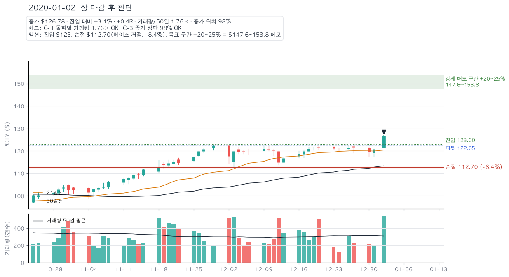

**2020-01-03** — 첫 눌림 −0.9%, 거래량 감소. 1~7일 안에 회복하는지 본다.

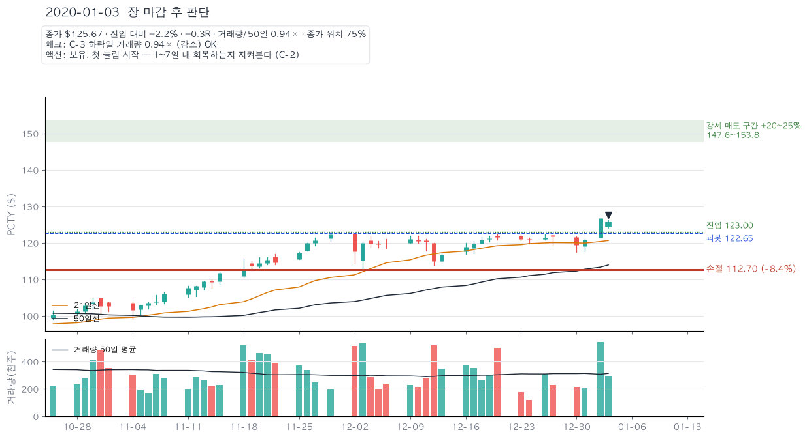

**2020-01-08** — 눌림 없이 사흘 연속 신고가. 0.7R, 스톱 그대로.

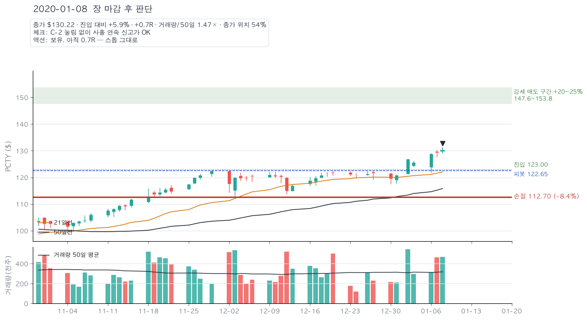

**2020-01-10** — 거래량 0.7~0.9배로 조용히 상승. 매물이 없다는 뜻.

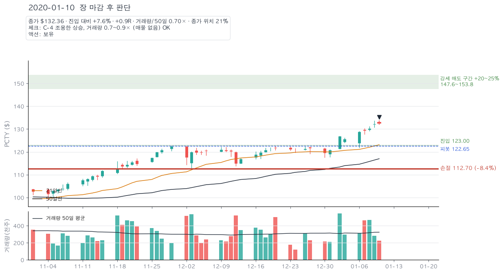

**2020-01-13** — +2.9% 신고가, 1.3R. 본전 스톱 조건(+15%)에 접근.

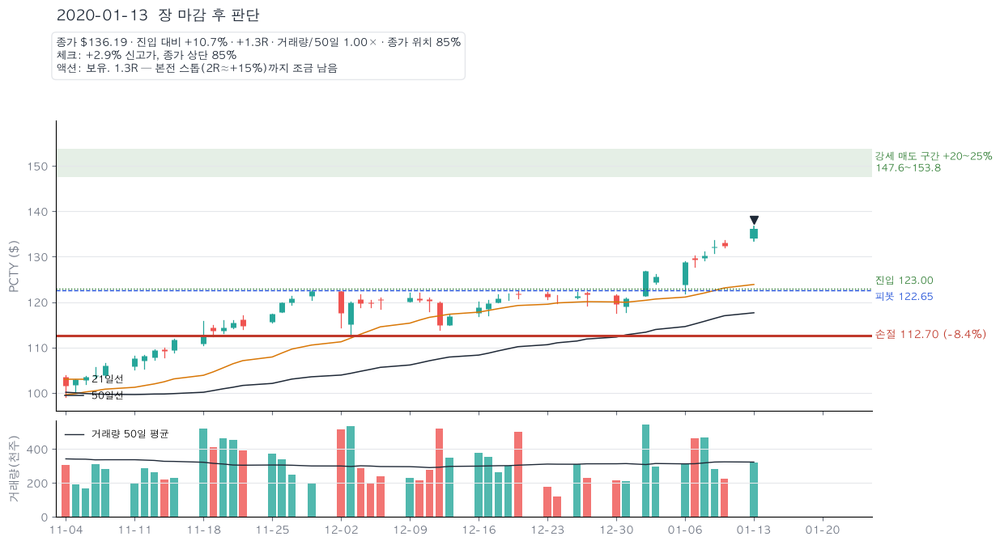

**2020-01-16** — +13.1%, 1.6R. 내일 +15%를 넘기면 손절선을 본전으로 올릴 준비.

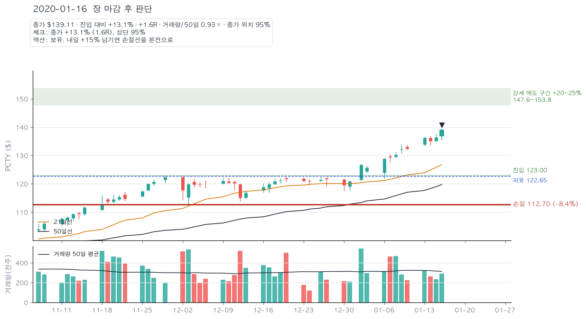

**2020-01-17** — **A-2 발동.** 종가 +15.1%(1.8R) → 손절선 $112.70에서 $123.00(본전)으로. 이때부터 이 트레이드는 잃을 수 없다.

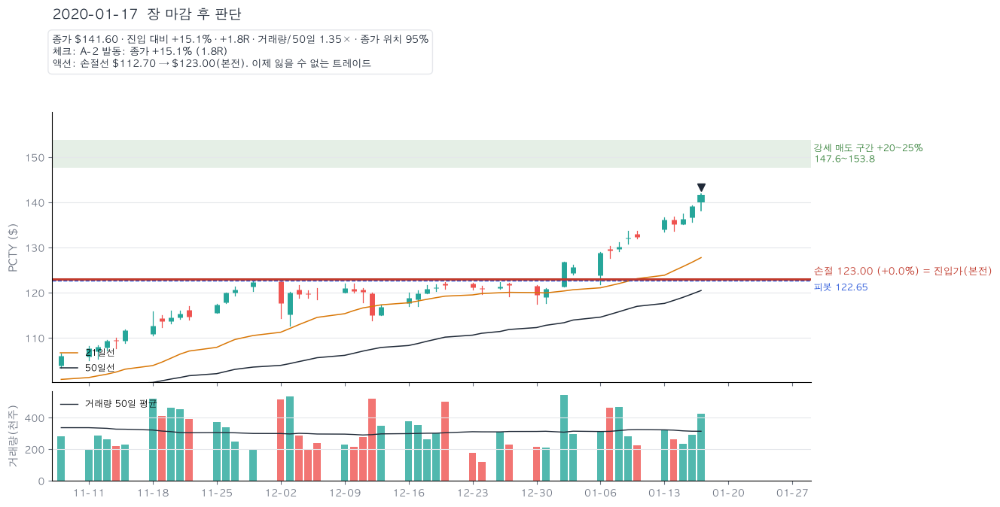

**2020-01-21** — **B-4 반전일 ①.** 장중 145.20 신고가 뒤 종가가 범위 하단 17%, 거래량 1.58배. 경고만 기록.

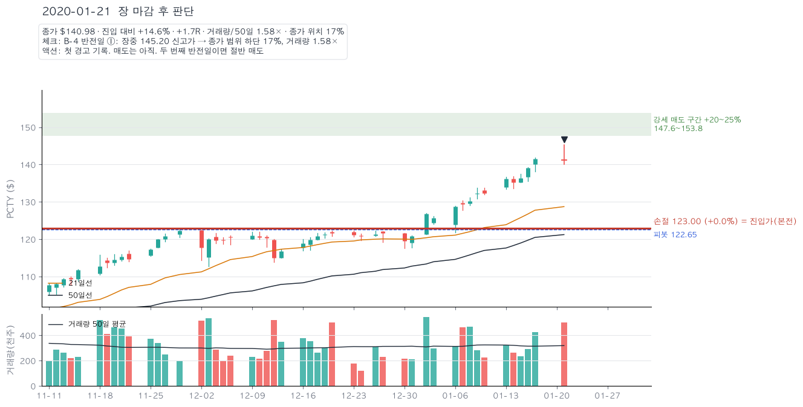

**2020-01-24** — 돌파 3주째. +20% 미달이므로 8주 보유 예외는 없다. +20% 강세일이 오면 절반 매도.

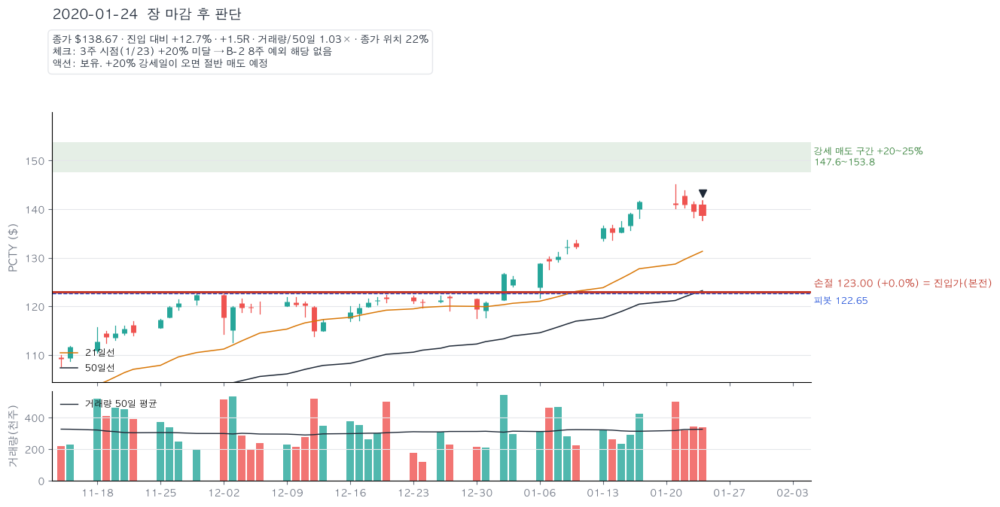

**2020-01-27** — **C-2 테니스공.** 코로나 충격 갭다운으로 장중 130.20(−10%)까지 밀렸다가 종가 상단 93% 회복. 본전 스톱까지 7% 여유라 흔들리지 않는다.

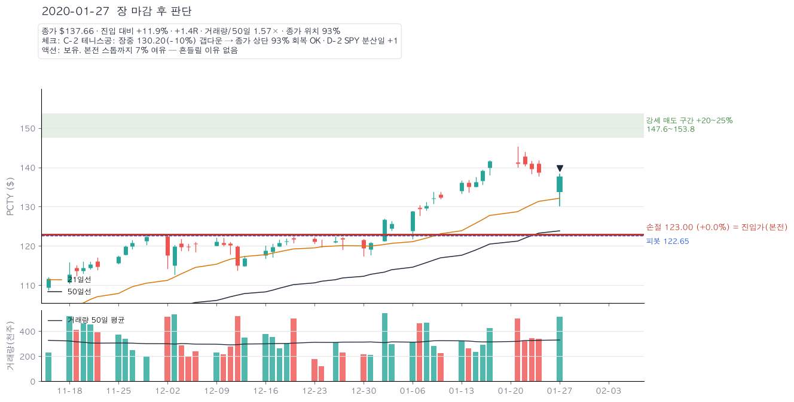

**2020-01-31** — 낙폭 회복. 상승일 거래량이 낮은 점은 경계.

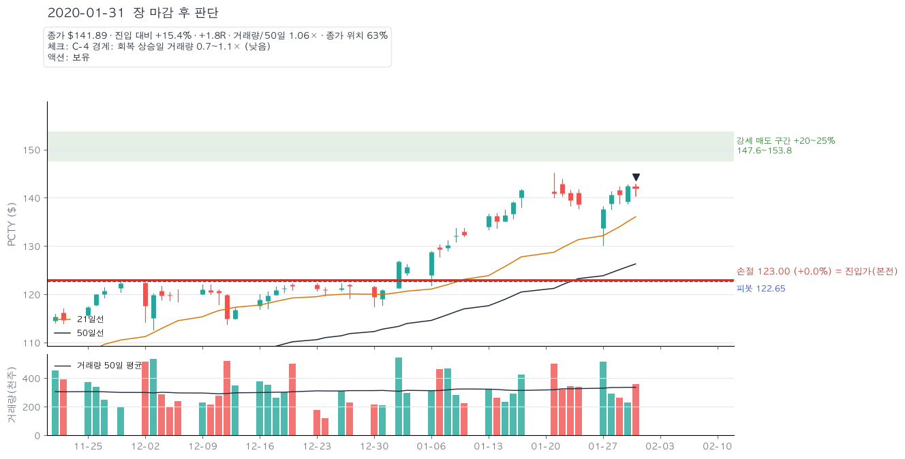

**2020-02-03** — **D-1.** 내일 장 마감 후 실적. 쿠션 +17%가 예상 변동 ±8~10%의 2배에 근접 → 보유 가능하되 강세일이면 절반 매도.

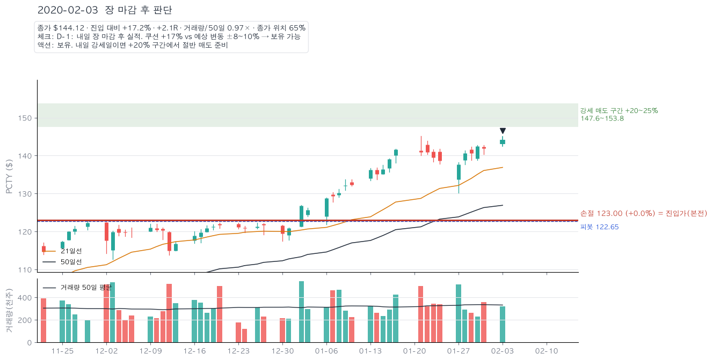

**2020-02-04** — **B-1 강세 매도.** +21.8% 신고가, 거래량 1.74배 → 절반 $149 매도. 잔여 절반 손절선 = 진입가 + 최고이익/2 = $136.50.

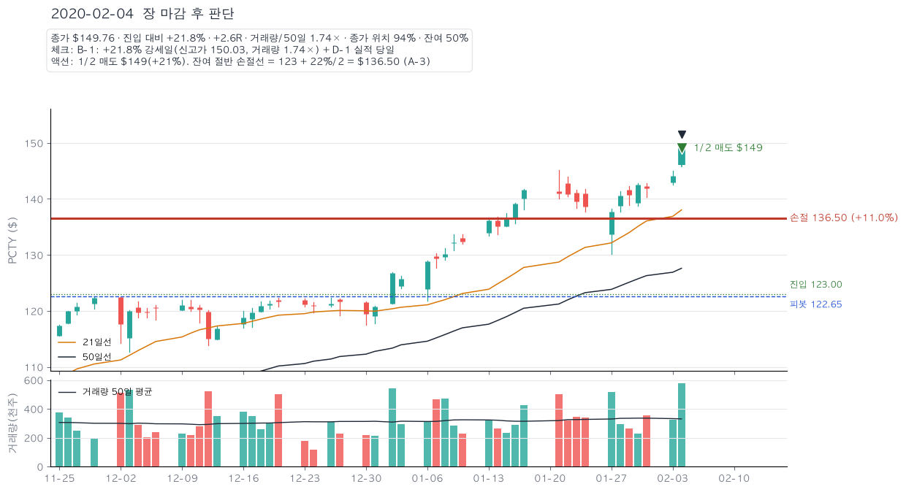

**2020-02-05** — **D-1 좋은 뉴스에 급락.** 실적 비트·가이던스 상향인데 −8.7% 갭다운, 거래량 4.49배. 장중 131.50으로 $136.50 스톱 이탈 → 잔여 청산 ≈$136(+11%). 포지션 종료.

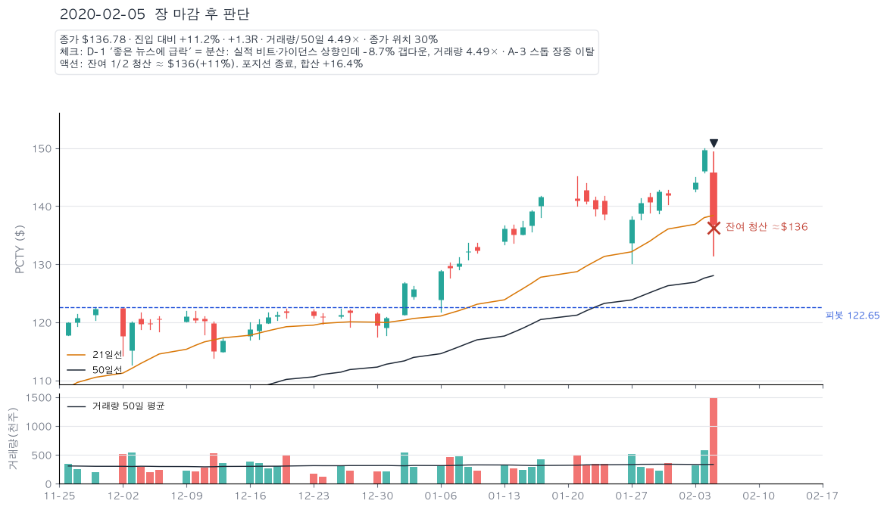

**2020-02-21** — (보유 시나리오) 2/19 신고가 150.73 다음 −3.1%, −4.4% 연속 = 반전일 ②. 백스톱은 50일선 $133.96.

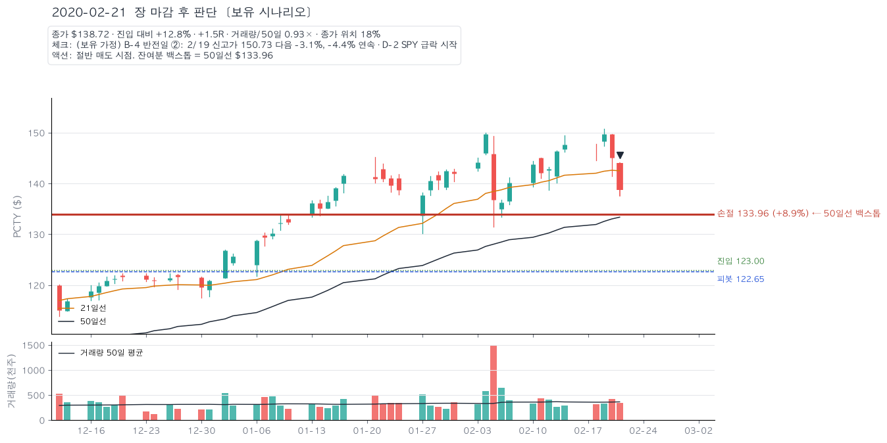

**2020-02-25** — (보유 시나리오) 종가 133.66 < 50일선 133.96 → 백스톱 매도 +8.7%.

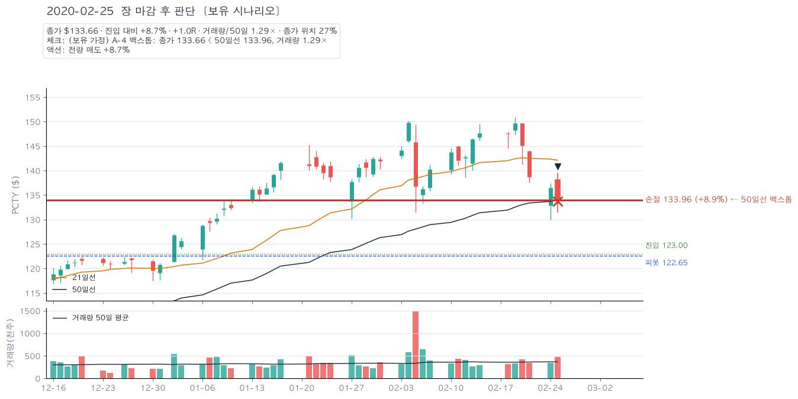


### 전체 기간 한 장

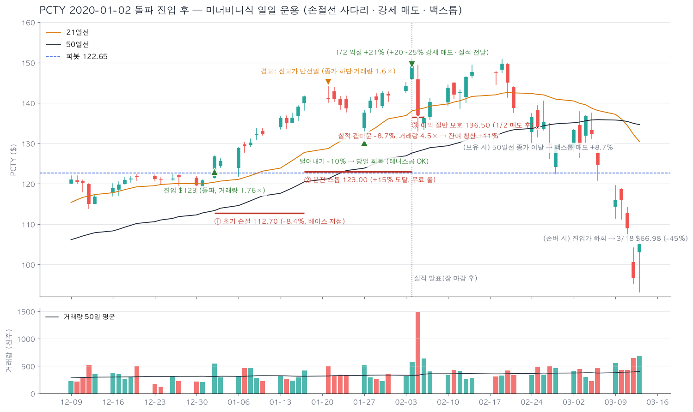

---

## 4. 운용 방식별 결과 비교 (같은 진입 $123)

| 방식 | 청산 | 결과 |
|---|---|---|
| **이 문서의 일일 운용** (1/2 강세 매도 + 절반 보호 스톱) | 2/4 절반 +21%, 2/5 절반 +11% | **+16.4%**, 최대 낙폭 −1% |
| 45 페이지 A 기본 (−8% / +22% 고정) | 2/4 익절선 149.63 | +22.0% (운 좋게 실적 전날 도달) |
| 45 페이지 B 러너 (50일선 청산) | 2/25 133.66 | +8.7% |
| 존버 | — | 3/18 기준 −45% |

고정 익절(+22%)이 이번엔 더 좋았지만, 익절선이 +25%였다면 2/5 갭다운을 그대로 맞고 2/25 50일선에서 +8.7%로 끝났다. 일일 운용은 **결과의 분산을 줄이는** 쪽이지 매번 최고 수익을 주는 쪽이 아니다.

---

## 5. 이 사례가 가르치는 것

1. **손절선은 사다리다.** 진입 후 15거래일 만에 +15%가 나오면 그 순간 트레이드는 무료가 된다(1/17). 그 뒤 1/27 −10% 급락에도 흔들릴 이유가 없었다.
2. **실적 발표는 도박이다.** 쿠션 +21%가 있어도 규칙은 "강세일에 절반은 팔고 간다". 2/5 4.5배 거래량 급락은 실적 내용(비트·가이던스 상향)과 무관했다. **좋은 뉴스에 대량 매도 = 기관 분산**이고, 이것이 2/20 이후 붕괴의 첫 신호였다.
3. **3주 안에 +20%가 아니면 8주 규칙은 없다.** PCTY는 4.5주 걸렸으므로 +20% 강세 매도가 정답이었다. 이 판단을 안 하면 "대형 주도주니까 들고 가자"는 합리화가 끼어든다.
4. **50일선 백스톱은 마지막 보루지 계획이 아니다.** 백스톱만 믿으면 +22%가 +8.7%로 줄어든다(2/25). 그 전에 A-3·B-4가 먼저 신호를 줬다.

---

## 6. 45 페이지에 반영할 때 (미구현 — 요청 시)

- `_POST_ITEMS`에 A-2(본전 스톱 시점)·A-3(절반 보호)·B-1(+20% 강세 매도)·B-4(반전일)·D-1(실적 쿠션)을 체크 항목으로 추가하고, 리플레이 일자별 테이블에 `R`, `적용 스톱(사다리)`, `종가 위치`, `거래량/50일` 컬럼을 넣으면 위 표를 페이지에서 그대로 재현할 수 있다.
- 규칙 변형 E "일일 운용(사다리 스톱 + 절반 강세 매도)"를 `replay_trade`에 추가하면 A~D와 나란히 비교된다.

자료: [Q2 FY2020 실적 보도자료 (2020-02-04, SEC 8-K Ex.99.1)](https://www.sec.gov/Archives/edgar/data/1591698/000110465920010623/tm205923d1_ex99-1.htm)
